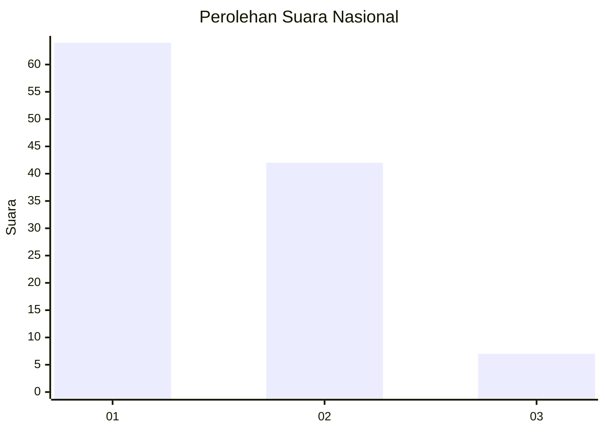
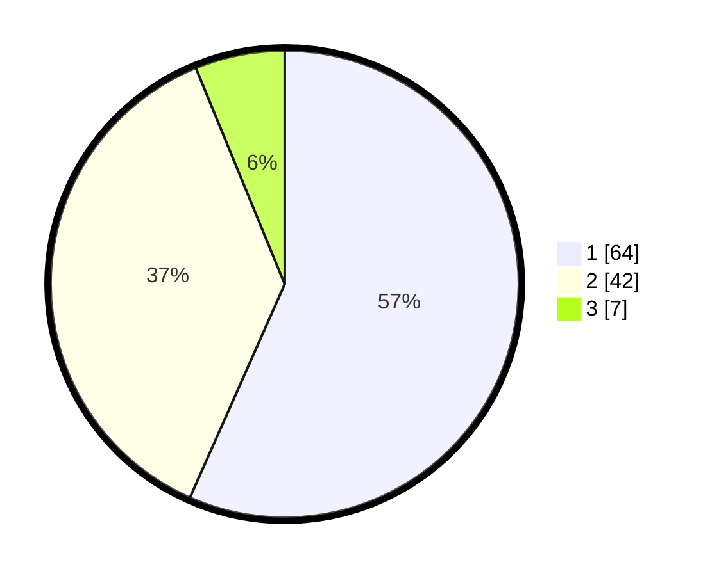

# Hasil

## Grafik

## Tabel

| No. | Nama Paslon    | Suara | Suara (raw) | Persentase |
|:--- |:-------------- | -----:| -----------:| ----------:|
| 1   | ANIES MUHAIMIN | 64    | [64][p-1]   | 56,64      |
| 2   | PRABOWO GIBRAN | 42    | [42][p-2]   | 37,17      |
| 3   | GANJAR MAHFUD  | 7     | [7][p-3]    | 6,19       |

[p-1]: https://github.com/gigit-pemilu/pemilu-2024/blob/main/pilpres/hitung-suara/sub/11-aceh/sub/71-kota-banda-aceh/sub/03-meuraxa/sub/2001-punge-jurong/sub/004-tps/sub/paslon-1.txt
[p-2]: https://github.com/gigit-pemilu/pemilu-2024/blob/main/pilpres/hitung-suara/sub/11-aceh/sub/71-kota-banda-aceh/sub/03-meuraxa/sub/2001-punge-jurong/sub/004-tps/sub/paslon-2.txt
[p-3]: https://github.com/gigit-pemilu/pemilu-2024/blob/main/pilpres/hitung-suara/sub/11-aceh/sub/71-kota-banda-aceh/sub/03-meuraxa/sub/2001-punge-jurong/sub/004-tps/sub/paslon-3.txt

## Foto C Plano

https://sirekap-obj-formc.kpu.go.id/cc9e/pemilu/ppwp/11/71/03/20/01/1171032001004-20240220-101702--e5cce8a5-b4c4-40b1-ae9c-aa5ac0a998ba.jpg

https://sirekap-obj-formc.kpu.go.id/cc9e/pemilu/ppwp/11/71/03/20/01/1171032001004-20240220-101935--a92c8b14-06dd-4ca2-9921-9e7f57010a15.jpg

https://sirekap-obj-formc.kpu.go.id/cc9e/pemilu/ppwp/11/71/03/20/01/1171032001004-20240220-102446--fbeb3283-aa2c-497a-bcd9-4ccfa911b840.jpg

## Metadata

| Key        | Value               |
| ---------- | ------------------- |
| Time Stamp | 2024-02-20 11:00:00 |

## DATA PEMILIH TETAP

Jumlah pemilih dalam DPT: **281**.
 * L: **142**.
 * P: **139**.

## DATA PENGGUNA HAK PILIH

Jumlah pengguna hak pilih dalam DPT: **201**.
 * L: **96**.
 * P: **105**.

Jumlah pengguna hak pilih dalam DPTb: **1**.
 * L: **0**.
 * P: **1**.

Jumlah pengguna hak pilih dalam DPK: **13**.
 * L: **11**.
 * P: **2**.

Jumlah pengguna hak pilih: **215**.
 * L: **107**.
 * P: **108**.

## JUMLAH SUARA SAH DAN TIDAK SAH

JUMLAH SELURUH SUARA SAH: **213**.

JUMLAH SUARA TIDAK SAH: **2**.

JUMLAH SELURUH SUARA SAH DAN SUARA TIDAK SAH: **215**.

