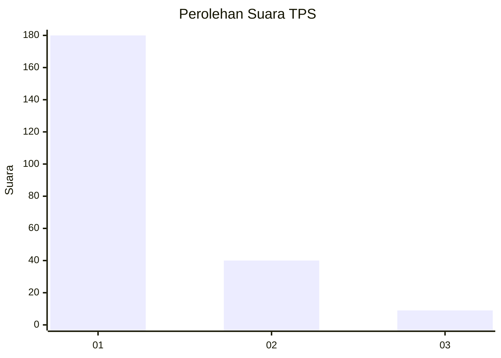
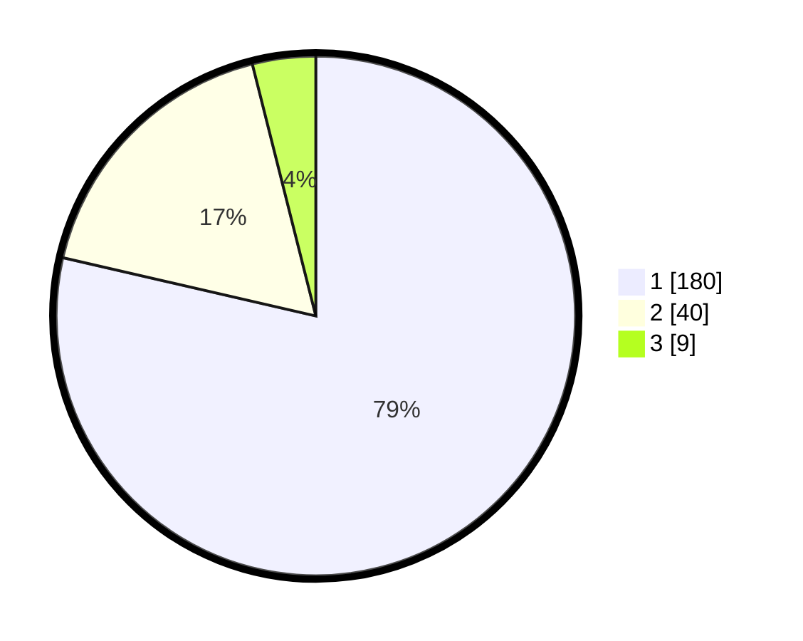

# Hasil

## Grafik

## Tabel

| No. | Nama Paslon    | Suara | Suara (raw) | Persentase |
|:--- |:-------------- | -----:| -----------:| ----------:|
| 1   | ANIES MUHAIMIN | 180   | [180][p-1]  | 78,60      |
| 2   | PRABOWO GIBRAN | 40    | [40][p-2]   | 17,47      |
| 3   | GANJAR MAHFUD  | 9     | [9][p-3]    | 3,93       |

[p-1]: https://github.com/gigit-pemilu/pemilu-2024-11-aceh/blob/main/pilpres/hitung-suara/sub/11-aceh/sub/71-kota-banda-aceh/sub/03-meuraxa/sub/2001-punge-jurong/sub/005-tps/sub/paslon-1.txt
[p-2]: https://github.com/gigit-pemilu/pemilu-2024-11-aceh/blob/main/pilpres/hitung-suara/sub/11-aceh/sub/71-kota-banda-aceh/sub/03-meuraxa/sub/2001-punge-jurong/sub/005-tps/sub/paslon-2.txt
[p-3]: https://github.com/gigit-pemilu/pemilu-2024-11-aceh/blob/main/pilpres/hitung-suara/sub/11-aceh/sub/71-kota-banda-aceh/sub/03-meuraxa/sub/2001-punge-jurong/sub/005-tps/sub/paslon-3.txt

## Foto C Plano

https://sirekap-obj-formc.kpu.go.id/f09d/pemilu/ppwp/11/71/03/20/01/1171032001005-20240220-102235--7c25eb45-879e-4231-a555-d2ce1e2e0e74.jpg

https://sirekap-obj-formc.kpu.go.id/f09d/pemilu/ppwp/11/71/03/20/01/1171032001005-20240220-102804--5977eb2b-3346-4f88-9af2-78eeb1202db4.jpg

https://sirekap-obj-formc.kpu.go.id/f09d/pemilu/ppwp/11/71/03/20/01/1171032001005-20240220-102916--f735ccee-1ad8-405f-bc0e-aa1097187c5a.jpg

## Metadata

| Key        | Value               |
| ---------- | ------------------- |
| Time Stamp | 2024-02-20 11:00:00 |

## DATA PEMILIH TETAP

Jumlah pemilih dalam DPT: **290**.
 * L: **142**.
 * P: **148**.

## DATA PENGGUNA HAK PILIH

Jumlah pengguna hak pilih dalam DPT: **223**.
 * L: **98**.
 * P: **125**.

Jumlah pengguna hak pilih dalam DPTb: **0**.
 * L: **0**.
 * P: **0**.

Jumlah pengguna hak pilih dalam DPK: **6**.
 * L: **2**.
 * P: **4**.

Jumlah pengguna hak pilih: **229**.
 * L: **100**.
 * P: **129**.

## JUMLAH SUARA SAH DAN TIDAK SAH

JUMLAH SELURUH SUARA SAH: **229**.

JUMLAH SUARA TIDAK SAH: **0**.

JUMLAH SELURUH SUARA SAH DAN SUARA TIDAK SAH: **229**.

