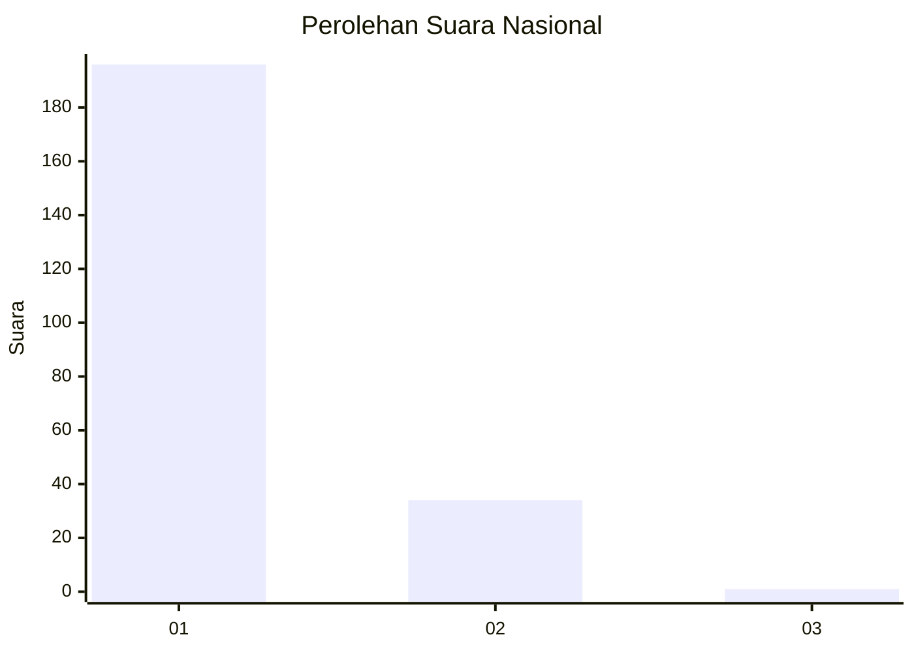
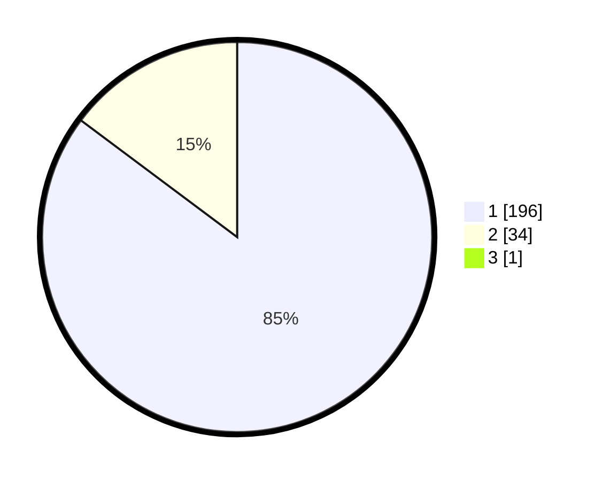

# Hasil

## Grafik

## Tabel

| No. | Nama Paslon    | Suara | Suara (raw) | Persentase |
|:--- |:-------------- | -----:| -----------:| ----------:|
| 1   | ANIES MUHAIMIN | 196   | [196][p-1]  | 84,85      |
| 2   | PRABOWO GIBRAN | 34    | [34][p-2]   | 14,72      |
| 3   | GANJAR MAHFUD  | 1     | [1][p-3]    | 0,43       |

[p-1]: https://github.com/gigit-pemilu/pemilu-2024/blob/main/pilpres/hitung-suara/sub/11-aceh/sub/71-kota-banda-aceh/sub/03-meuraxa/sub/2004-deah-glumpang/sub/001-tps/sub/paslon-1.txt
[p-2]: https://github.com/gigit-pemilu/pemilu-2024/blob/main/pilpres/hitung-suara/sub/11-aceh/sub/71-kota-banda-aceh/sub/03-meuraxa/sub/2004-deah-glumpang/sub/001-tps/sub/paslon-2.txt
[p-3]: https://github.com/gigit-pemilu/pemilu-2024/blob/main/pilpres/hitung-suara/sub/11-aceh/sub/71-kota-banda-aceh/sub/03-meuraxa/sub/2004-deah-glumpang/sub/001-tps/sub/paslon-3.txt

## Foto C Plano

https://sirekap-obj-formc.kpu.go.id/c21b/pemilu/ppwp/11/71/03/20/04/1171032004001-20240216-103036--601fe5c0-023e-4ce7-a06f-71cb2c2e27d4.jpg

https://sirekap-obj-formc.kpu.go.id/c21b/pemilu/ppwp/11/71/03/20/04/1171032004001-20240216-103227--8e5734f0-5796-49a5-9cea-782e0fc68b4e.jpg

https://sirekap-obj-formc.kpu.go.id/c21b/pemilu/ppwp/11/71/03/20/04/1171032004001-20240216-103909--581b8755-640f-4c92-935d-6780f6231959.jpg

## Metadata

| Key        | Value               |
| ---------- | ------------------- |
| Time Stamp | 2024-02-17 18:30:00 |

