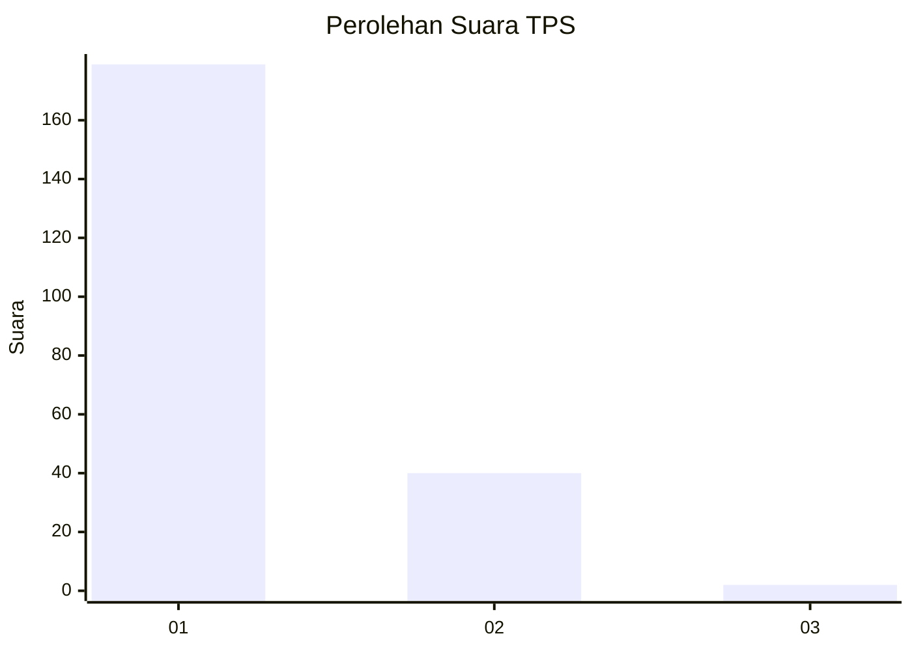
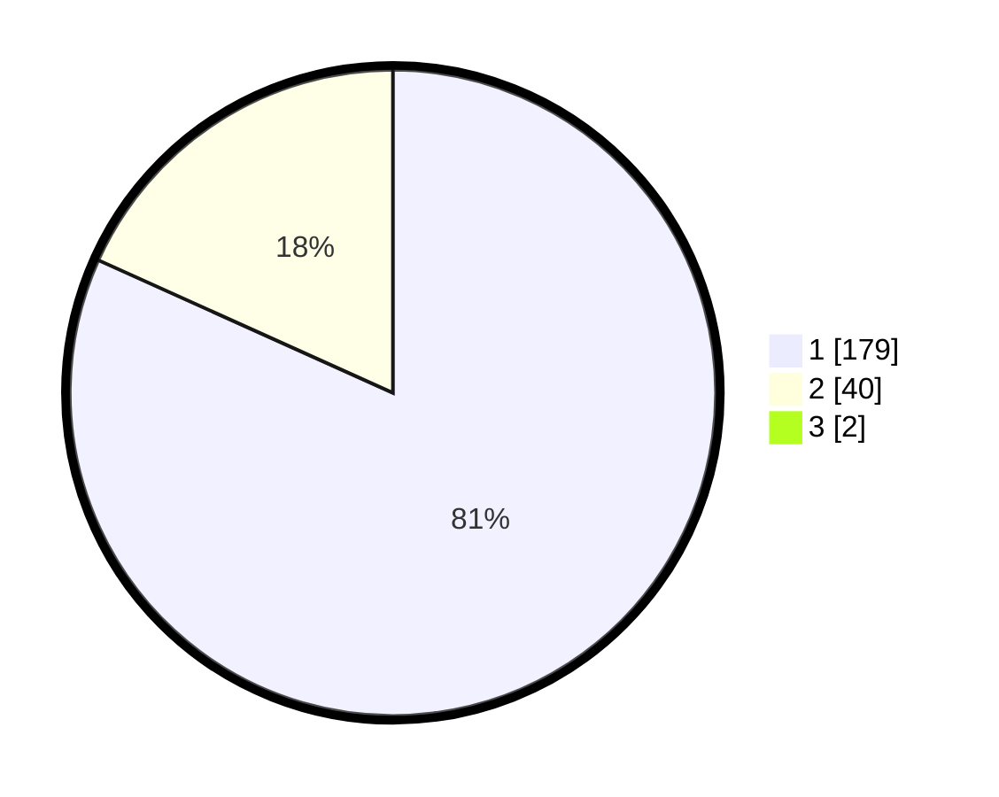

# Hasil

## Grafik

## Tabel

| No. | Nama Paslon    | Suara | Suara (raw) | Persentase |
|:--- |:-------------- | -----:| -----------:| ----------:|
| 1   | ANIES MUHAIMIN | 179   | [179][p-1]  | 81,00      |
| 2   | PRABOWO GIBRAN | 40    | [40][p-2]   | 18,10      |
| 3   | GANJAR MAHFUD  | 2     | [2][p-3]    | 0,90       |

[p-1]: https://github.com/gigit-pemilu/pemilu-2024-11-aceh/blob/main/pilpres/hitung-suara/sub/11-aceh/sub/71-kota-banda-aceh/sub/03-meuraxa/sub/2004-deah-glumpang/sub/003-tps/sub/paslon-1.txt
[p-2]: https://github.com/gigit-pemilu/pemilu-2024-11-aceh/blob/main/pilpres/hitung-suara/sub/11-aceh/sub/71-kota-banda-aceh/sub/03-meuraxa/sub/2004-deah-glumpang/sub/003-tps/sub/paslon-2.txt
[p-3]: https://github.com/gigit-pemilu/pemilu-2024-11-aceh/blob/main/pilpres/hitung-suara/sub/11-aceh/sub/71-kota-banda-aceh/sub/03-meuraxa/sub/2004-deah-glumpang/sub/003-tps/sub/paslon-3.txt

## Foto C Plano

https://sirekap-obj-formc.kpu.go.id/e9e9/pemilu/ppwp/11/71/03/20/04/1171032004003-20240216-174128--91c3809f-1ff9-4ea8-a1ac-2936062c34c5.jpg

https://sirekap-obj-formc.kpu.go.id/e9e9/pemilu/ppwp/11/71/03/20/04/1171032004003-20240214-202753--af26295d-f9fd-4480-a933-d734dd795267.jpg

https://sirekap-obj-formc.kpu.go.id/e9e9/pemilu/ppwp/11/71/03/20/04/1171032004003-20240214-202841--feec03ac-84f5-486c-8a3c-6846ad05a341.jpg

## Metadata

| Key        | Value               |
| ---------- | ------------------- |
| Time Stamp | 2024-02-16 21:01:00 |

