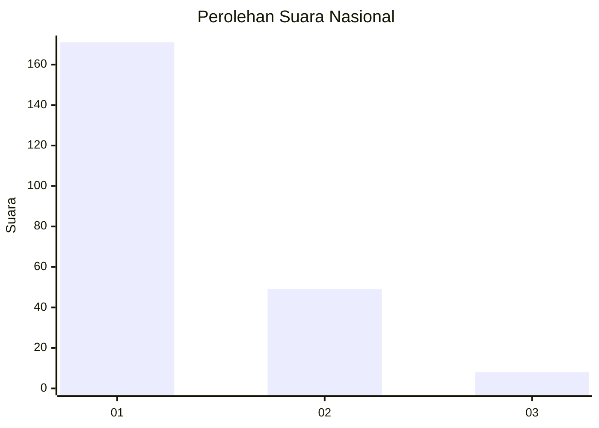
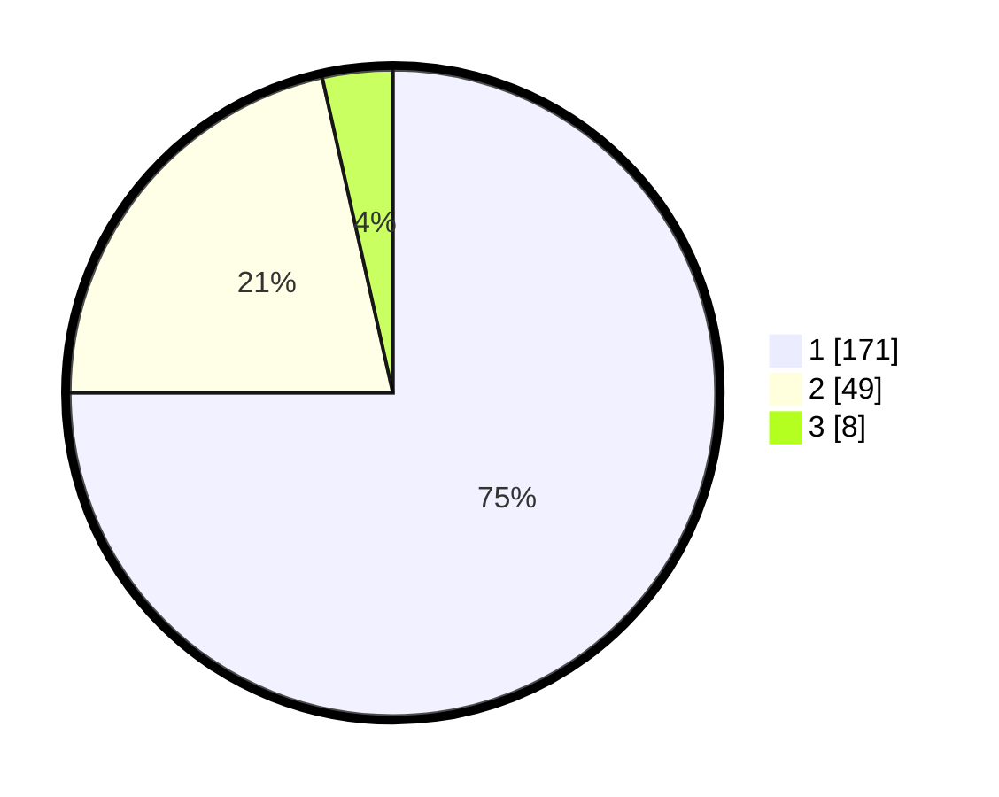

# Hasil

## Grafik

## Tabel

| No. | Nama Paslon    | Suara | Suara (raw) | Persentase |
|:--- |:-------------- | -----:| -----------:| ----------:|
| 1   | ANIES MUHAIMIN | 171   | [171][p-1]  | 75,00      |
| 2   | PRABOWO GIBRAN | 49    | [49][p-2]   | 21,49      |
| 3   | GANJAR MAHFUD  | 8     | [8][p-3]    | 3,51       |

[p-1]: https://github.com/gigit-pemilu/pemilu-2024/blob/main/pilpres/hitung-suara/sub/11-aceh/sub/71-kota-banda-aceh/sub/03-meuraxa/sub/2007-lampaseh-aceh/sub/003-tps/sub/paslon-1.txt
[p-2]: https://github.com/gigit-pemilu/pemilu-2024/blob/main/pilpres/hitung-suara/sub/11-aceh/sub/71-kota-banda-aceh/sub/03-meuraxa/sub/2007-lampaseh-aceh/sub/003-tps/sub/paslon-2.txt
[p-3]: https://github.com/gigit-pemilu/pemilu-2024/blob/main/pilpres/hitung-suara/sub/11-aceh/sub/71-kota-banda-aceh/sub/03-meuraxa/sub/2007-lampaseh-aceh/sub/003-tps/sub/paslon-3.txt

## Foto C Plano

https://sirekap-obj-formc.kpu.go.id/ac2b/pemilu/ppwp/11/71/03/20/07/1171032007003-20240217-095518--38214932-833e-44eb-b980-4c5331443e9e.jpg

https://sirekap-obj-formc.kpu.go.id/ac2b/pemilu/ppwp/11/71/03/20/07/1171032007003-20240217-095526--d50b7bfc-4d40-4956-accc-7d9ca73393e7.jpg

https://sirekap-obj-formc.kpu.go.id/ac2b/pemilu/ppwp/11/71/03/20/07/1171032007003-20240217-095529--23bcb1c2-9eb1-4b97-be5c-49a232cbd63d.jpg

## Metadata

| Key        | Value               |
| ---------- | ------------------- |
| Time Stamp | 2024-02-17 10:30:03 |

