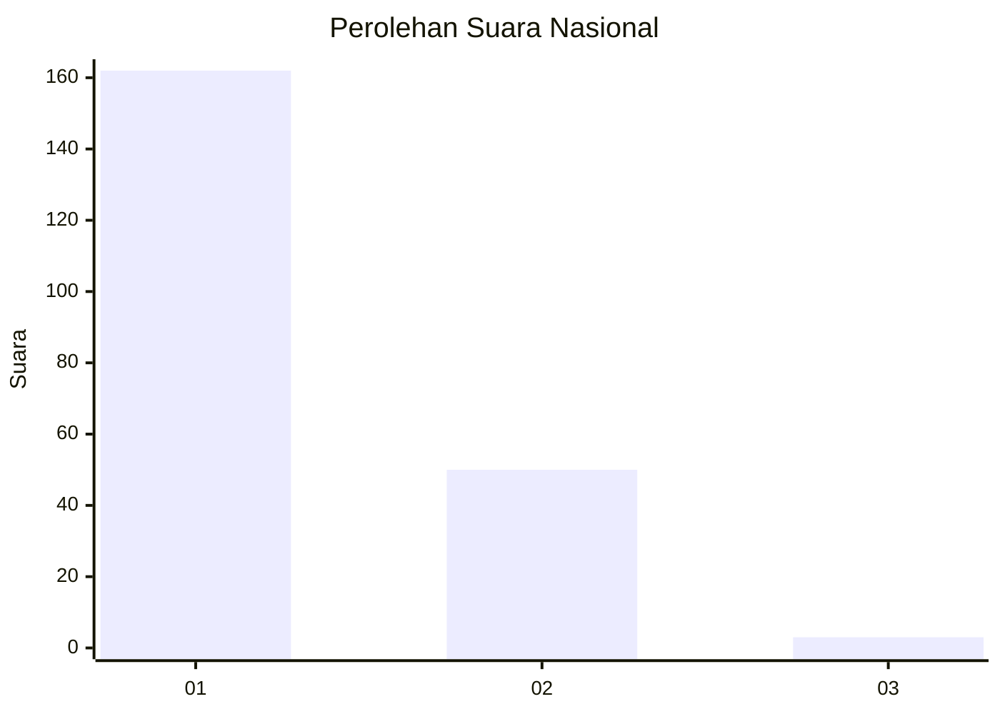
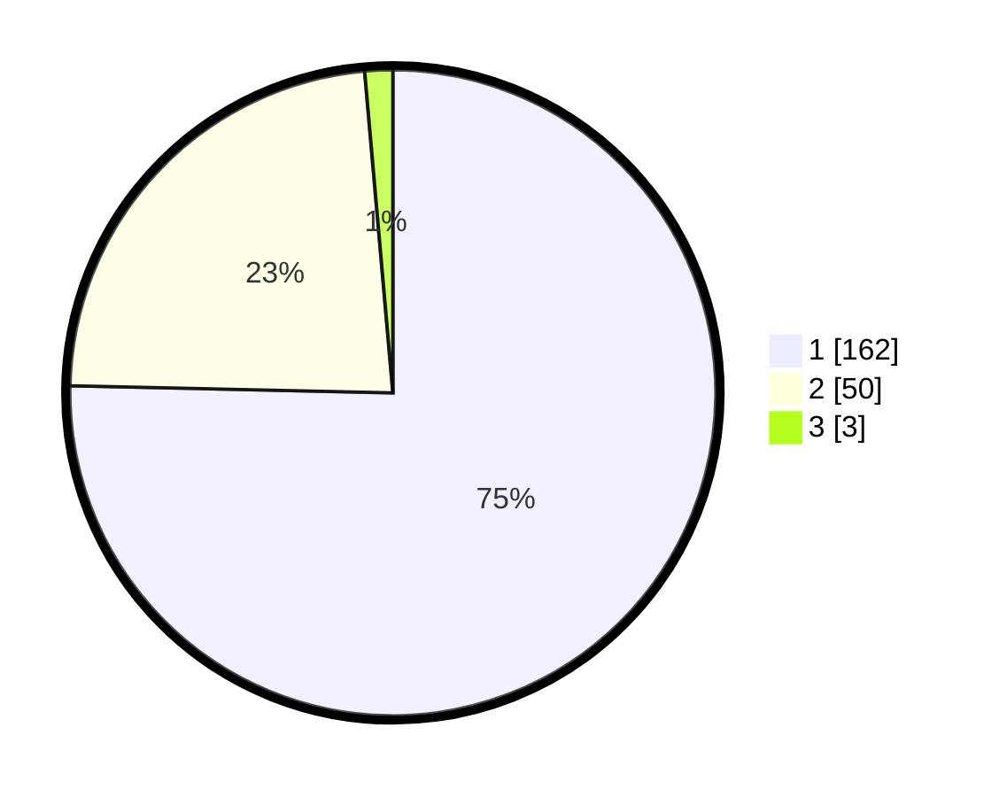

# Hasil

## Grafik

## Tabel

| No. | Nama Paslon    | Suara | Suara (raw) | Persentase |
|:--- |:-------------- | -----:| -----------:| ----------:|
| 1   | ANIES MUHAIMIN | 162   | [162][p-1]  | 75,35      |
| 2   | PRABOWO GIBRAN | 50    | [50][p-2]   | 23,26      |
| 3   | GANJAR MAHFUD  | 3     | [3][p-3]    | 1,40       |

[p-1]: https://github.com/gigit-pemilu/pemilu-2024/blob/main/pilpres/hitung-suara/sub/11-aceh/sub/71-kota-banda-aceh/sub/03-meuraxa/sub/2008-blang-oi/sub/001-tps/sub/paslon-1.txt
[p-2]: https://github.com/gigit-pemilu/pemilu-2024/blob/main/pilpres/hitung-suara/sub/11-aceh/sub/71-kota-banda-aceh/sub/03-meuraxa/sub/2008-blang-oi/sub/001-tps/sub/paslon-2.txt
[p-3]: https://github.com/gigit-pemilu/pemilu-2024/blob/main/pilpres/hitung-suara/sub/11-aceh/sub/71-kota-banda-aceh/sub/03-meuraxa/sub/2008-blang-oi/sub/001-tps/sub/paslon-3.txt

## Foto C Plano

https://sirekap-obj-formc.kpu.go.id/1817/pemilu/ppwp/11/71/03/20/08/1171032008001-20240217-204904--014e8500-6d7e-47a2-83b1-1bff748bf74f.jpg

https://sirekap-obj-formc.kpu.go.id/1817/pemilu/ppwp/11/71/03/20/08/1171032008001-20240217-203856--2c72fbc4-f07c-4792-b9c9-1fdf6dc64fd2.jpg

https://sirekap-obj-formc.kpu.go.id/1817/pemilu/ppwp/11/71/03/20/08/1171032008001-20240217-204032--959011b1-57d2-4f0a-90f0-ee95469de7ad.jpg

## Metadata

| Key        | Value               |
| ---------- | ------------------- |
| Time Stamp | 2024-02-19 06:16:00 |

