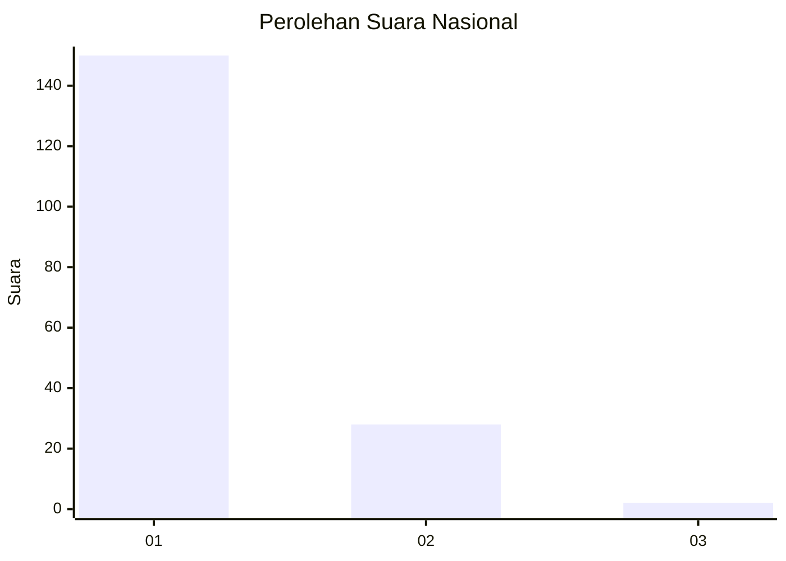
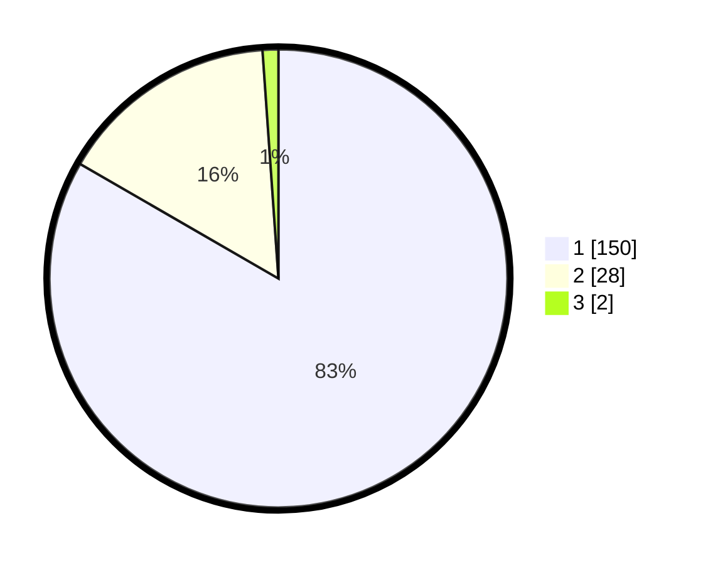

# Hasil

## Grafik

## Tabel

| No. | Nama Paslon    | Suara | Suara (raw) | Persentase |
|:--- |:-------------- | -----:| -----------:| ----------:|
| 1   | ANIES MUHAIMIN | 150   | [150][p-1]  | 83,33      |
| 2   | PRABOWO GIBRAN | 28    | [28][p-2]   | 15,56      |
| 3   | GANJAR MAHFUD  | 2     | [2][p-3]    | 1,11       |

[p-1]: https://github.com/gigit-pemilu/pemilu-2024/blob/main/pilpres/hitung-suara/sub/11-aceh/sub/71-kota-banda-aceh/sub/03-meuraxa/sub/2008-blang-oi/sub/007-tps/sub/paslon-1.txt
[p-2]: https://github.com/gigit-pemilu/pemilu-2024/blob/main/pilpres/hitung-suara/sub/11-aceh/sub/71-kota-banda-aceh/sub/03-meuraxa/sub/2008-blang-oi/sub/007-tps/sub/paslon-2.txt
[p-3]: https://github.com/gigit-pemilu/pemilu-2024/blob/main/pilpres/hitung-suara/sub/11-aceh/sub/71-kota-banda-aceh/sub/03-meuraxa/sub/2008-blang-oi/sub/007-tps/sub/paslon-3.txt

## Foto C Plano

https://sirekap-obj-formc.kpu.go.id/5e2f/pemilu/ppwp/11/71/03/20/08/1171032008007-20240219-194303--38586168-5ed4-441f-870d-1ef6bc07eff6.jpg

https://sirekap-obj-formc.kpu.go.id/5e2f/pemilu/ppwp/11/71/03/20/08/1171032008007-20240217-174617--c288f720-da18-432a-a489-3552984761ee.jpg

https://sirekap-obj-formc.kpu.go.id/5e2f/pemilu/ppwp/11/71/03/20/08/1171032008007-20240217-174803--040cfab0-2ae8-4ed4-a327-faff6d2724a9.jpg

## Metadata

| Key        | Value               |
| ---------- | ------------------- |
| Time Stamp | 2024-02-19 20:00:00 |

