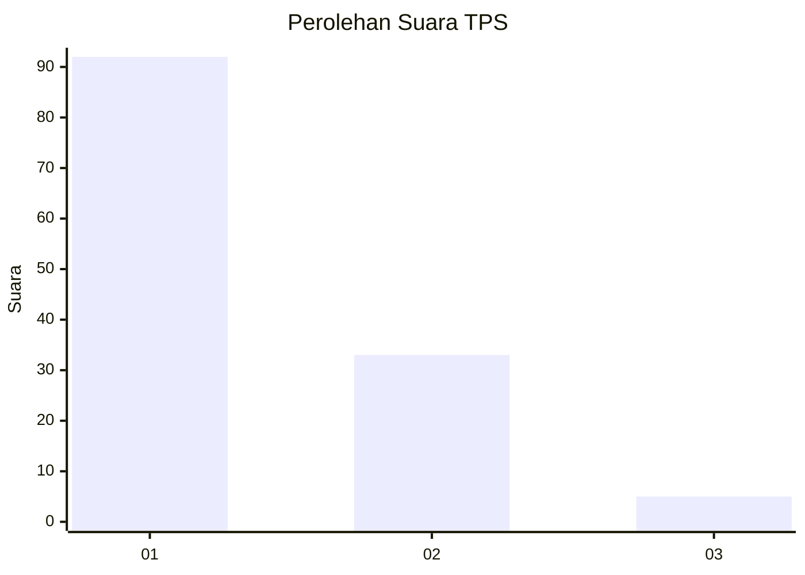
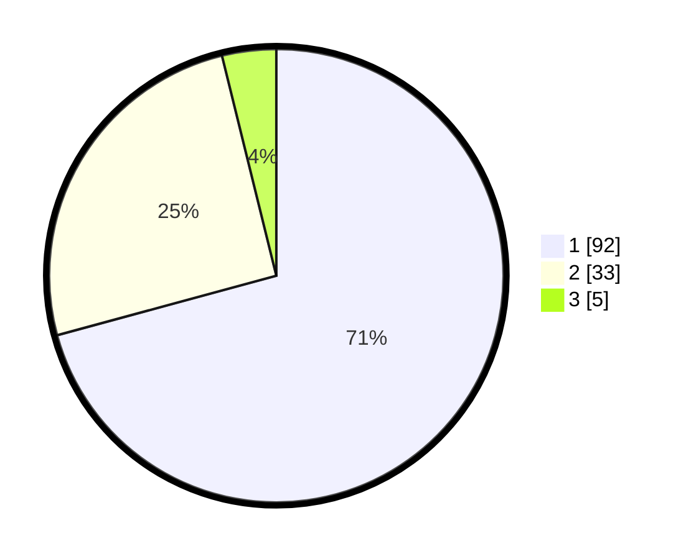

# Hasil

## Grafik

## Tabel

| No. | Nama Paslon    | Suara | Suara (raw) | Persentase |
|:--- |:-------------- | -----:| -----------:| ----------:|
| 1   | ANIES MUHAIMIN | 92    | [92][p-1]   | 70,77      |
| 2   | PRABOWO GIBRAN | 33    | [33][p-2]   | 25,38      |
| 3   | GANJAR MAHFUD  | 5     | [5][p-3]    | 3,85       |

[p-1]: https://github.com/gigit-pemilu/pemilu-2024-11-aceh/blob/main/pilpres/hitung-suara/sub/11-aceh/sub/71-kota-banda-aceh/sub/03-meuraxa/sub/2012-lamjabat/sub/003-tps/sub/paslon-1.txt
[p-2]: https://github.com/gigit-pemilu/pemilu-2024-11-aceh/blob/main/pilpres/hitung-suara/sub/11-aceh/sub/71-kota-banda-aceh/sub/03-meuraxa/sub/2012-lamjabat/sub/003-tps/sub/paslon-2.txt
[p-3]: https://github.com/gigit-pemilu/pemilu-2024-11-aceh/blob/main/pilpres/hitung-suara/sub/11-aceh/sub/71-kota-banda-aceh/sub/03-meuraxa/sub/2012-lamjabat/sub/003-tps/sub/paslon-3.txt

## Foto C Plano

https://sirekap-obj-formc.kpu.go.id/e64d/pemilu/ppwp/11/71/03/20/12/1171032012003-20240219-214329--f38ea8bb-80e4-4acb-86aa-65392b47a8e6.jpg

https://sirekap-obj-formc.kpu.go.id/e64d/pemilu/ppwp/11/71/03/20/12/1171032012003-20240219-214904--d60f9158-a0db-4f8e-b478-6c3600d94b52.jpg

https://sirekap-obj-formc.kpu.go.id/e64d/pemilu/ppwp/11/71/03/20/12/1171032012003-20240219-215028--8f6da7ed-96a9-47bd-b27a-0e4b99f5cac9.jpg

## Metadata

| Key        | Value               |
| ---------- | ------------------- |
| Time Stamp | 2024-02-19 22:00:00 |

## DATA PEMILIH TETAP

Jumlah pemilih dalam DPT: **138**.
 * L: **66**.
 * P: **72**.

## DATA PENGGUNA HAK PILIH

Jumlah pengguna hak pilih dalam DPT: **104**.
 * L: **49**.
 * P: **55**.

Jumlah pengguna hak pilih dalam DPTb: **0**.
 * L: **0**.
 * P: **0**.

Jumlah pengguna hak pilih dalam DPK: **27**.
 * L: **12**.
 * P: **15**.

Jumlah pengguna hak pilih: **131**.
 * L: **61**.
 * P: **70**.

## JUMLAH SUARA SAH DAN TIDAK SAH

JUMLAH SELURUH SUARA SAH: **130**.

JUMLAH SUARA TIDAK SAH: **1**.

JUMLAH SELURUH SUARA SAH DAN SUARA TIDAK SAH: **131**.

