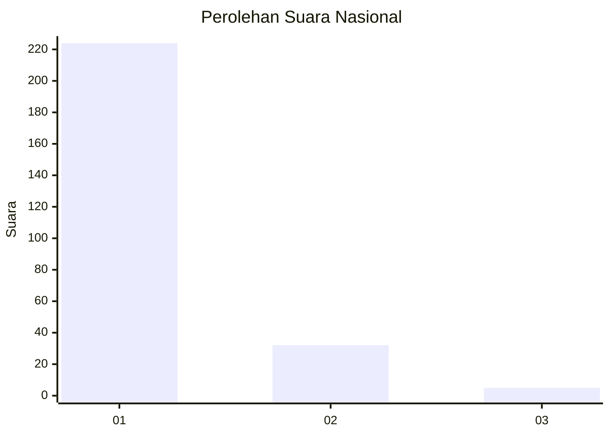
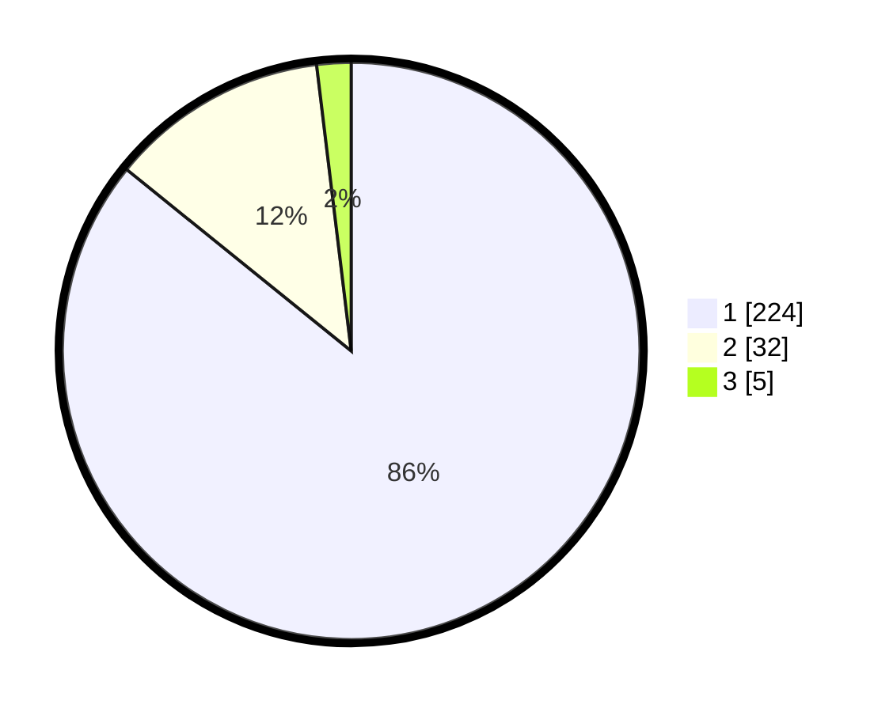

# Hasil

## Grafik

## Tabel

| No. | Nama Paslon    | Suara | Suara (raw) | Persentase |
|:--- |:-------------- | -----:| -----------:| ----------:|
| 1   | ANIES MUHAIMIN | 224   | [224][p-1]  | 85,82      |
| 2   | PRABOWO GIBRAN | 32    | [32][p-2]   | 12,26      |
| 3   | GANJAR MAHFUD  | 5     | [5][p-3]    | 1,92       |

[p-1]: https://github.com/gigit-pemilu/pemilu-2024/blob/main/pilpres/hitung-suara/sub/11-aceh/sub/71-kota-banda-aceh/sub/03-meuraxa/sub/2015-gampong-baro/sub/004-tps/sub/paslon-1.txt
[p-2]: https://github.com/gigit-pemilu/pemilu-2024/blob/main/pilpres/hitung-suara/sub/11-aceh/sub/71-kota-banda-aceh/sub/03-meuraxa/sub/2015-gampong-baro/sub/004-tps/sub/paslon-2.txt
[p-3]: https://github.com/gigit-pemilu/pemilu-2024/blob/main/pilpres/hitung-suara/sub/11-aceh/sub/71-kota-banda-aceh/sub/03-meuraxa/sub/2015-gampong-baro/sub/004-tps/sub/paslon-3.txt

## Foto C Plano

https://sirekap-obj-formc.kpu.go.id/a8d0/pemilu/ppwp/11/71/03/20/15/1171032015004-20240221-111218--9e8b4485-f1ca-4d23-8b22-1bde9aef07fe.jpg

https://sirekap-obj-formc.kpu.go.id/a8d0/pemilu/ppwp/11/71/03/20/15/1171032015004-20240215-022919--06b136ae-ceb2-4563-bddf-2e198657c5dc.jpg

https://sirekap-obj-formc.kpu.go.id/a8d0/pemilu/ppwp/11/71/03/20/15/1171032015004-20240215-023059--508afb62-005c-4643-9e96-9ed0d3472004.jpg

## Metadata

| Key        | Value               |
| ---------- | ------------------- |
| Time Stamp | 2024-02-21 12:00:00 |

