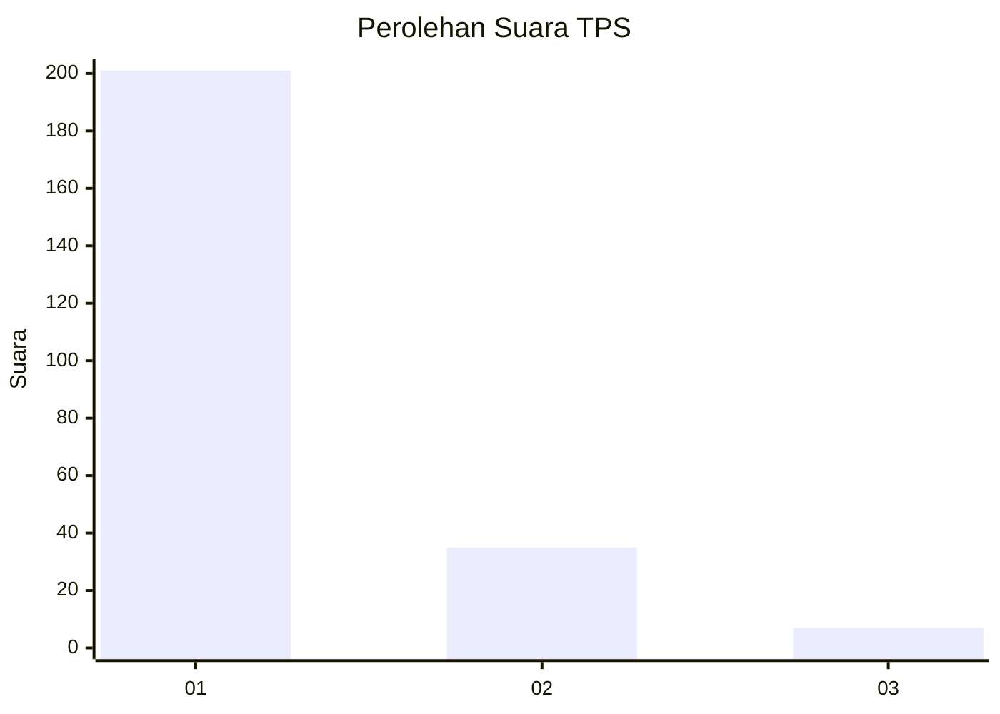
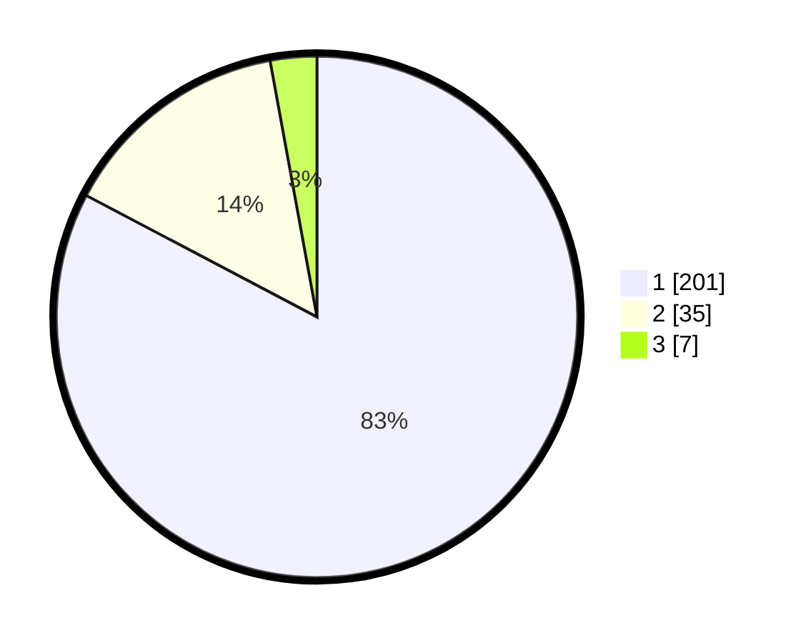

# Hasil

## Grafik

## Tabel

| No. | Nama Paslon    | Suara | Suara (raw) | Persentase |
|:--- |:-------------- | -----:| -----------:| ----------:|
| 1   | ANIES MUHAIMIN | 201   | [201][p-1]  | 82,72      |
| 2   | PRABOWO GIBRAN | 35    | [35][p-2]   | 14,40      |
| 3   | GANJAR MAHFUD  | 7     | [7][p-3]    | 2,88       |

[p-1]: https://github.com/gigit-pemilu/pemilu-2024-11-aceh/blob/main/pilpres/hitung-suara/sub/11-aceh/sub/71-kota-banda-aceh/sub/04-syiah-kuala/sub/2001-jeulingke/sub/001-tps/sub/paslon-1.txt
[p-2]: https://github.com/gigit-pemilu/pemilu-2024-11-aceh/blob/main/pilpres/hitung-suara/sub/11-aceh/sub/71-kota-banda-aceh/sub/04-syiah-kuala/sub/2001-jeulingke/sub/001-tps/sub/paslon-2.txt
[p-3]: https://github.com/gigit-pemilu/pemilu-2024-11-aceh/blob/main/pilpres/hitung-suara/sub/11-aceh/sub/71-kota-banda-aceh/sub/04-syiah-kuala/sub/2001-jeulingke/sub/001-tps/sub/paslon-3.txt

## Foto C Plano

https://sirekap-obj-formc.kpu.go.id/6a3f/pemilu/ppwp/11/71/04/20/01/1171042001001-20240222-112625--a3890417-9854-4645-8f82-4440e04c81d8.jpg

https://sirekap-obj-formc.kpu.go.id/6a3f/pemilu/ppwp/11/71/04/20/01/1171042001001-20240222-113122--d64ea764-537f-4e77-83bb-b3a5fb3fb72e.jpg

https://sirekap-obj-formc.kpu.go.id/6a3f/pemilu/ppwp/11/71/04/20/01/1171042001001-20240222-113259--2662edb7-b67b-4f89-baaa-2127b04546c8.jpg

## Metadata

| Key        | Value               |
| ---------- | ------------------- |
| Time Stamp | 2024-02-22 17:00:00 |

## DATA PEMILIH TETAP

Jumlah pemilih dalam DPT: **292**.
 * L: **129**.
 * P: **163**.

## DATA PENGGUNA HAK PILIH

Jumlah pengguna hak pilih dalam DPT: **225**.
 * L: **101**.
 * P: **124**.

Jumlah pengguna hak pilih dalam DPTb: **15**.
 * L: **5**.
 * P: **10**.

Jumlah pengguna hak pilih dalam DPK: **4**.
 * L: **2**.
 * P: **2**.

Jumlah pengguna hak pilih: **244**.
 * L: **108**.
 * P: **136**.

## JUMLAH SUARA SAH DAN TIDAK SAH

JUMLAH SELURUH SUARA SAH: **243**.

JUMLAH SUARA TIDAK SAH: **1**.

JUMLAH SELURUH SUARA SAH DAN SUARA TIDAK SAH: **244**.

