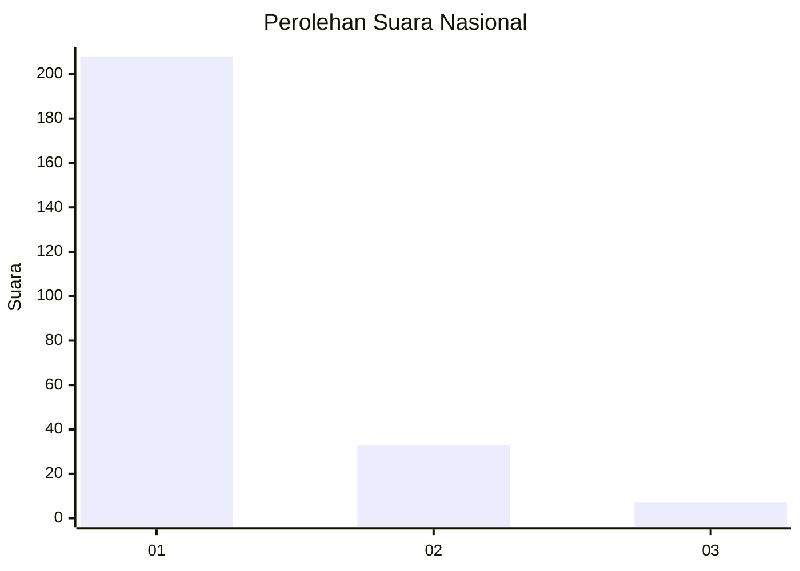
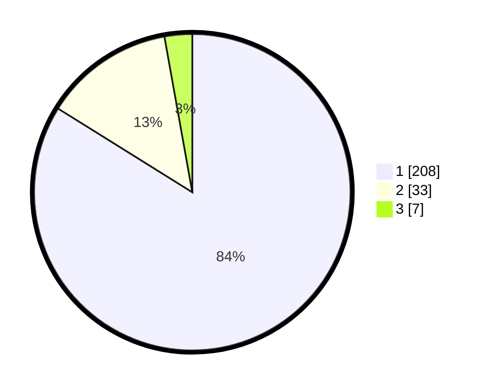

# Hasil

## Grafik

## Tabel

| No. | Nama Paslon    | Suara | Suara (raw) | Persentase |
|:--- |:-------------- | -----:| -----------:| ----------:|
| 1   | ANIES MUHAIMIN | 208   | [208][p-1]  | 83,87      |
| 2   | PRABOWO GIBRAN | 33    | [33][p-2]   | 13,31      |
| 3   | GANJAR MAHFUD  | 7     | [7][p-3]    | 2,82       |

[p-1]: https://github.com/gigit-pemilu/pemilu-2024/blob/main/pilpres/hitung-suara/sub/11-aceh/sub/71-kota-banda-aceh/sub/04-syiah-kuala/sub/2001-jeulingke/sub/003-tps/sub/paslon-1.txt
[p-2]: https://github.com/gigit-pemilu/pemilu-2024/blob/main/pilpres/hitung-suara/sub/11-aceh/sub/71-kota-banda-aceh/sub/04-syiah-kuala/sub/2001-jeulingke/sub/003-tps/sub/paslon-2.txt
[p-3]: https://github.com/gigit-pemilu/pemilu-2024/blob/main/pilpres/hitung-suara/sub/11-aceh/sub/71-kota-banda-aceh/sub/04-syiah-kuala/sub/2001-jeulingke/sub/003-tps/sub/paslon-3.txt

## Foto C Plano

https://sirekap-obj-formc.kpu.go.id/5a9c/pemilu/ppwp/11/71/04/20/01/1171042001003-20240222-101252--eb1ead13-90f5-4dcc-8077-823f8e5de09f.jpg

https://sirekap-obj-formc.kpu.go.id/5a9c/pemilu/ppwp/11/71/04/20/01/1171042001003-20240222-101335--d66cb42f-1ca3-4010-bf61-2de86573da40.jpg

https://sirekap-obj-formc.kpu.go.id/5a9c/pemilu/ppwp/11/71/04/20/01/1171042001003-20240222-101405--bb497359-db92-48f4-b02e-700151d127d5.jpg

## Metadata

| Key        | Value               |
| ---------- | ------------------- |
| Time Stamp | 2024-02-24 22:31:28 |

## DATA PEMILIH TETAP

Jumlah pemilih dalam DPT: **287**.
 * L: **132**.
 * P: **155**.

## DATA PENGGUNA HAK PILIH

Jumlah pengguna hak pilih dalam DPT: **222**.
 * L: **102**.
 * P: **120**.

Jumlah pengguna hak pilih dalam DPTb: **12**.
 * L: **6**.
 * P: **6**.

Jumlah pengguna hak pilih dalam DPK: **11**.
 * L: **4**.
 * P: **7**.

Jumlah pengguna hak pilih: **245**.
 * L: **112**.
 * P: **133**.

## JUMLAH SUARA SAH DAN TIDAK SAH

JUMLAH SELURUH SUARA SAH: **244**.

JUMLAH SUARA TIDAK SAH: **1**.

JUMLAH SELURUH SUARA SAH DAN SUARA TIDAK SAH: **245**.

