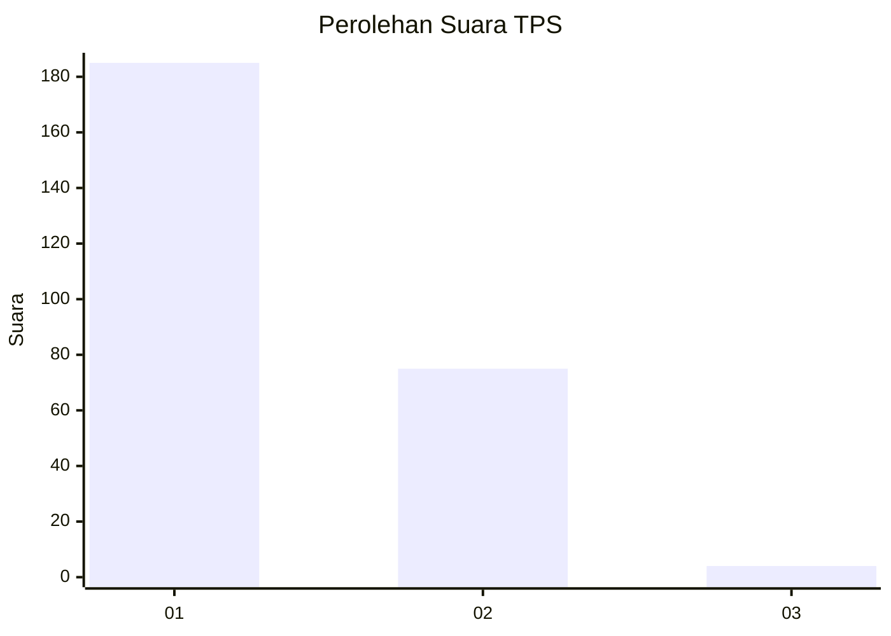
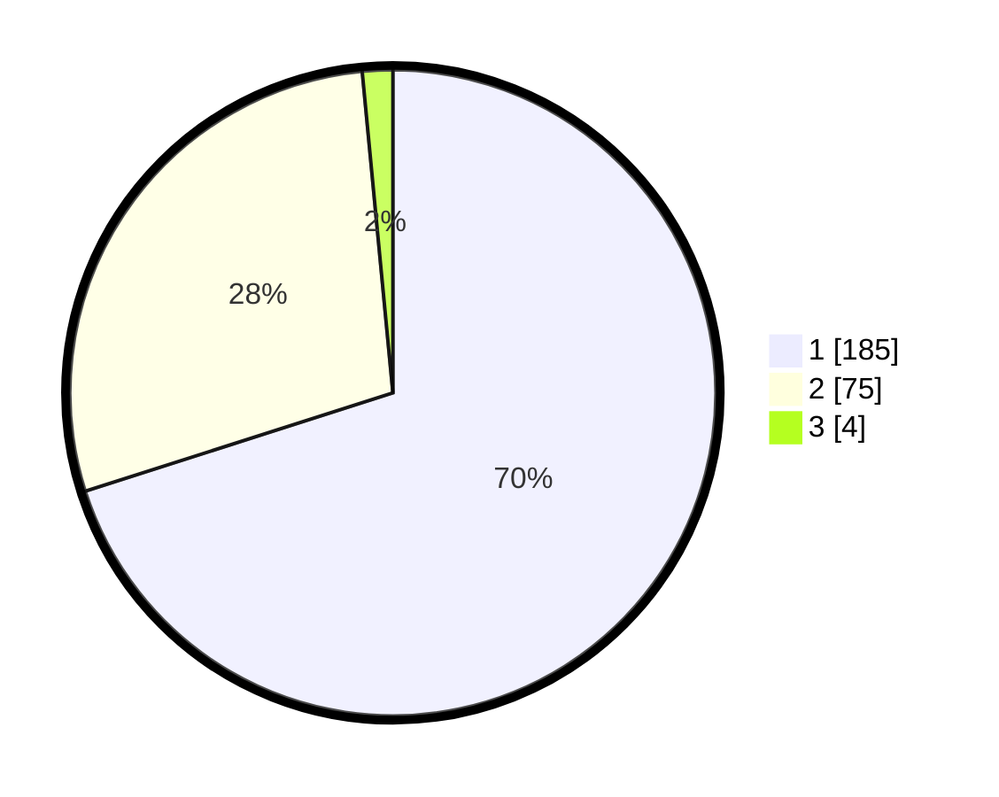

# Hasil

## Grafik

## Tabel

| No. | Nama Paslon    | Suara | Suara (raw) | Persentase |
|:--- |:-------------- | -----:| -----------:| ----------:|
| 1   | ANIES MUHAIMIN | 185   | [185][p-1]  | 70,08      |
| 2   | PRABOWO GIBRAN | 75    | [75][p-2]   | 28,41      |
| 3   | GANJAR MAHFUD  | 4     | [4][p-3]    | 1,52       |

[p-1]: https://github.com/gigit-pemilu/pemilu-2024-11-aceh/blob/main/pilpres/hitung-suara/sub/11-aceh/sub/71-kota-banda-aceh/sub/04-syiah-kuala/sub/2001-jeulingke/sub/006-tps/sub/paslon-1.txt
[p-2]: https://github.com/gigit-pemilu/pemilu-2024-11-aceh/blob/main/pilpres/hitung-suara/sub/11-aceh/sub/71-kota-banda-aceh/sub/04-syiah-kuala/sub/2001-jeulingke/sub/006-tps/sub/paslon-2.txt
[p-3]: https://github.com/gigit-pemilu/pemilu-2024-11-aceh/blob/main/pilpres/hitung-suara/sub/11-aceh/sub/71-kota-banda-aceh/sub/04-syiah-kuala/sub/2001-jeulingke/sub/006-tps/sub/paslon-3.txt

## Foto C Plano

https://sirekap-obj-formc.kpu.go.id/b650/pemilu/ppwp/11/71/04/20/01/1171042001006-20240222-114941--b4809069-8b47-42ec-9cfe-41db3a94fea2.jpg

https://sirekap-obj-formc.kpu.go.id/b650/pemilu/ppwp/11/71/04/20/01/1171042001006-20240222-115234--60f93ad8-2c0f-4ef5-a106-2d6e47c7af07.jpg

https://sirekap-obj-formc.kpu.go.id/b650/pemilu/ppwp/11/71/04/20/01/1171042001006-20240222-115447--f6e1884b-2bdb-40ec-971c-219873ffd743.jpg

## Metadata

| Key        | Value               |
| ---------- | ------------------- |
| Time Stamp | 2024-02-22 18:00:00 |

## DATA PEMILIH TETAP

Jumlah pemilih dalam DPT: **284**.
 * L: **139**.
 * P: **145**.

## DATA PENGGUNA HAK PILIH

Jumlah pengguna hak pilih dalam DPT: **198**.
 * L: **93**.
 * P: **105**.

Jumlah pengguna hak pilih dalam DPTb: **8**.
 * L: **3**.
 * P: **5**.

Jumlah pengguna hak pilih dalam DPK: **18**.
 * L: **8**.
 * P: **10**.

Jumlah pengguna hak pilih: **224**.
 * L: **105**.
 * P: **119**.

## JUMLAH SUARA SAH DAN TIDAK SAH

JUMLAH SELURUH SUARA SAH: **224**.

JUMLAH SUARA TIDAK SAH: **0**.

JUMLAH SELURUH SUARA SAH DAN SUARA TIDAK SAH: **224**.

