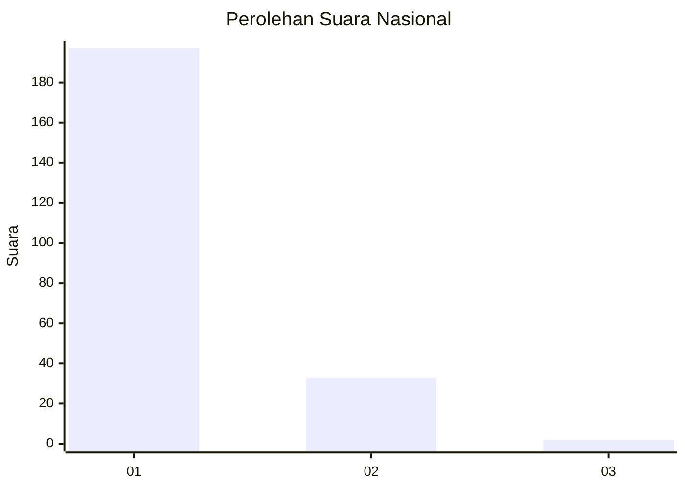
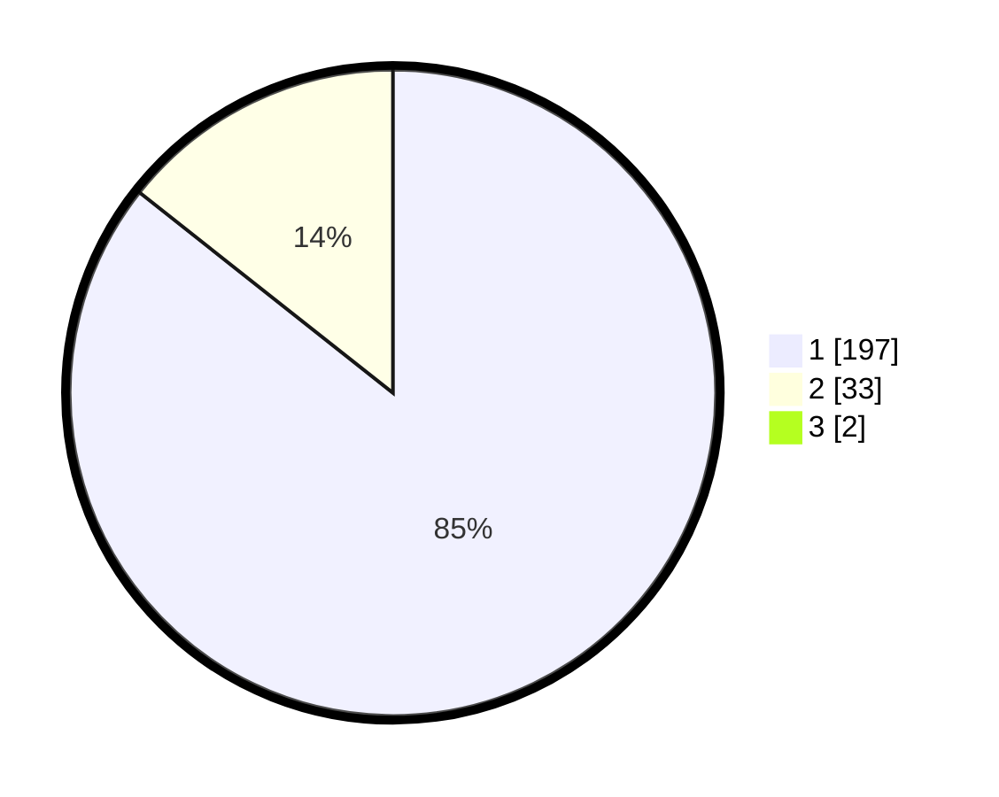

# Hasil

## Grafik

## Tabel

| No. | Nama Paslon    | Suara | Suara (raw) | Persentase |
|:--- |:-------------- | -----:| -----------:| ----------:|
| 1   | ANIES MUHAIMIN | 197   | [197][p-1]  | 84,91      |
| 2   | PRABOWO GIBRAN | 33    | [33][p-2]   | 14,22      |
| 3   | GANJAR MAHFUD  | 2     | [2][p-3]    | 0,86       |

[p-1]: https://github.com/gigit-pemilu/pemilu-2024/blob/main/pilpres/hitung-suara/sub/11-aceh/sub/71-kota-banda-aceh/sub/04-syiah-kuala/sub/2005-ie-masen-kayee-adang/sub/001-tps/sub/paslon-1.txt
[p-2]: https://github.com/gigit-pemilu/pemilu-2024/blob/main/pilpres/hitung-suara/sub/11-aceh/sub/71-kota-banda-aceh/sub/04-syiah-kuala/sub/2005-ie-masen-kayee-adang/sub/001-tps/sub/paslon-2.txt
[p-3]: https://github.com/gigit-pemilu/pemilu-2024/blob/main/pilpres/hitung-suara/sub/11-aceh/sub/71-kota-banda-aceh/sub/04-syiah-kuala/sub/2005-ie-masen-kayee-adang/sub/001-tps/sub/paslon-3.txt

## Foto C Plano

https://sirekap-obj-formc.kpu.go.id/95d5/pemilu/ppwp/11/71/04/20/05/1171042005001-20240216-094242--a22b5123-abcd-4763-88b4-eea31a50b95e.jpg

https://sirekap-obj-formc.kpu.go.id/95d5/pemilu/ppwp/11/71/04/20/05/1171042005001-20240217-100147--4dcf8349-7595-47ab-b8f3-a892c0a86be0.jpg

https://sirekap-obj-formc.kpu.go.id/95d5/pemilu/ppwp/11/71/04/20/05/1171042005001-20240217-100304--78137424-d217-401b-8f6c-85b38e646feb.jpg

## Metadata

| Key        | Value               |
| ---------- | ------------------- |
| Time Stamp | 2024-02-17 10:30:03 |

