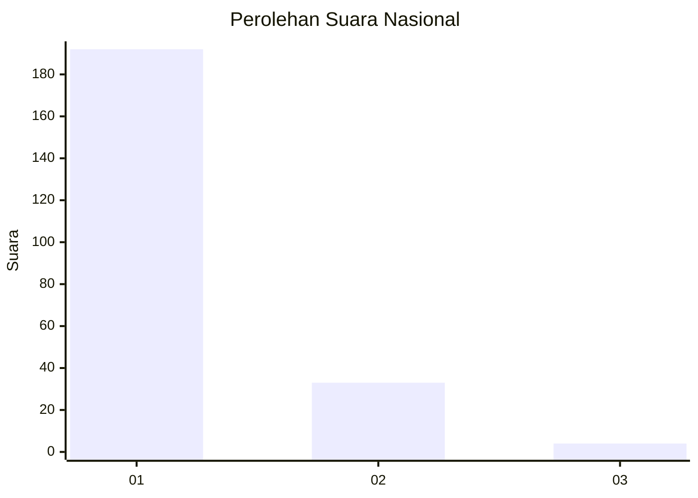
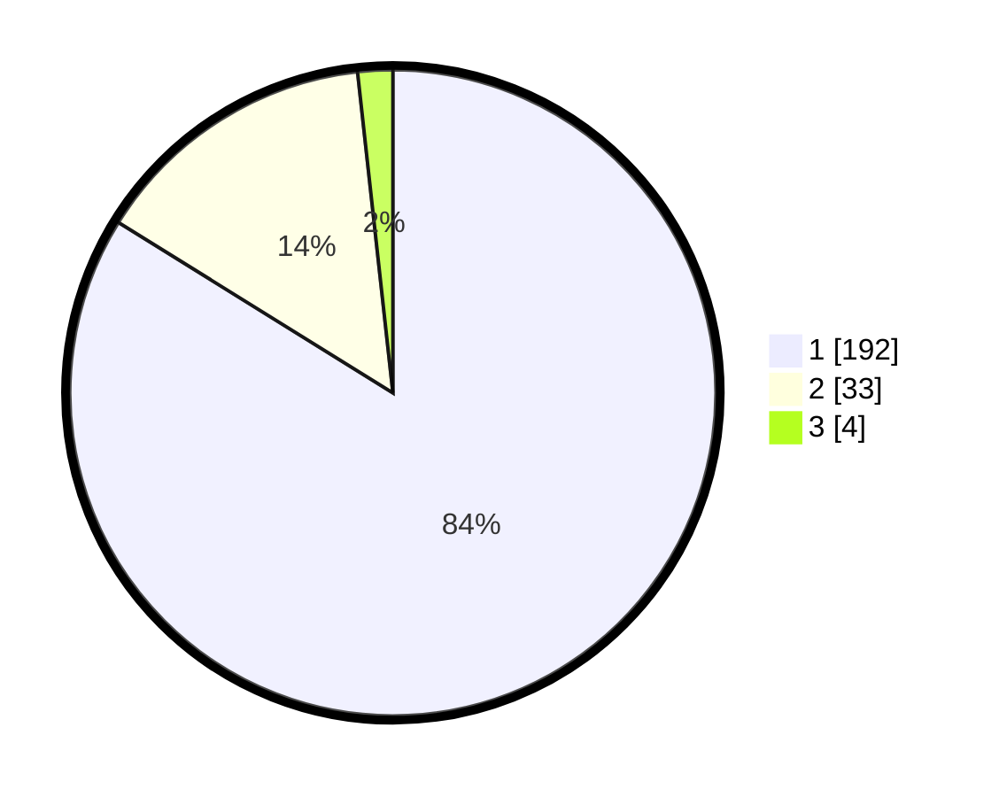

# Hasil

## Grafik

## Tabel

| No. | Nama Paslon    | Suara | Suara (raw) | Persentase |
|:--- |:-------------- | -----:| -----------:| ----------:|
| 1   | ANIES MUHAIMIN | 192   | [192][p-1]  | 83,84      |
| 2   | PRABOWO GIBRAN | 33    | [33][p-2]   | 14,41      |
| 3   | GANJAR MAHFUD  | 4     | [4][p-3]    | 1,75       |

[p-1]: https://github.com/gigit-pemilu/pemilu-2024/blob/main/pilpres/hitung-suara/sub/11-aceh/sub/71-kota-banda-aceh/sub/04-syiah-kuala/sub/2005-ie-masen-kayee-adang/sub/004-tps/sub/paslon-1.txt
[p-2]: https://github.com/gigit-pemilu/pemilu-2024/blob/main/pilpres/hitung-suara/sub/11-aceh/sub/71-kota-banda-aceh/sub/04-syiah-kuala/sub/2005-ie-masen-kayee-adang/sub/004-tps/sub/paslon-2.txt
[p-3]: https://github.com/gigit-pemilu/pemilu-2024/blob/main/pilpres/hitung-suara/sub/11-aceh/sub/71-kota-banda-aceh/sub/04-syiah-kuala/sub/2005-ie-masen-kayee-adang/sub/004-tps/sub/paslon-3.txt

## Foto C Plano

https://sirekap-obj-formc.kpu.go.id/0c5a/pemilu/ppwp/11/71/04/20/05/1171042005004-20240217-172708--7b87cd98-c801-430b-811a-f9bedac96a84.jpg

https://sirekap-obj-formc.kpu.go.id/0c5a/pemilu/ppwp/11/71/04/20/05/1171042005004-20240217-172835--38e1cf67-ed50-436b-a089-e8dd1c693f28.jpg

https://sirekap-obj-formc.kpu.go.id/0c5a/pemilu/ppwp/11/71/04/20/05/1171042005004-20240217-172948--a74f845c-aebc-4d0f-94eb-0b9b673e6e4c.jpg

## Metadata

| Key        | Value               |
| ---------- | ------------------- |
| Time Stamp | 2024-02-17 18:00:00 |

