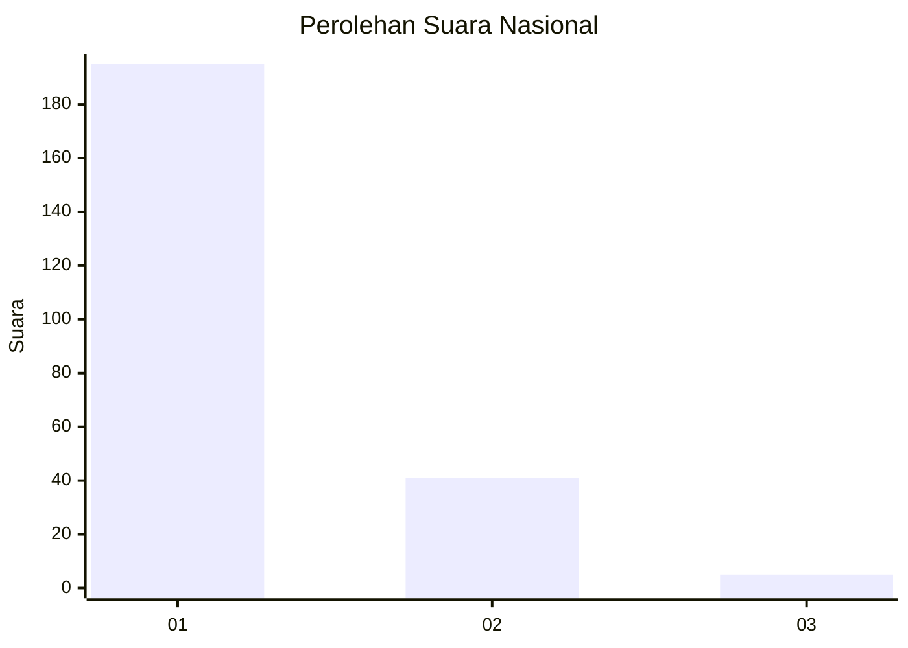
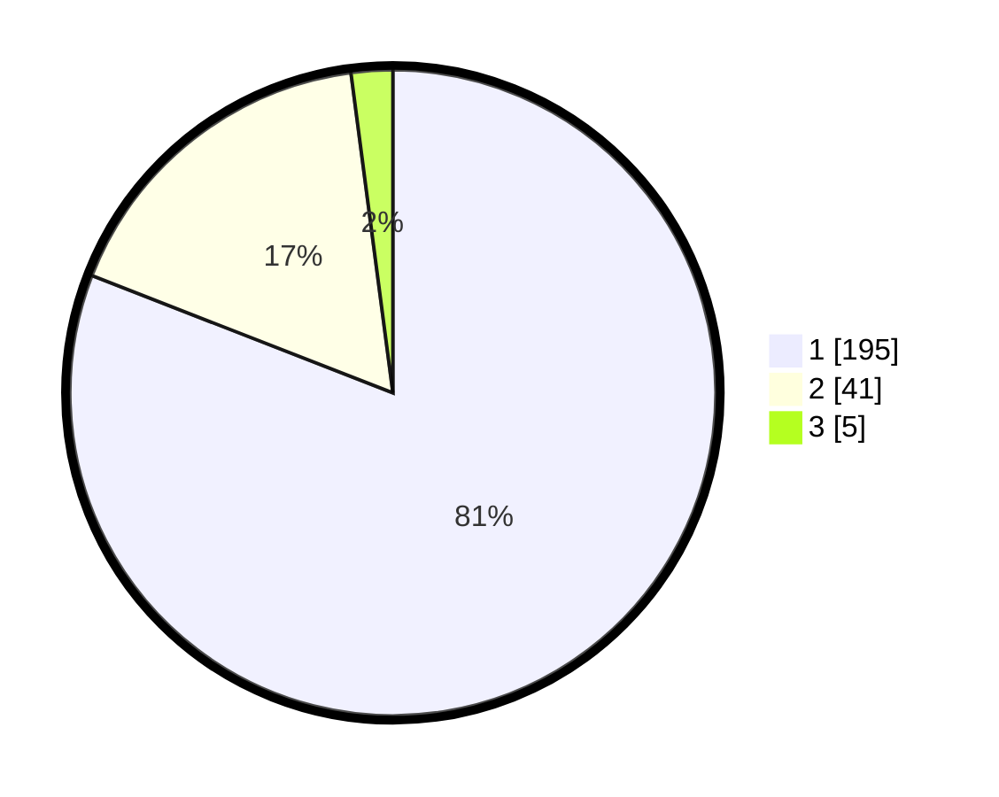

# Hasil

## Grafik

## Tabel

| No. | Nama Paslon    | Suara | Suara (raw) | Persentase |
|:--- |:-------------- | -----:| -----------:| ----------:|
| 1   | ANIES MUHAIMIN | 195   | [195][p-1]  | 80,91      |
| 2   | PRABOWO GIBRAN | 41    | [41][p-2]   | 17,01      |
| 3   | GANJAR MAHFUD  | 5     | [5][p-3]    | 2,07       |

[p-1]: https://github.com/gigit-pemilu/pemilu-2024/blob/main/pilpres/hitung-suara/sub/11-aceh/sub/71-kota-banda-aceh/sub/04-syiah-kuala/sub/2009-rukoh/sub/005-tps/sub/paslon-1.txt
[p-2]: https://github.com/gigit-pemilu/pemilu-2024/blob/main/pilpres/hitung-suara/sub/11-aceh/sub/71-kota-banda-aceh/sub/04-syiah-kuala/sub/2009-rukoh/sub/005-tps/sub/paslon-2.txt
[p-3]: https://github.com/gigit-pemilu/pemilu-2024/blob/main/pilpres/hitung-suara/sub/11-aceh/sub/71-kota-banda-aceh/sub/04-syiah-kuala/sub/2009-rukoh/sub/005-tps/sub/paslon-3.txt

## Foto C Plano

https://sirekap-obj-formc.kpu.go.id/3cba/pemilu/ppwp/11/71/04/20/09/1171042009005-20240218-100137--fb3cbd73-28e1-4338-9160-3aede65b5d8b.jpg

https://sirekap-obj-formc.kpu.go.id/3cba/pemilu/ppwp/11/71/04/20/09/1171042009005-20240218-095527--c255b4c1-1e3e-4b1f-85af-b47e96f9be96.jpg

https://sirekap-obj-formc.kpu.go.id/3cba/pemilu/ppwp/11/71/04/20/09/1171042009005-20240218-100046--2287987e-14be-4ad0-9980-0a80d2b81c11.jpg

## Metadata

| Key        | Value               |
| ---------- | ------------------- |
| Time Stamp | 2024-02-19 06:16:00 |

