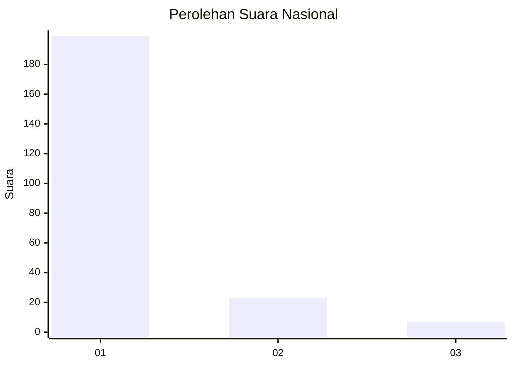
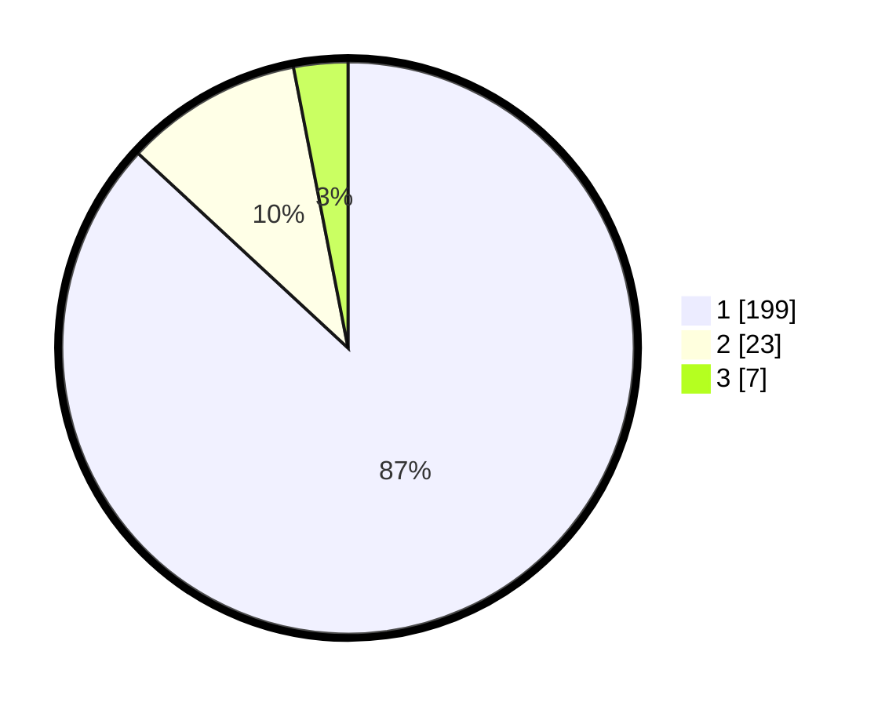

# Hasil

## Grafik

## Tabel

| No. | Nama Paslon    | Suara | Suara (raw) | Persentase |
|:--- |:-------------- | -----:| -----------:| ----------:|
| 1   | ANIES MUHAIMIN | 199   | [199][p-1]  | 86,90      |
| 2   | PRABOWO GIBRAN | 23    | [23][p-2]   | 10,04      |
| 3   | GANJAR MAHFUD  | 7     | [7][p-3]    | 3,06       |

[p-1]: https://github.com/gigit-pemilu/pemilu-2024/blob/main/pilpres/hitung-suara/sub/11-aceh/sub/71-kota-banda-aceh/sub/05-lueng-bata/sub/2001-lueng-bata/sub/001-tps/sub/paslon-1.txt
[p-2]: https://github.com/gigit-pemilu/pemilu-2024/blob/main/pilpres/hitung-suara/sub/11-aceh/sub/71-kota-banda-aceh/sub/05-lueng-bata/sub/2001-lueng-bata/sub/001-tps/sub/paslon-2.txt
[p-3]: https://github.com/gigit-pemilu/pemilu-2024/blob/main/pilpres/hitung-suara/sub/11-aceh/sub/71-kota-banda-aceh/sub/05-lueng-bata/sub/2001-lueng-bata/sub/001-tps/sub/paslon-3.txt

## Foto C Plano

https://sirekap-obj-formc.kpu.go.id/80a0/pemilu/ppwp/11/71/05/20/01/1171052001001-20240214-195054--bba08cc2-8c6f-4479-be37-6fb84f4445b5.jpg

https://sirekap-obj-formc.kpu.go.id/80a0/pemilu/ppwp/11/71/05/20/01/1171052001001-20240214-195120--1295055b-e3c3-46b5-b57f-50fa86cd7327.jpg

https://sirekap-obj-formc.kpu.go.id/80a0/pemilu/ppwp/11/71/05/20/01/1171052001001-20240214-195139--15081acb-1353-4e9e-b8f0-befafee530be.jpg

## Metadata

| Key        | Value               |
| ---------- | ------------------- |
| Time Stamp | 2024-02-15 00:41:44 |

## DATA PEMILIH TETAP

Jumlah pemilih dalam DPT: **267**.
 * L: **132**.
 * P: **135**.

## DATA PENGGUNA HAK PILIH

Jumlah pengguna hak pilih dalam DPT: **218**.
 * L: **100**.
 * P: **118**.

Jumlah pengguna hak pilih dalam DPTb: **17**.
 * L: **9**.
 * P: **8**.

Jumlah pengguna hak pilih dalam DPK: **1**.
 * L: **0**.
 * P: **1**.

Jumlah pengguna hak pilih: **236**.
 * L: **109**.
 * P: **127**.

## JUMLAH SUARA SAH DAN TIDAK SAH

JUMLAH SELURUH SUARA SAH: **229**.

JUMLAH SUARA TIDAK SAH: **7**.

JUMLAH SELURUH SUARA SAH DAN SUARA TIDAK SAH: **236**.

