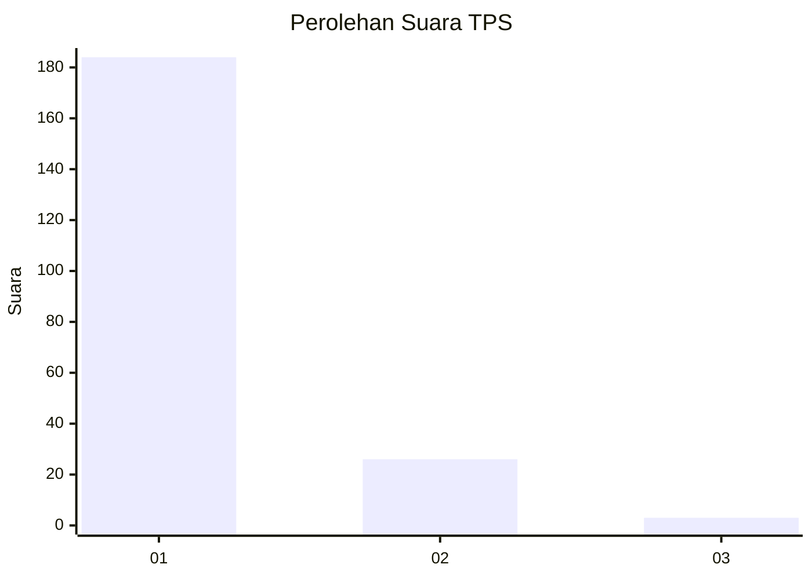
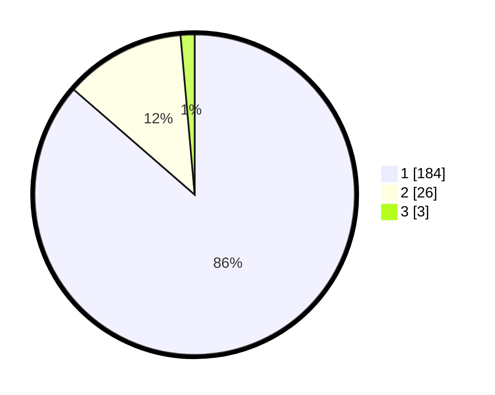

# Hasil

## Grafik

## Tabel

| No. | Nama Paslon    | Suara | Suara (raw) | Persentase |
|:--- |:-------------- | -----:| -----------:| ----------:|
| 1   | ANIES MUHAIMIN | 184   | [184][p-1]  | 86,38      |
| 2   | PRABOWO GIBRAN | 26    | [26][p-2]   | 12,21      |
| 3   | GANJAR MAHFUD  | 3     | [3][p-3]    | 1,41       |

[p-1]: https://github.com/gigit-pemilu/pemilu-2024-11-aceh/blob/main/pilpres/hitung-suara/sub/11-aceh/sub/71-kota-banda-aceh/sub/05-lueng-bata/sub/2001-lueng-bata/sub/005-tps/sub/paslon-1.txt
[p-2]: https://github.com/gigit-pemilu/pemilu-2024-11-aceh/blob/main/pilpres/hitung-suara/sub/11-aceh/sub/71-kota-banda-aceh/sub/05-lueng-bata/sub/2001-lueng-bata/sub/005-tps/sub/paslon-2.txt
[p-3]: https://github.com/gigit-pemilu/pemilu-2024-11-aceh/blob/main/pilpres/hitung-suara/sub/11-aceh/sub/71-kota-banda-aceh/sub/05-lueng-bata/sub/2001-lueng-bata/sub/005-tps/sub/paslon-3.txt

## Foto C Plano

https://sirekap-obj-formc.kpu.go.id/041e/pemilu/ppwp/11/71/05/20/01/1171052001005-20240217-151911--b9c9719d-e362-43b4-bbe8-270293592b74.jpg

https://sirekap-obj-formc.kpu.go.id/041e/pemilu/ppwp/11/71/05/20/01/1171052001005-20240217-152108--a8e27130-101d-4dc4-9eb4-0bb64f28719e.jpg

https://sirekap-obj-formc.kpu.go.id/041e/pemilu/ppwp/11/71/05/20/01/1171052001005-20240217-152333--185d0d24-6807-4fa1-92ce-d6e8bc64ed21.jpg

## Metadata

| Key        | Value               |
| ---------- | ------------------- |
| Time Stamp | 2024-02-17 18:30:00 |

