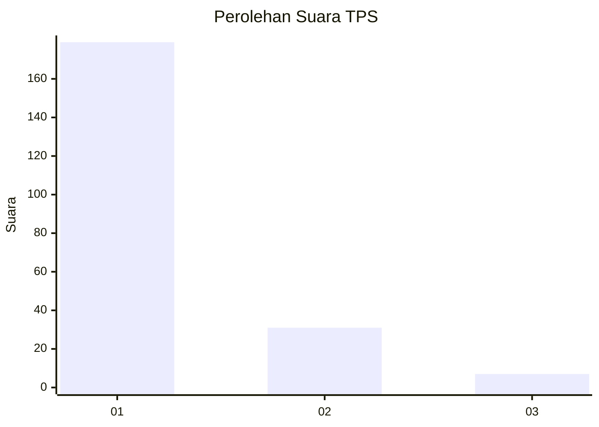
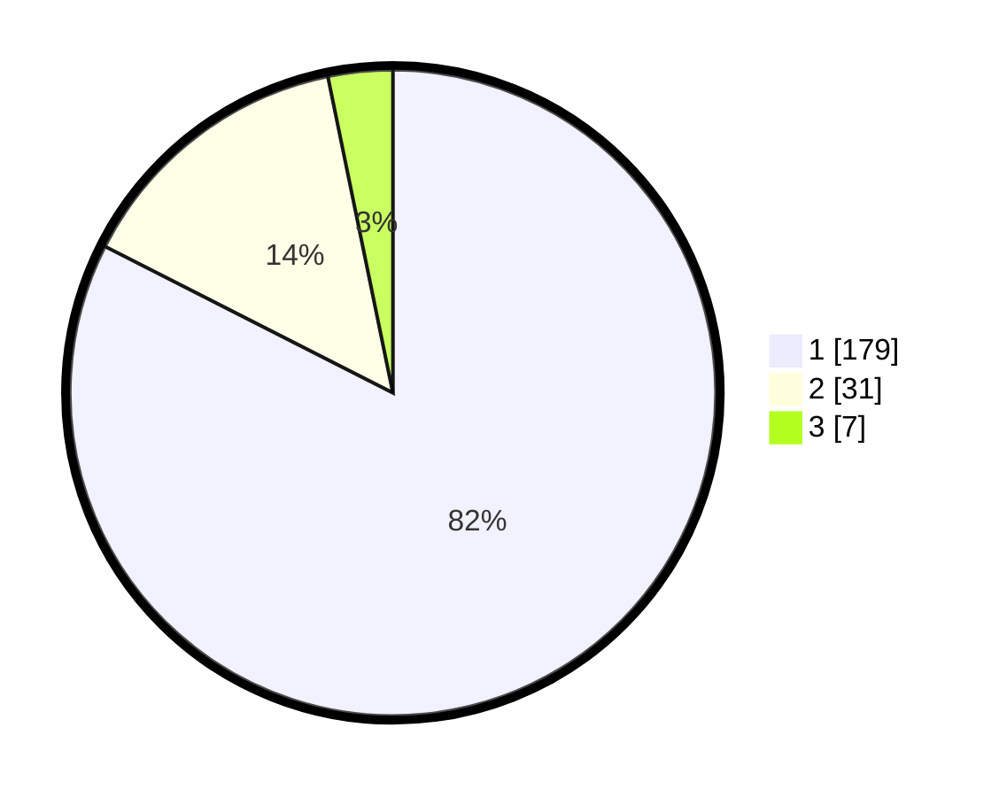

# Hasil

## Grafik

## Tabel

| No. | Nama Paslon    | Suara | Suara (raw) | Persentase |
|:--- |:-------------- | -----:| -----------:| ----------:|
| 1   | ANIES MUHAIMIN | 179   | [179][p-1]  | 82,49      |
| 2   | PRABOWO GIBRAN | 31    | [31][p-2]   | 14,29      |
| 3   | GANJAR MAHFUD  | 7     | [7][p-3]    | 3,23       |

[p-1]: https://github.com/gigit-pemilu/pemilu-2024-11-aceh/blob/main/pilpres/hitung-suara/sub/11-aceh/sub/71-kota-banda-aceh/sub/05-lueng-bata/sub/2001-lueng-bata/sub/006-tps/sub/paslon-1.txt
[p-2]: https://github.com/gigit-pemilu/pemilu-2024-11-aceh/blob/main/pilpres/hitung-suara/sub/11-aceh/sub/71-kota-banda-aceh/sub/05-lueng-bata/sub/2001-lueng-bata/sub/006-tps/sub/paslon-2.txt
[p-3]: https://github.com/gigit-pemilu/pemilu-2024-11-aceh/blob/main/pilpres/hitung-suara/sub/11-aceh/sub/71-kota-banda-aceh/sub/05-lueng-bata/sub/2001-lueng-bata/sub/006-tps/sub/paslon-3.txt

## Foto C Plano

https://sirekap-obj-formc.kpu.go.id/80ad/pemilu/ppwp/11/71/05/20/01/1171052001006-20240217-161423--aed716ae-25be-4e2d-8891-ef8cbe6fb3c9.jpg

https://sirekap-obj-formc.kpu.go.id/80ad/pemilu/ppwp/11/71/05/20/01/1171052001006-20240217-161511--873b47aa-3d50-41be-bd46-29a6ad8ad5e1.jpg

https://sirekap-obj-formc.kpu.go.id/80ad/pemilu/ppwp/11/71/05/20/01/1171052001006-20240217-161617--b6971b91-dd8f-42ad-8742-f943370d2ea8.jpg

## Metadata

| Key        | Value               |
| ---------- | ------------------- |
| Time Stamp | 2024-02-17 18:30:00 |

