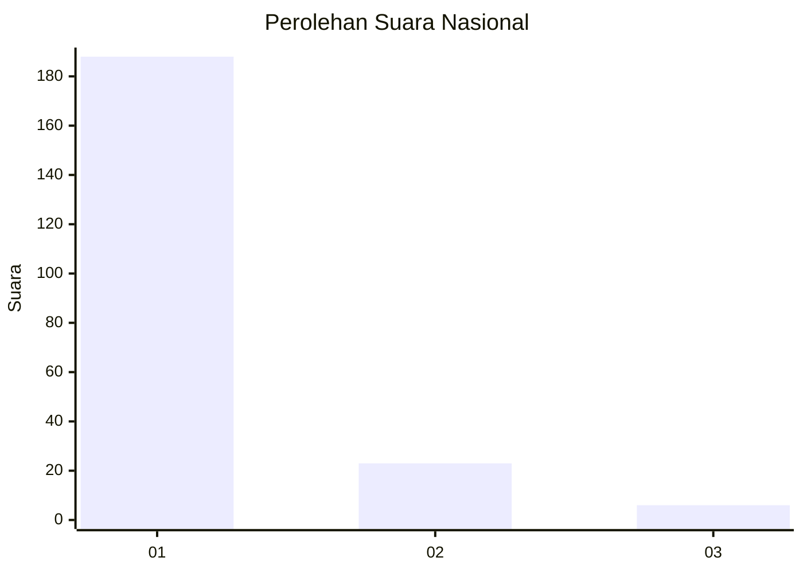
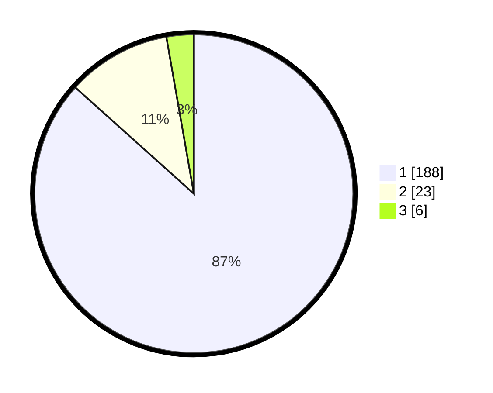

# Hasil

## Grafik

## Tabel

| No. | Nama Paslon    | Suara | Suara (raw) | Persentase |
|:--- |:-------------- | -----:| -----------:| ----------:|
| 1   | ANIES MUHAIMIN | 188   | [188][p-1]  | 86,64      |
| 2   | PRABOWO GIBRAN | 23    | [23][p-2]   | 10,60      |
| 3   | GANJAR MAHFUD  | 6     | [6][p-3]    | 2,76       |

[p-1]: https://github.com/gigit-pemilu/pemilu-2024/blob/main/pilpres/hitung-suara/sub/11-aceh/sub/71-kota-banda-aceh/sub/05-lueng-bata/sub/2001-lueng-bata/sub/007-tps/sub/paslon-1.txt
[p-2]: https://github.com/gigit-pemilu/pemilu-2024/blob/main/pilpres/hitung-suara/sub/11-aceh/sub/71-kota-banda-aceh/sub/05-lueng-bata/sub/2001-lueng-bata/sub/007-tps/sub/paslon-2.txt
[p-3]: https://github.com/gigit-pemilu/pemilu-2024/blob/main/pilpres/hitung-suara/sub/11-aceh/sub/71-kota-banda-aceh/sub/05-lueng-bata/sub/2001-lueng-bata/sub/007-tps/sub/paslon-3.txt

## Foto C Plano

https://sirekap-obj-formc.kpu.go.id/526d/pemilu/ppwp/11/71/05/20/01/1171052001007-20240217-171044--42ec1439-1f80-4fae-8dd5-7c0b692017ee.jpg

https://sirekap-obj-formc.kpu.go.id/526d/pemilu/ppwp/11/71/05/20/01/1171052001007-20240217-171117--f36a54fc-b7a3-4096-80d3-fb79e7111b23.jpg

https://sirekap-obj-formc.kpu.go.id/526d/pemilu/ppwp/11/71/05/20/01/1171052001007-20240217-171142--ba412002-bb4f-420f-89fb-1338d22a6e24.jpg

## Metadata

| Key        | Value               |
| ---------- | ------------------- |
| Time Stamp | 2024-02-17 18:30:00 |

