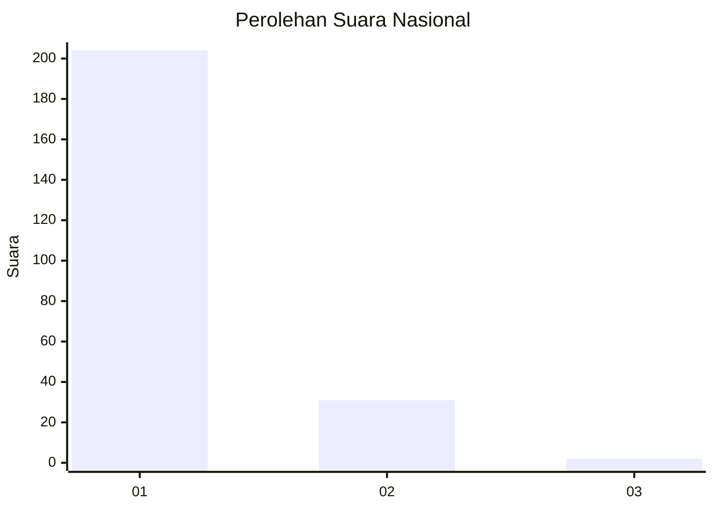
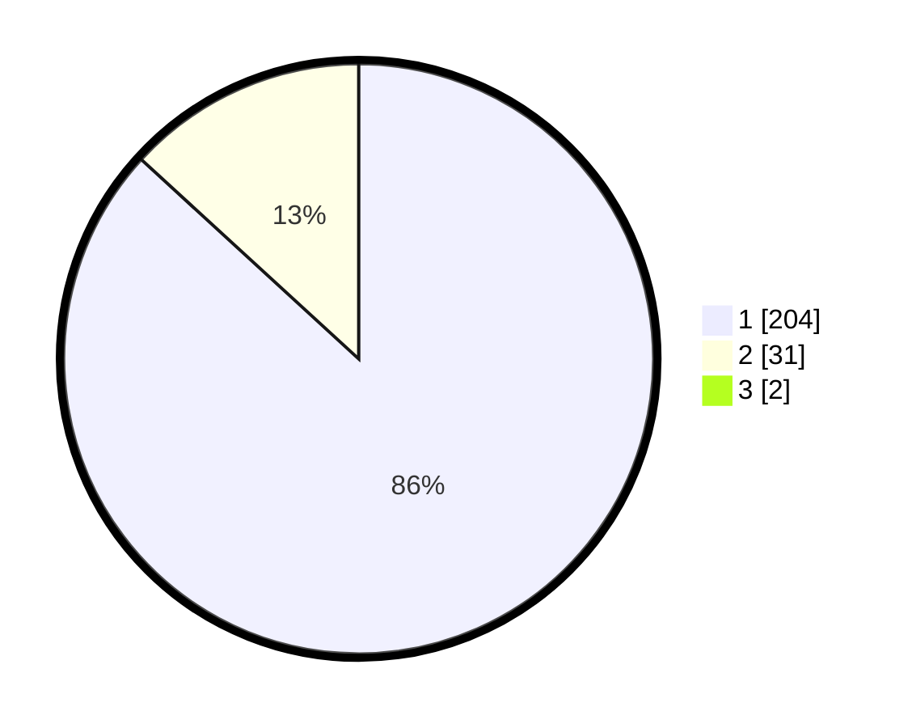

# Hasil

## Grafik

## Tabel

| No. | Nama Paslon    | Suara | Suara (raw) | Persentase |
|:--- |:-------------- | -----:| -----------:| ----------:|
| 1   | ANIES MUHAIMIN | 204   | [204][p-1]  | 86,08      |
| 2   | PRABOWO GIBRAN | 31    | [31][p-2]   | 13,08      |
| 3   | GANJAR MAHFUD  | 2     | [2][p-3]    | 0,84       |

[p-1]: https://github.com/gigit-pemilu/pemilu-2024/blob/main/pilpres/hitung-suara/sub/11-aceh/sub/71-kota-banda-aceh/sub/05-lueng-bata/sub/2001-lueng-bata/sub/008-tps/sub/paslon-1.txt
[p-2]: https://github.com/gigit-pemilu/pemilu-2024/blob/main/pilpres/hitung-suara/sub/11-aceh/sub/71-kota-banda-aceh/sub/05-lueng-bata/sub/2001-lueng-bata/sub/008-tps/sub/paslon-2.txt
[p-3]: https://github.com/gigit-pemilu/pemilu-2024/blob/main/pilpres/hitung-suara/sub/11-aceh/sub/71-kota-banda-aceh/sub/05-lueng-bata/sub/2001-lueng-bata/sub/008-tps/sub/paslon-3.txt

## Foto C Plano

https://sirekap-obj-formc.kpu.go.id/da9d/pemilu/ppwp/11/71/05/20/01/1171052001008-20240217-200715--8af05b5a-fd07-4a8b-9596-648a47bc34b3.jpg

https://sirekap-obj-formc.kpu.go.id/da9d/pemilu/ppwp/11/71/05/20/01/1171052001008-20240217-200745--18c8784b-8350-4c47-ab3d-06a5129524d4.jpg

https://sirekap-obj-formc.kpu.go.id/da9d/pemilu/ppwp/11/71/05/20/01/1171052001008-20240217-200818--3654e3a0-5fef-4cdd-8ba8-5301e49f931b.jpg

## Metadata

| Key        | Value               |
| ---------- | ------------------- |
| Time Stamp | 2024-02-19 06:16:00 |

