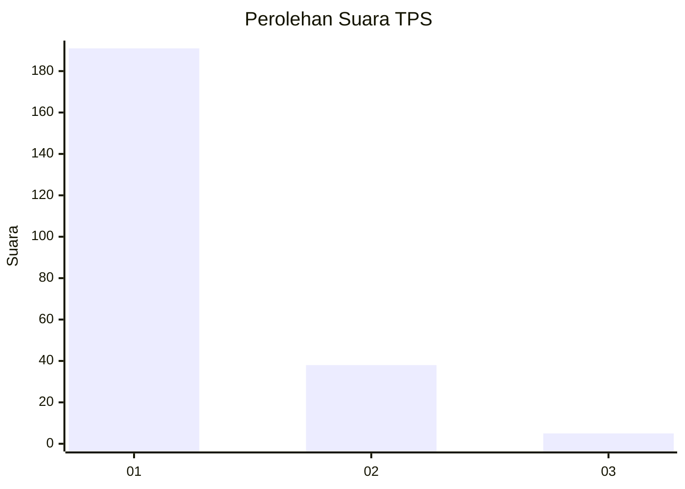
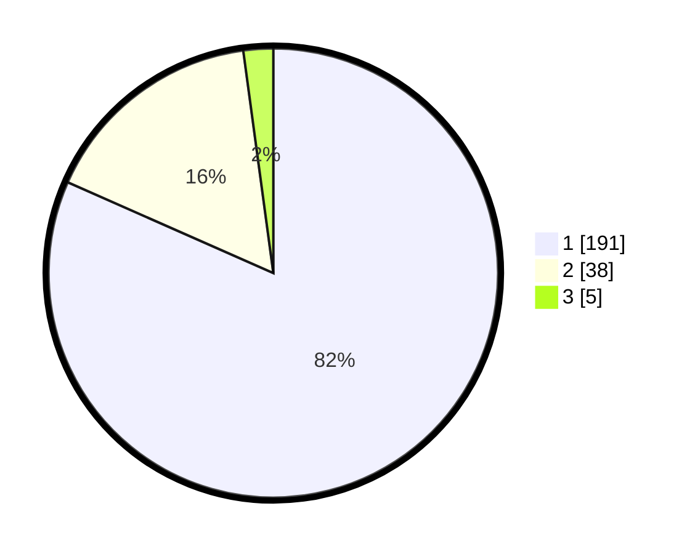

# Hasil

## Grafik

## Tabel

| No. | Nama Paslon    | Suara | Suara (raw) | Persentase |
|:--- |:-------------- | -----:| -----------:| ----------:|
| 1   | ANIES MUHAIMIN | 191   | [191][p-1]  | 81,62      |
| 2   | PRABOWO GIBRAN | 38    | [38][p-2]   | 16,24      |
| 3   | GANJAR MAHFUD  | 5     | [5][p-3]    | 2,14       |

[p-1]: https://github.com/gigit-pemilu/pemilu-2024-11-aceh/blob/main/pilpres/hitung-suara/sub/11-aceh/sub/71-kota-banda-aceh/sub/05-lueng-bata/sub/2002-cot-mesjid/sub/004-tps/sub/paslon-1.txt
[p-2]: https://github.com/gigit-pemilu/pemilu-2024-11-aceh/blob/main/pilpres/hitung-suara/sub/11-aceh/sub/71-kota-banda-aceh/sub/05-lueng-bata/sub/2002-cot-mesjid/sub/004-tps/sub/paslon-2.txt
[p-3]: https://github.com/gigit-pemilu/pemilu-2024-11-aceh/blob/main/pilpres/hitung-suara/sub/11-aceh/sub/71-kota-banda-aceh/sub/05-lueng-bata/sub/2002-cot-mesjid/sub/004-tps/sub/paslon-3.txt

## Foto C Plano

https://sirekap-obj-formc.kpu.go.id/6433/pemilu/ppwp/11/71/05/20/02/1171052002004-20240215-023937--de48dfd5-2088-4a10-b99e-87682df1163d.jpg

https://sirekap-obj-formc.kpu.go.id/6433/pemilu/ppwp/11/71/05/20/02/1171052002004-20240222-110001--50dfe4ff-7fa4-4358-a340-1d74921a0aae.jpg

https://sirekap-obj-formc.kpu.go.id/6433/pemilu/ppwp/11/71/05/20/02/1171052002004-20240222-102420--8519d3c5-b807-4295-80cb-e58f81771851.jpg

## Metadata

| Key        | Value               |
| ---------- | ------------------- |
| Time Stamp | 2024-02-24 22:31:28 |

