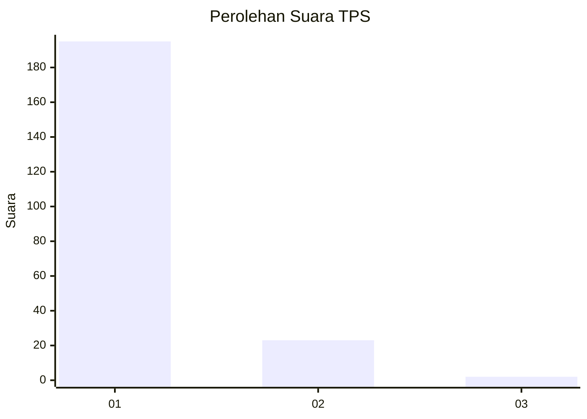
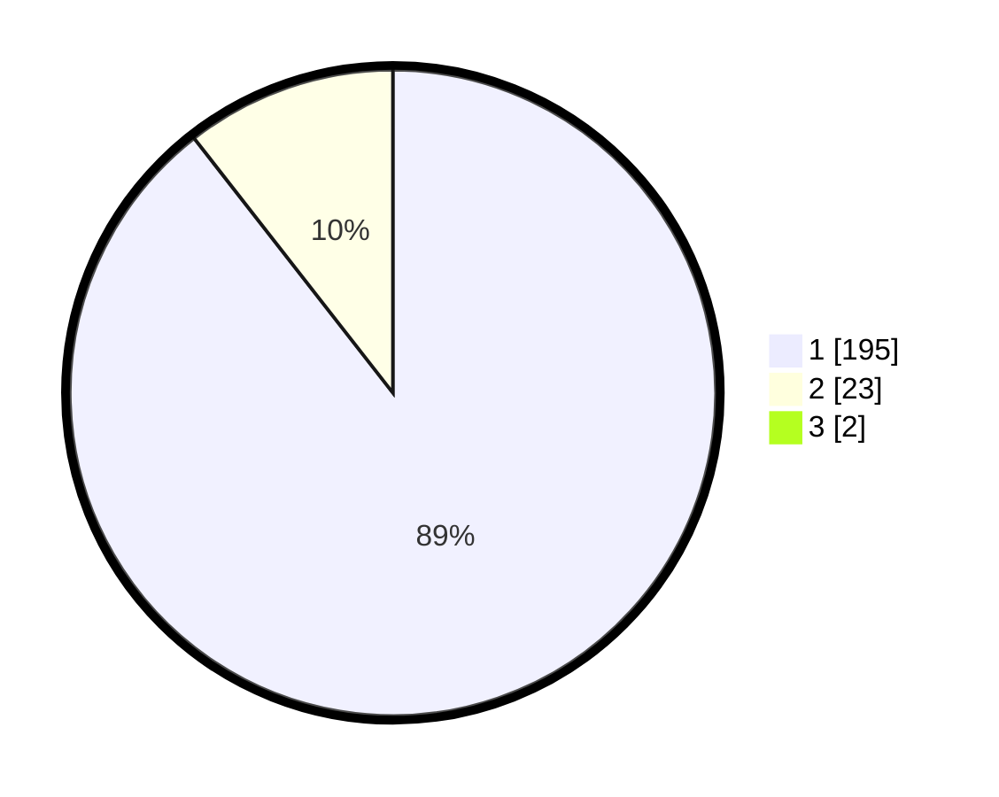

# Hasil

## Grafik

## Tabel

| No. | Nama Paslon    | Suara | Suara (raw) | Persentase |
|:--- |:-------------- | -----:| -----------:| ----------:|
| 1   | ANIES MUHAIMIN | 195   | [195][p-1]  | 88,64      |
| 2   | PRABOWO GIBRAN | 23    | [23][p-2]   | 10,45      |
| 3   | GANJAR MAHFUD  | 2     | [2][p-3]    | 0,91       |

[p-1]: https://github.com/gigit-pemilu/pemilu-2024-11-aceh/blob/main/pilpres/hitung-suara/sub/11-aceh/sub/71-kota-banda-aceh/sub/05-lueng-bata/sub/2002-cot-mesjid/sub/005-tps/sub/paslon-1.txt
[p-2]: https://github.com/gigit-pemilu/pemilu-2024-11-aceh/blob/main/pilpres/hitung-suara/sub/11-aceh/sub/71-kota-banda-aceh/sub/05-lueng-bata/sub/2002-cot-mesjid/sub/005-tps/sub/paslon-2.txt
[p-3]: https://github.com/gigit-pemilu/pemilu-2024-11-aceh/blob/main/pilpres/hitung-suara/sub/11-aceh/sub/71-kota-banda-aceh/sub/05-lueng-bata/sub/2002-cot-mesjid/sub/005-tps/sub/paslon-3.txt

## Foto C Plano

https://sirekap-obj-formc.kpu.go.id/a4f3/pemilu/ppwp/11/71/05/20/02/1171052002005-20240222-113251--bd1a1c63-f972-47e2-ab00-fd780507382b.jpg

https://sirekap-obj-formc.kpu.go.id/a4f3/pemilu/ppwp/11/71/05/20/02/1171052002005-20240222-113344--c980c7c4-a792-431c-90ee-68dd22d5aa56.jpg

https://sirekap-obj-formc.kpu.go.id/a4f3/pemilu/ppwp/11/71/05/20/02/1171052002005-20240222-113549--5346f531-b2e9-4649-a6c1-f1f38b39fc2c.jpg

## Metadata

| Key        | Value               |
| ---------- | ------------------- |
| Time Stamp | 2024-02-24 22:31:28 |

