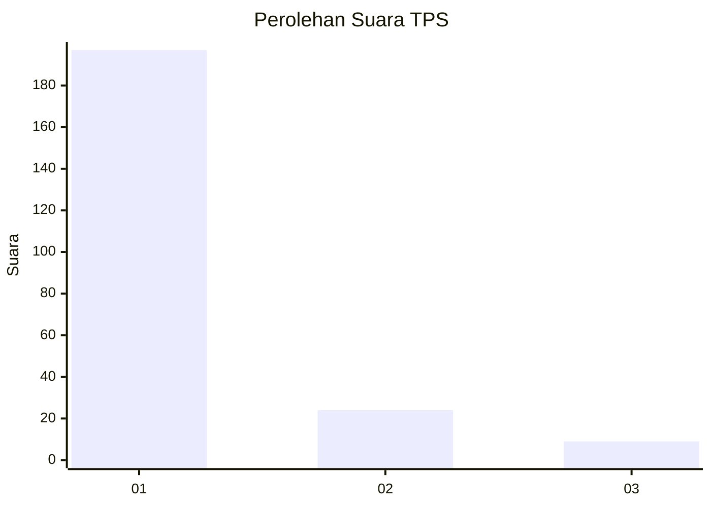
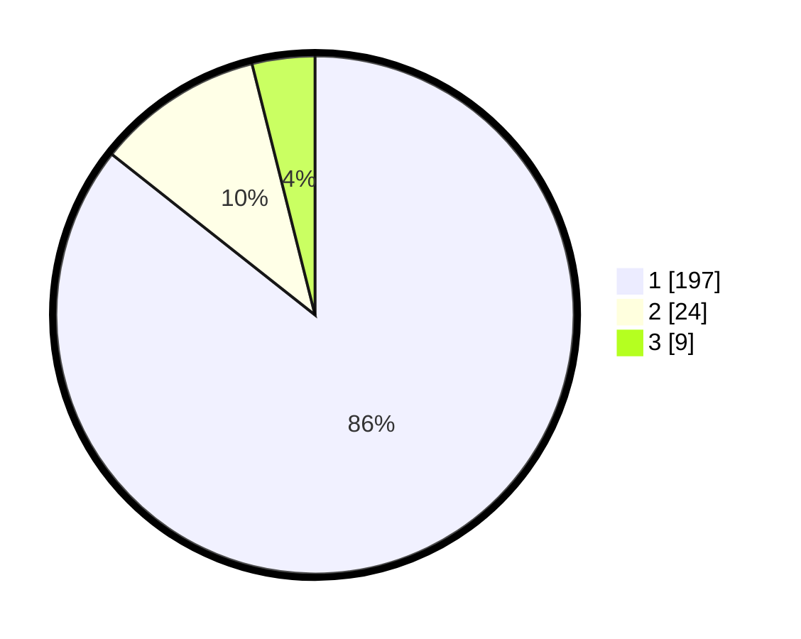

# Hasil

## Grafik

## Tabel

| No. | Nama Paslon    | Suara | Suara (raw) | Persentase |
|:--- |:-------------- | -----:| -----------:| ----------:|
| 1   | ANIES MUHAIMIN | 197   | [197][p-1]  | 85,65      |
| 2   | PRABOWO GIBRAN | 24    | [24][p-2]   | 10,43      |
| 3   | GANJAR MAHFUD  | 9     | [9][p-3]    | 3,91       |

[p-1]: https://github.com/gigit-pemilu/pemilu-2024-11-aceh/blob/main/pilpres/hitung-suara/sub/11-aceh/sub/71-kota-banda-aceh/sub/05-lueng-bata/sub/2002-cot-mesjid/sub/006-tps/sub/paslon-1.txt
[p-2]: https://github.com/gigit-pemilu/pemilu-2024-11-aceh/blob/main/pilpres/hitung-suara/sub/11-aceh/sub/71-kota-banda-aceh/sub/05-lueng-bata/sub/2002-cot-mesjid/sub/006-tps/sub/paslon-2.txt
[p-3]: https://github.com/gigit-pemilu/pemilu-2024-11-aceh/blob/main/pilpres/hitung-suara/sub/11-aceh/sub/71-kota-banda-aceh/sub/05-lueng-bata/sub/2002-cot-mesjid/sub/006-tps/sub/paslon-3.txt

## Foto C Plano

https://sirekap-obj-formc.kpu.go.id/13a9/pemilu/ppwp/11/71/05/20/02/1171052002006-20240222-142253--f1841848-8703-4753-9e6b-40c25807aee9.jpg

https://sirekap-obj-formc.kpu.go.id/13a9/pemilu/ppwp/11/71/05/20/02/1171052002006-20240222-142406--538ae0f7-2061-43e1-8ddc-fae2e9038e11.jpg

https://sirekap-obj-formc.kpu.go.id/13a9/pemilu/ppwp/11/71/05/20/02/1171052002006-20240222-142510--fd962df1-b317-4309-b02a-cf2742a9d0cf.jpg

## Metadata

| Key        | Value               |
| ---------- | ------------------- |
| Time Stamp | 2024-02-24 22:31:28 |

