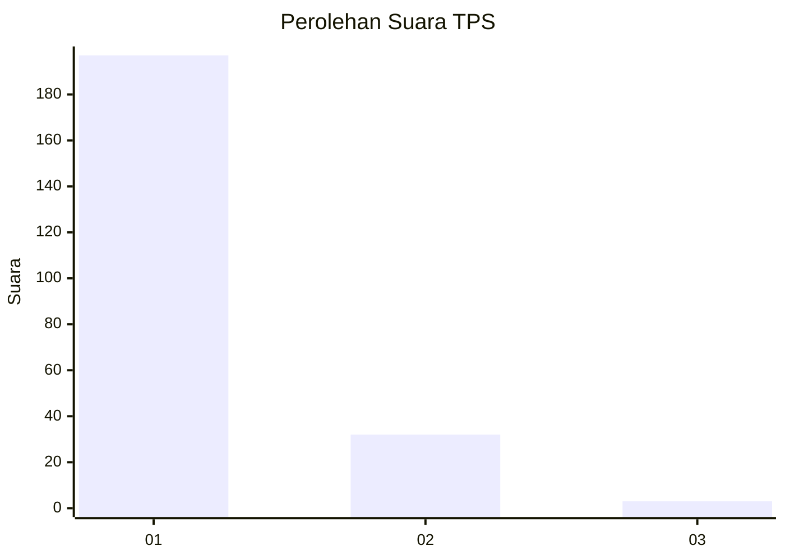
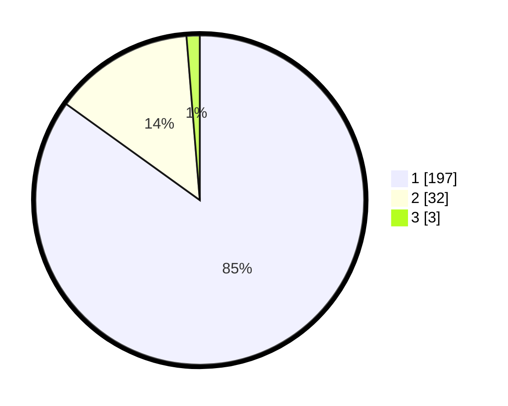

# Hasil

## Grafik

## Tabel

| No. | Nama Paslon    | Suara | Suara (raw) | Persentase |
|:--- |:-------------- | -----:| -----------:| ----------:|
| 1   | ANIES MUHAIMIN | 197   | [197][p-1]  | 84,91      |
| 2   | PRABOWO GIBRAN | 32    | [32][p-2]   | 13,79      |
| 3   | GANJAR MAHFUD  | 3     | [3][p-3]    | 1,29       |

[p-1]: https://github.com/gigit-pemilu/pemilu-2024-11-aceh/blob/main/pilpres/hitung-suara/sub/11-aceh/sub/71-kota-banda-aceh/sub/05-lueng-bata/sub/2002-cot-mesjid/sub/008-tps/sub/paslon-1.txt
[p-2]: https://github.com/gigit-pemilu/pemilu-2024-11-aceh/blob/main/pilpres/hitung-suara/sub/11-aceh/sub/71-kota-banda-aceh/sub/05-lueng-bata/sub/2002-cot-mesjid/sub/008-tps/sub/paslon-2.txt
[p-3]: https://github.com/gigit-pemilu/pemilu-2024-11-aceh/blob/main/pilpres/hitung-suara/sub/11-aceh/sub/71-kota-banda-aceh/sub/05-lueng-bata/sub/2002-cot-mesjid/sub/008-tps/sub/paslon-3.txt

## Foto C Plano

https://sirekap-obj-formc.kpu.go.id/0cc1/pemilu/ppwp/11/71/05/20/02/1171052002008-20240222-160605--8b88016b-131e-49a1-9420-bb7e4ed3798e.jpg

https://sirekap-obj-formc.kpu.go.id/0cc1/pemilu/ppwp/11/71/05/20/02/1171052002008-20240222-160633--895f7e06-827a-450e-981c-c5df4c277096.jpg

https://sirekap-obj-formc.kpu.go.id/0cc1/pemilu/ppwp/11/71/05/20/02/1171052002008-20240222-160807--5b462ce1-d74b-4192-92aa-f2a26636c839.jpg

## Metadata

| Key        | Value               |
| ---------- | ------------------- |
| Time Stamp | 2024-02-24 22:31:28 |

