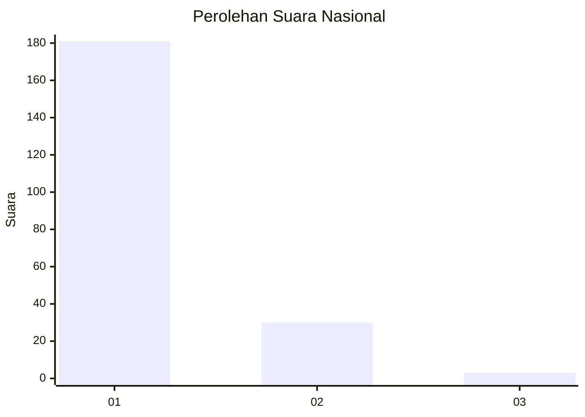
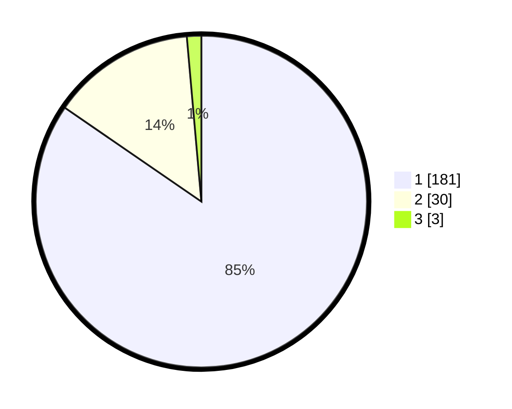

# Hasil

## Grafik

## Tabel

| No. | Nama Paslon    | Suara | Suara (raw) | Persentase |
|:--- |:-------------- | -----:| -----------:| ----------:|
| 1   | ANIES MUHAIMIN | 181   | [181][p-1]  | 84,58      |
| 2   | PRABOWO GIBRAN | 30    | [30][p-2]   | 14,02      |
| 3   | GANJAR MAHFUD  | 3     | [3][p-3]    | 1,40       |

[p-1]: https://github.com/gigit-pemilu/pemilu-2024/blob/main/pilpres/hitung-suara/sub/11-aceh/sub/71-kota-banda-aceh/sub/05-lueng-bata/sub/2002-cot-mesjid/sub/010-tps/sub/paslon-1.txt
[p-2]: https://github.com/gigit-pemilu/pemilu-2024/blob/main/pilpres/hitung-suara/sub/11-aceh/sub/71-kota-banda-aceh/sub/05-lueng-bata/sub/2002-cot-mesjid/sub/010-tps/sub/paslon-2.txt
[p-3]: https://github.com/gigit-pemilu/pemilu-2024/blob/main/pilpres/hitung-suara/sub/11-aceh/sub/71-kota-banda-aceh/sub/05-lueng-bata/sub/2002-cot-mesjid/sub/010-tps/sub/paslon-3.txt

## Foto C Plano

https://sirekap-obj-formc.kpu.go.id/e2be/pemilu/ppwp/11/71/05/20/02/1171052002010-20240222-211619--e2c3f0e0-e99d-4b74-b4f8-7b5fd8495a31.jpg

https://sirekap-obj-formc.kpu.go.id/e2be/pemilu/ppwp/11/71/05/20/02/1171052002010-20240222-211652--66f4e841-6389-419b-8352-c57009725f22.jpg

https://sirekap-obj-formc.kpu.go.id/e2be/pemilu/ppwp/11/71/05/20/02/1171052002010-20240222-211809--a0005777-63e4-40d9-a8a2-f8876bc6a770.jpg

## Metadata

| Key        | Value               |
| ---------- | ------------------- |
| Time Stamp | 2024-02-24 22:31:28 |

