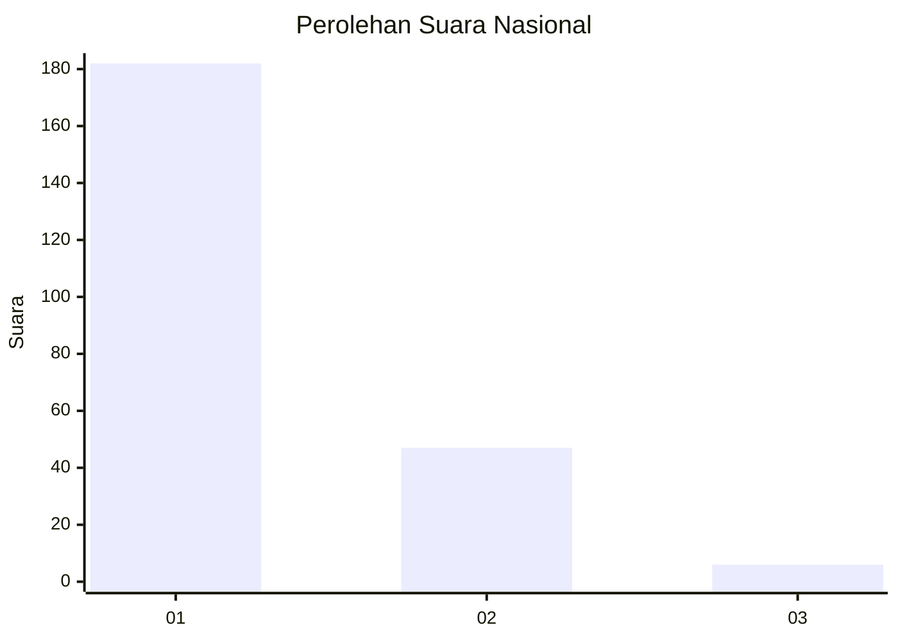
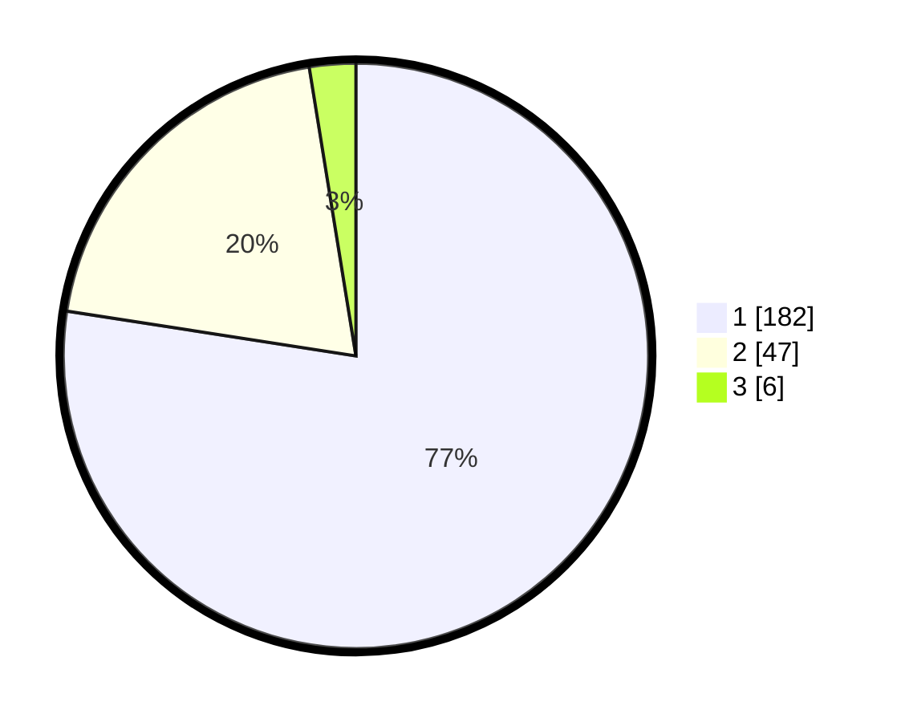

# Hasil

## Grafik

## Tabel

| No. | Nama Paslon    | Suara | Suara (raw) | Persentase |
|:--- |:-------------- | -----:| -----------:| ----------:|
| 1   | ANIES MUHAIMIN | 182   | [182][p-1]  | 77,45      |
| 2   | PRABOWO GIBRAN | 47    | [47][p-2]   | 20,00      |
| 3   | GANJAR MAHFUD  | 6     | [6][p-3]    | 2,55       |

[p-1]: https://github.com/gigit-pemilu/pemilu-2024/blob/main/pilpres/hitung-suara/sub/11-aceh/sub/71-kota-banda-aceh/sub/05-lueng-bata/sub/2003-panteriek/sub/001-tps/sub/paslon-1.txt
[p-2]: https://github.com/gigit-pemilu/pemilu-2024/blob/main/pilpres/hitung-suara/sub/11-aceh/sub/71-kota-banda-aceh/sub/05-lueng-bata/sub/2003-panteriek/sub/001-tps/sub/paslon-2.txt
[p-3]: https://github.com/gigit-pemilu/pemilu-2024/blob/main/pilpres/hitung-suara/sub/11-aceh/sub/71-kota-banda-aceh/sub/05-lueng-bata/sub/2003-panteriek/sub/001-tps/sub/paslon-3.txt

## Foto C Plano

https://sirekap-obj-formc.kpu.go.id/65ff/pemilu/ppwp/11/71/05/20/03/1171052003001-20240218-093651--40787d20-eda5-4d17-b0bd-2da297838553.jpg

https://sirekap-obj-formc.kpu.go.id/65ff/pemilu/ppwp/11/71/05/20/03/1171052003001-20240218-094106--62632a70-cba7-466e-9bdc-809590092f4c.jpg

https://sirekap-obj-formc.kpu.go.id/65ff/pemilu/ppwp/11/71/05/20/03/1171052003001-20240218-094139--e18adc45-1bc0-4512-8e8e-865c63dbba29.jpg

## Metadata

| Key        | Value               |
| ---------- | ------------------- |
| Time Stamp | 2024-02-19 06:16:00 |

