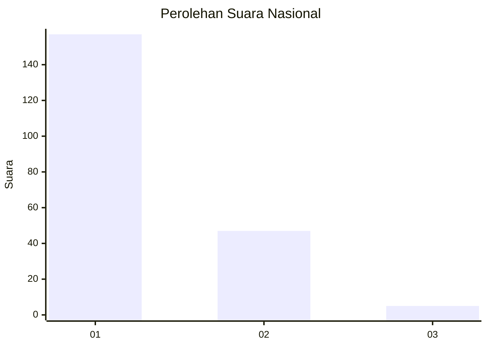
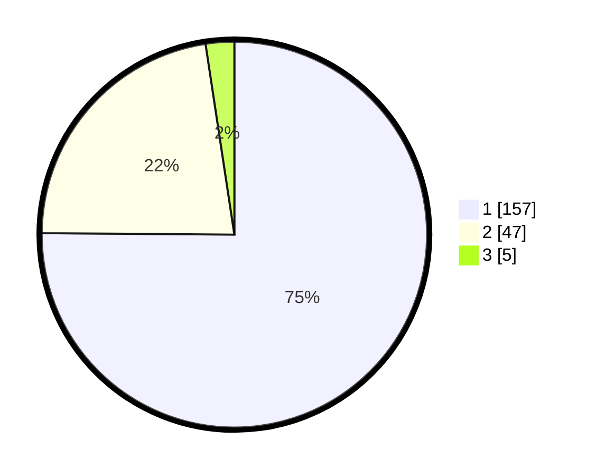

# Hasil

## Grafik

## Tabel

| No. | Nama Paslon    | Suara | Suara (raw) | Persentase |
|:--- |:-------------- | -----:| -----------:| ----------:|
| 1   | ANIES MUHAIMIN | 157   | [157][p-1]  | 75,12      |
| 2   | PRABOWO GIBRAN | 47    | [47][p-2]   | 22,49      |
| 3   | GANJAR MAHFUD  | 5     | [5][p-3]    | 2,39       |

[p-1]: https://github.com/gigit-pemilu/pemilu-2024/blob/main/pilpres/hitung-suara/sub/11-aceh/sub/71-kota-banda-aceh/sub/05-lueng-bata/sub/2003-panteriek/sub/002-tps/sub/paslon-1.txt
[p-2]: https://github.com/gigit-pemilu/pemilu-2024/blob/main/pilpres/hitung-suara/sub/11-aceh/sub/71-kota-banda-aceh/sub/05-lueng-bata/sub/2003-panteriek/sub/002-tps/sub/paslon-2.txt
[p-3]: https://github.com/gigit-pemilu/pemilu-2024/blob/main/pilpres/hitung-suara/sub/11-aceh/sub/71-kota-banda-aceh/sub/05-lueng-bata/sub/2003-panteriek/sub/002-tps/sub/paslon-3.txt

## Foto C Plano

https://sirekap-obj-formc.kpu.go.id/c05f/pemilu/ppwp/11/71/05/20/03/1171052003002-20240218-110840--de8648d8-aee4-4f14-94da-c9586f555b11.jpg

https://sirekap-obj-formc.kpu.go.id/c05f/pemilu/ppwp/11/71/05/20/03/1171052003002-20240218-110849--87f0ca2d-a976-4650-a2c8-7f6479f6cfcf.jpg

https://sirekap-obj-formc.kpu.go.id/c05f/pemilu/ppwp/11/71/05/20/03/1171052003002-20240218-110928--34f63a0d-70c1-4e83-9345-d354b7ec6bfe.jpg

## Metadata

| Key        | Value               |
| ---------- | ------------------- |
| Time Stamp | 2024-02-19 06:16:00 |

