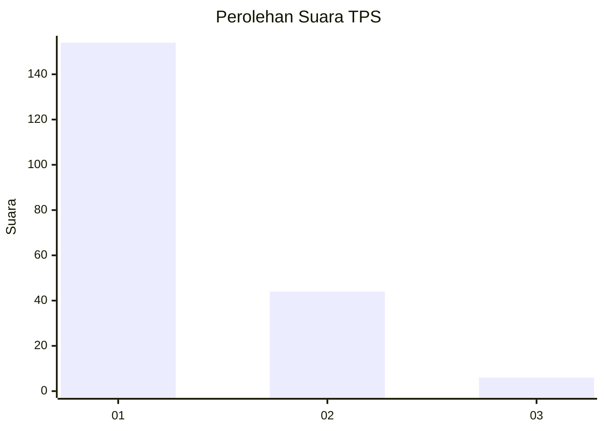
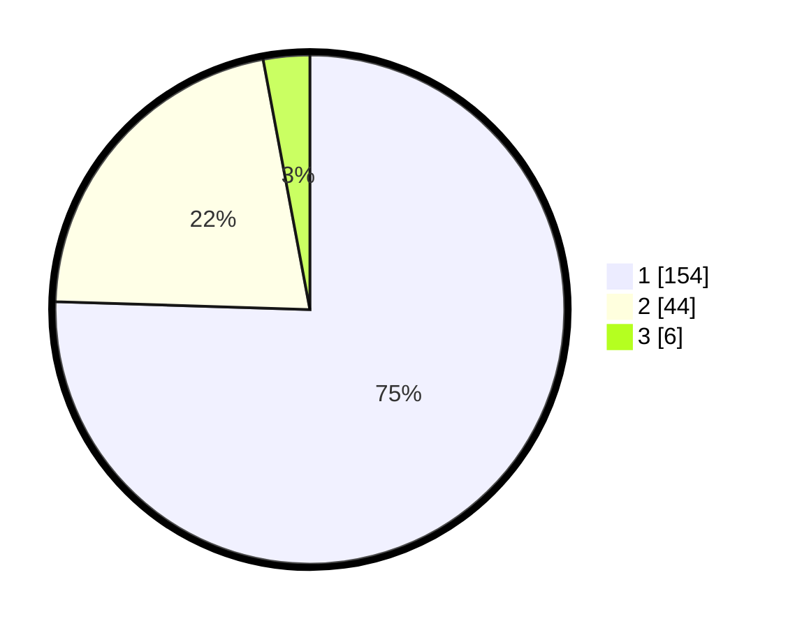

# Hasil

## Grafik

## Tabel

| No. | Nama Paslon    | Suara | Suara (raw) | Persentase |
|:--- |:-------------- | -----:| -----------:| ----------:|
| 1   | ANIES MUHAIMIN | 154   | [154][p-1]  | 75,49      |
| 2   | PRABOWO GIBRAN | 44    | [44][p-2]   | 21,57      |
| 3   | GANJAR MAHFUD  | 6     | [6][p-3]    | 2,94       |

[p-1]: https://github.com/gigit-pemilu/pemilu-2024-11-aceh/blob/main/pilpres/hitung-suara/sub/11-aceh/sub/71-kota-banda-aceh/sub/05-lueng-bata/sub/2003-panteriek/sub/003-tps/sub/paslon-1.txt
[p-2]: https://github.com/gigit-pemilu/pemilu-2024-11-aceh/blob/main/pilpres/hitung-suara/sub/11-aceh/sub/71-kota-banda-aceh/sub/05-lueng-bata/sub/2003-panteriek/sub/003-tps/sub/paslon-2.txt
[p-3]: https://github.com/gigit-pemilu/pemilu-2024-11-aceh/blob/main/pilpres/hitung-suara/sub/11-aceh/sub/71-kota-banda-aceh/sub/05-lueng-bata/sub/2003-panteriek/sub/003-tps/sub/paslon-3.txt

## Foto C Plano

https://sirekap-obj-formc.kpu.go.id/e54c/pemilu/ppwp/11/71/05/20/03/1171052003003-20240218-115310--93ee83bf-4754-4184-a27e-43e1df588c32.jpg

https://sirekap-obj-formc.kpu.go.id/e54c/pemilu/ppwp/11/71/05/20/03/1171052003003-20240218-115427--653666a5-54bb-42e6-bfae-8f199b7de78e.jpg

https://sirekap-obj-formc.kpu.go.id/e54c/pemilu/ppwp/11/71/05/20/03/1171052003003-20240218-115520--691de6b5-eaed-4eee-ab29-67a012c3833c.jpg

## Metadata

| Key        | Value               |
| ---------- | ------------------- |
| Time Stamp | 2024-02-19 06:16:00 |

