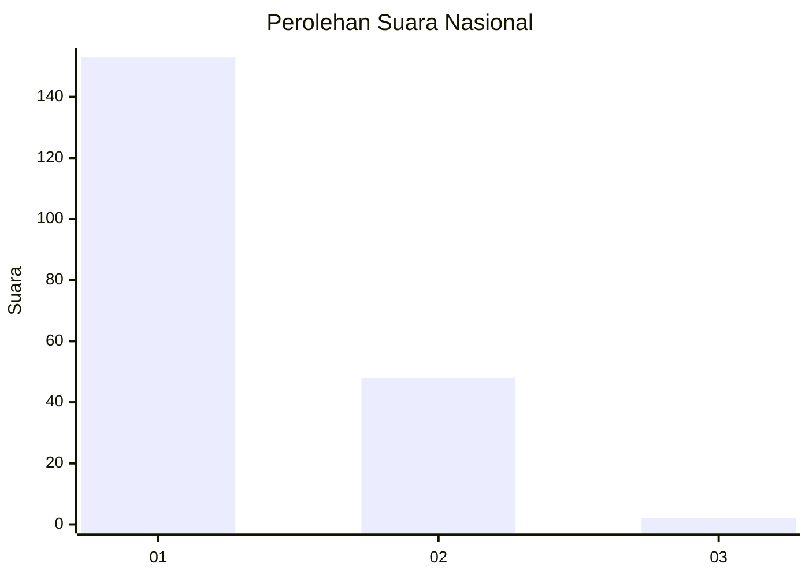
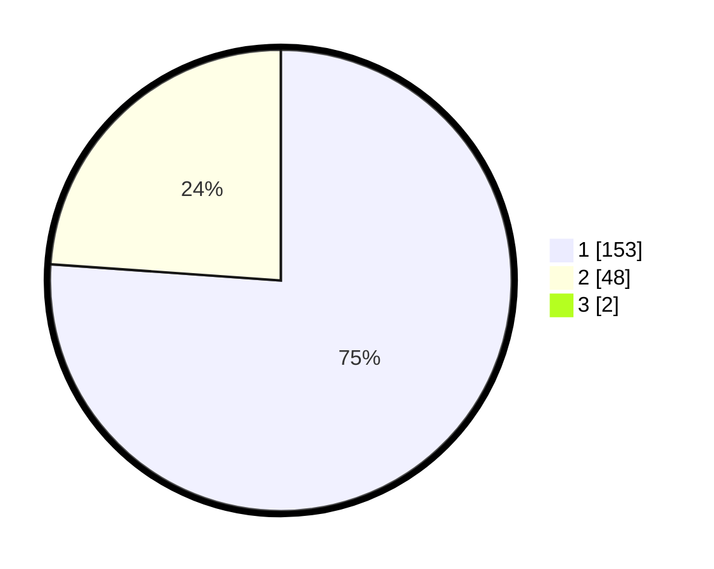

# Hasil

## Grafik

## Tabel

| No. | Nama Paslon    | Suara | Suara (raw) | Persentase |
|:--- |:-------------- | -----:| -----------:| ----------:|
| 1   | ANIES MUHAIMIN | 153   | [153][p-1]  | 75,37      |
| 2   | PRABOWO GIBRAN | 48    | [48][p-2]   | 23,65      |
| 3   | GANJAR MAHFUD  | 2     | [2][p-3]    | 0,99       |

[p-1]: https://github.com/gigit-pemilu/pemilu-2024/blob/main/pilpres/hitung-suara/sub/11-aceh/sub/71-kota-banda-aceh/sub/05-lueng-bata/sub/2003-panteriek/sub/004-tps/sub/paslon-1.txt
[p-2]: https://github.com/gigit-pemilu/pemilu-2024/blob/main/pilpres/hitung-suara/sub/11-aceh/sub/71-kota-banda-aceh/sub/05-lueng-bata/sub/2003-panteriek/sub/004-tps/sub/paslon-2.txt
[p-3]: https://github.com/gigit-pemilu/pemilu-2024/blob/main/pilpres/hitung-suara/sub/11-aceh/sub/71-kota-banda-aceh/sub/05-lueng-bata/sub/2003-panteriek/sub/004-tps/sub/paslon-3.txt

## Foto C Plano

https://sirekap-obj-formc.kpu.go.id/8680/pemilu/ppwp/11/71/05/20/03/1171052003004-20240218-141929--1ad78b0b-9dcd-4719-b07c-9e27804d2ea9.jpg

https://sirekap-obj-formc.kpu.go.id/8680/pemilu/ppwp/11/71/05/20/03/1171052003004-20240218-141953--ee7f975f-c25e-4642-9f8f-a8009dc33a14.jpg

https://sirekap-obj-formc.kpu.go.id/8680/pemilu/ppwp/11/71/05/20/03/1171052003004-20240218-142032--df8aa753-656b-4084-8053-72398ef9ab16.jpg

## Metadata

| Key        | Value               |
| ---------- | ------------------- |
| Time Stamp | 2024-02-19 06:16:00 |

