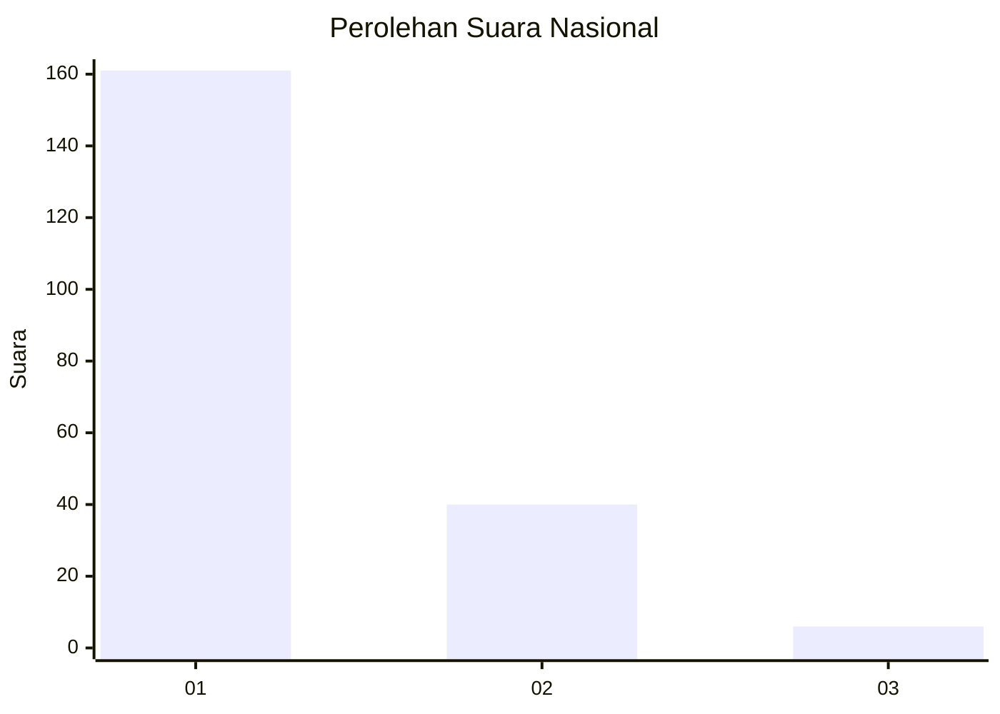
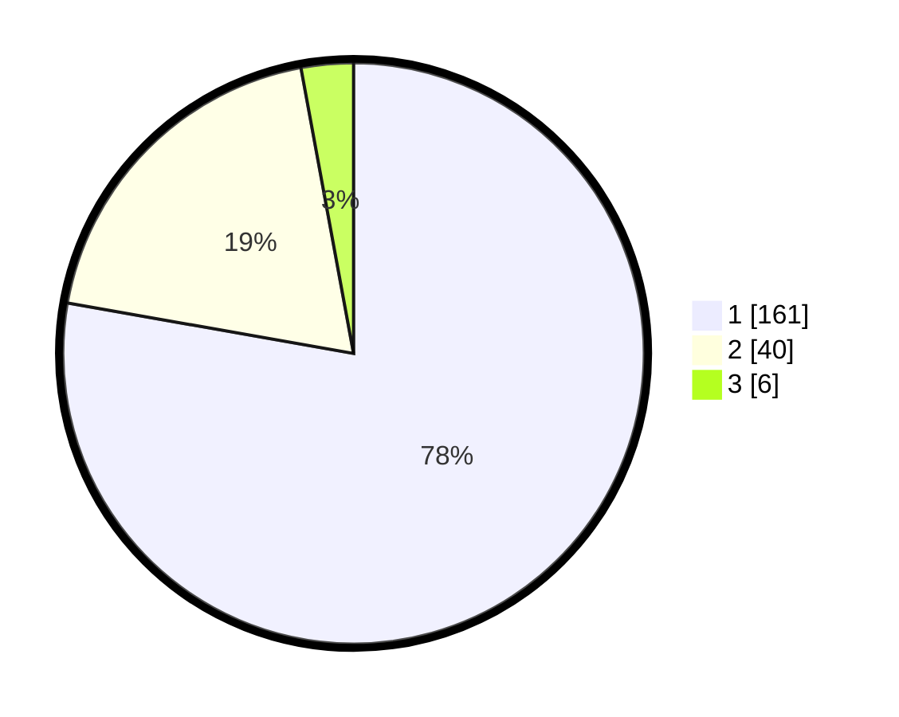

# Hasil

## Grafik

## Tabel

| No. | Nama Paslon    | Suara | Suara (raw) | Persentase |
|:--- |:-------------- | -----:| -----------:| ----------:|
| 1   | ANIES MUHAIMIN | 161   | [161][p-1]  | 77,78      |
| 2   | PRABOWO GIBRAN | 40    | [40][p-2]   | 19,32      |
| 3   | GANJAR MAHFUD  | 6     | [6][p-3]    | 2,90       |

[p-1]: https://github.com/gigit-pemilu/pemilu-2024/blob/main/pilpres/hitung-suara/sub/11-aceh/sub/71-kota-banda-aceh/sub/05-lueng-bata/sub/2003-panteriek/sub/005-tps/sub/paslon-1.txt
[p-2]: https://github.com/gigit-pemilu/pemilu-2024/blob/main/pilpres/hitung-suara/sub/11-aceh/sub/71-kota-banda-aceh/sub/05-lueng-bata/sub/2003-panteriek/sub/005-tps/sub/paslon-2.txt
[p-3]: https://github.com/gigit-pemilu/pemilu-2024/blob/main/pilpres/hitung-suara/sub/11-aceh/sub/71-kota-banda-aceh/sub/05-lueng-bata/sub/2003-panteriek/sub/005-tps/sub/paslon-3.txt

## Foto C Plano

https://sirekap-obj-formc.kpu.go.id/451b/pemilu/ppwp/11/71/05/20/03/1171052003005-20240218-150204--a15a2530-cd5f-402c-9e40-f9b23a1c99f9.jpg

https://sirekap-obj-formc.kpu.go.id/451b/pemilu/ppwp/11/71/05/20/03/1171052003005-20240218-150224--a954740b-255f-4141-8402-25f75dbbb377.jpg

https://sirekap-obj-formc.kpu.go.id/451b/pemilu/ppwp/11/71/05/20/03/1171052003005-20240218-150248--2a130f6d-1807-4b2f-9a84-c9ad49f05d01.jpg

## Metadata

| Key        | Value               |
| ---------- | ------------------- |
| Time Stamp | 2024-02-19 06:16:00 |

