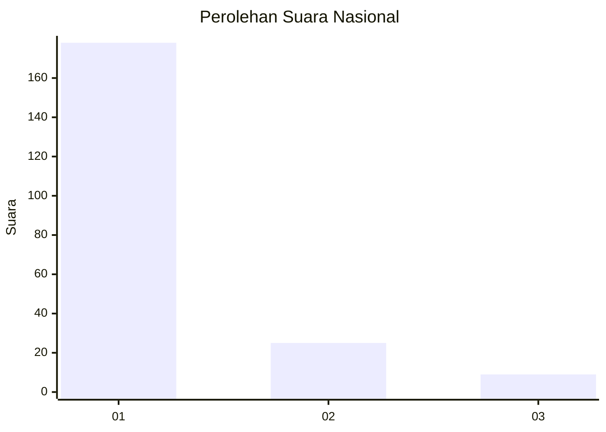
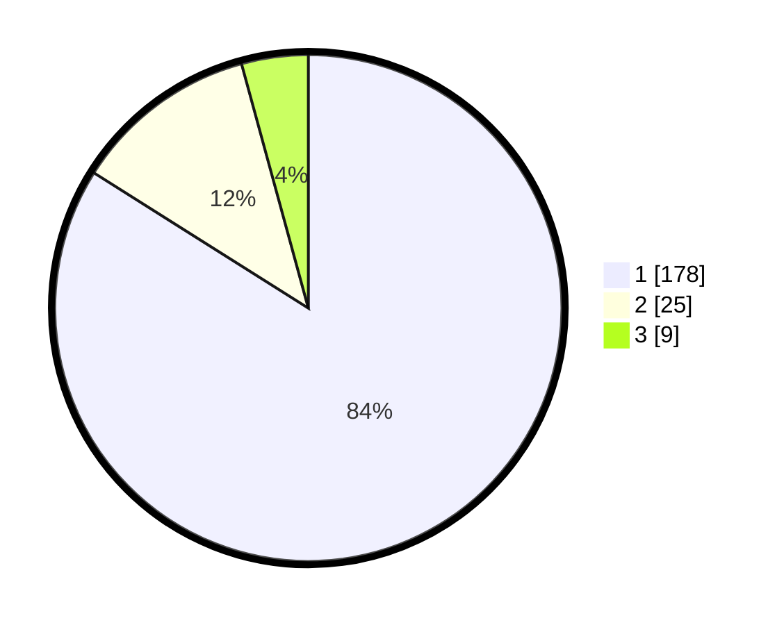

# Hasil

## Grafik

## Tabel

| No. | Nama Paslon    | Suara | Suara (raw) | Persentase |
|:--- |:-------------- | -----:| -----------:| ----------:|
| 1   | ANIES MUHAIMIN | 178   | [178][p-1]  | 83,96      |
| 2   | PRABOWO GIBRAN | 25    | [25][p-2]   | 11,79      |
| 3   | GANJAR MAHFUD  | 9     | [9][p-3]    | 4,25       |

[p-1]: https://github.com/gigit-pemilu/pemilu-2024/blob/main/pilpres/hitung-suara/sub/11-aceh/sub/71-kota-banda-aceh/sub/05-lueng-bata/sub/2003-panteriek/sub/006-tps/sub/paslon-1.txt
[p-2]: https://github.com/gigit-pemilu/pemilu-2024/blob/main/pilpres/hitung-suara/sub/11-aceh/sub/71-kota-banda-aceh/sub/05-lueng-bata/sub/2003-panteriek/sub/006-tps/sub/paslon-2.txt
[p-3]: https://github.com/gigit-pemilu/pemilu-2024/blob/main/pilpres/hitung-suara/sub/11-aceh/sub/71-kota-banda-aceh/sub/05-lueng-bata/sub/2003-panteriek/sub/006-tps/sub/paslon-3.txt

## Foto C Plano

https://sirekap-obj-formc.kpu.go.id/d6a8/pemilu/ppwp/11/71/05/20/03/1171052003006-20240218-155243--b0d0f61d-b038-47b5-9a9c-6fd33f3db3c3.jpg

https://sirekap-obj-formc.kpu.go.id/d6a8/pemilu/ppwp/11/71/05/20/03/1171052003006-20240218-155306--3c8d8673-d529-485b-8105-504e8128fbd7.jpg

https://sirekap-obj-formc.kpu.go.id/d6a8/pemilu/ppwp/11/71/05/20/03/1171052003006-20240218-155351--9de131ab-fee8-4c63-a31e-752eb21a2b4b.jpg

## Metadata

| Key        | Value               |
| ---------- | ------------------- |
| Time Stamp | 2024-02-19 06:16:00 |

