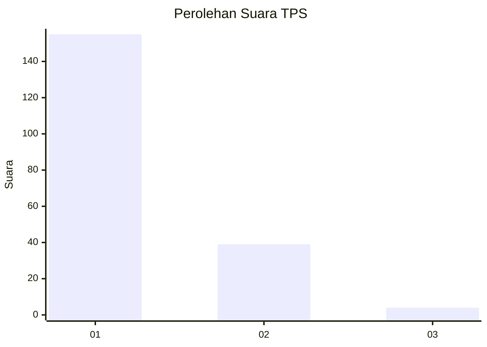
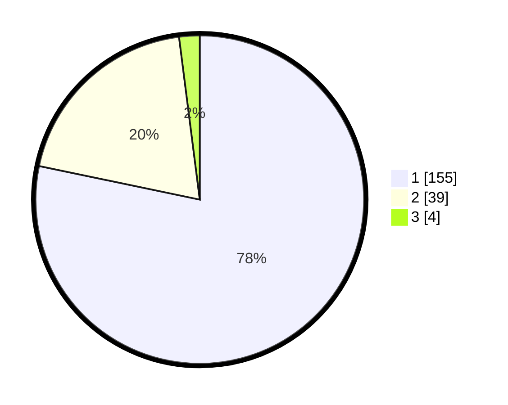

# Hasil

## Grafik

## Tabel

| No. | Nama Paslon    | Suara | Suara (raw) | Persentase |
|:--- |:-------------- | -----:| -----------:| ----------:|
| 1   | ANIES MUHAIMIN | 155   | [155][p-1]  | 78,28      |
| 2   | PRABOWO GIBRAN | 39    | [39][p-2]   | 19,70      |
| 3   | GANJAR MAHFUD  | 4     | [4][p-3]    | 2,02       |

[p-1]: https://github.com/gigit-pemilu/pemilu-2024-11-aceh/blob/main/pilpres/hitung-suara/sub/11-aceh/sub/71-kota-banda-aceh/sub/05-lueng-bata/sub/2003-panteriek/sub/008-tps/sub/paslon-1.txt
[p-2]: https://github.com/gigit-pemilu/pemilu-2024-11-aceh/blob/main/pilpres/hitung-suara/sub/11-aceh/sub/71-kota-banda-aceh/sub/05-lueng-bata/sub/2003-panteriek/sub/008-tps/sub/paslon-2.txt
[p-3]: https://github.com/gigit-pemilu/pemilu-2024-11-aceh/blob/main/pilpres/hitung-suara/sub/11-aceh/sub/71-kota-banda-aceh/sub/05-lueng-bata/sub/2003-panteriek/sub/008-tps/sub/paslon-3.txt

## Foto C Plano

https://sirekap-obj-formc.kpu.go.id/8d14/pemilu/ppwp/11/71/05/20/03/1171052003008-20240218-210242--e09d52a8-57ad-4197-a01d-c84863d3faa8.jpg

https://sirekap-obj-formc.kpu.go.id/8d14/pemilu/ppwp/11/71/05/20/03/1171052003008-20240218-210416--2a3d5468-da5c-4bfe-a64b-aa3dda145ef5.jpg

https://sirekap-obj-formc.kpu.go.id/8d14/pemilu/ppwp/11/71/05/20/03/1171052003008-20240218-210443--f60e3d87-1000-41a8-b7a6-0ef5bee4212c.jpg

## Metadata

| Key        | Value               |
| ---------- | ------------------- |
| Time Stamp | 2024-02-19 10:00:00 |

