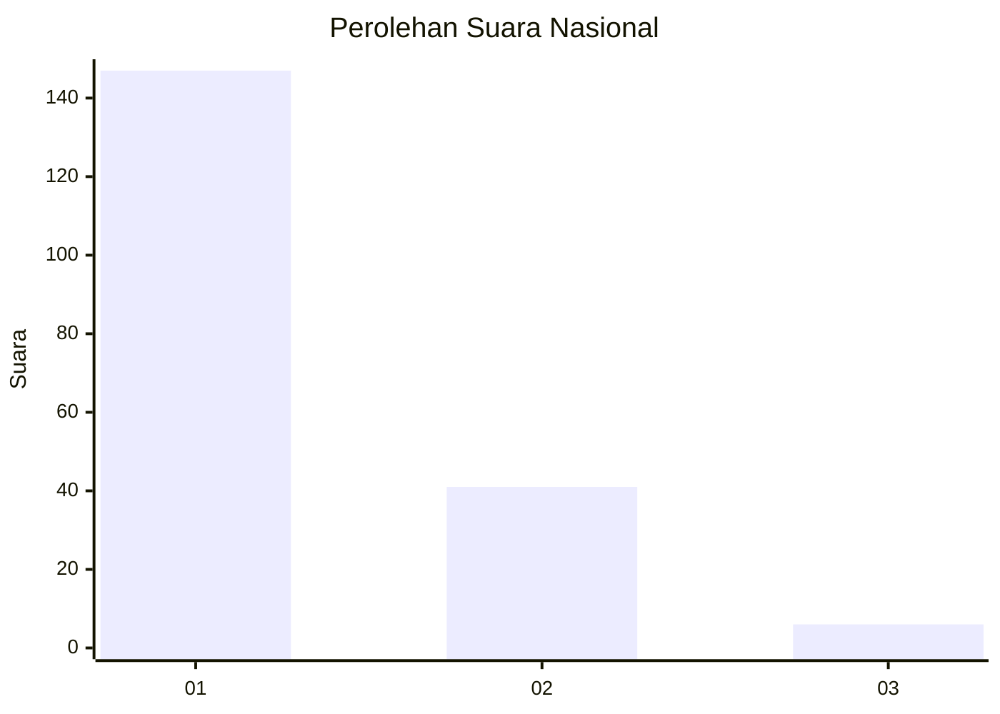
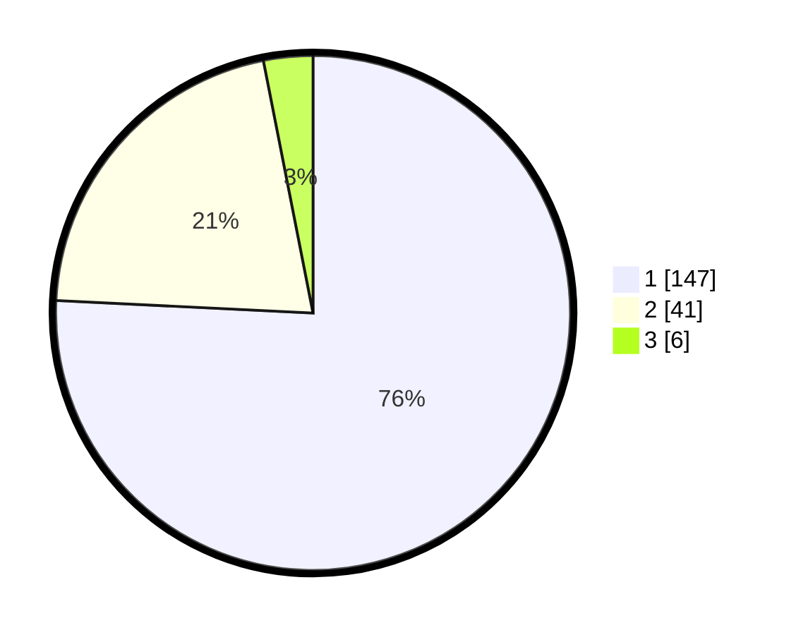

# Hasil

## Grafik

## Tabel

| No. | Nama Paslon    | Suara | Suara (raw) | Persentase |
|:--- |:-------------- | -----:| -----------:| ----------:|
| 1   | ANIES MUHAIMIN | 147   | [147][p-1]  | 75,77      |
| 2   | PRABOWO GIBRAN | 41    | [41][p-2]   | 21,13      |
| 3   | GANJAR MAHFUD  | 6     | [6][p-3]    | 3,09       |

[p-1]: https://github.com/gigit-pemilu/pemilu-2024/blob/main/pilpres/hitung-suara/sub/11-aceh/sub/71-kota-banda-aceh/sub/05-lueng-bata/sub/2003-panteriek/sub/009-tps/sub/paslon-1.txt
[p-2]: https://github.com/gigit-pemilu/pemilu-2024/blob/main/pilpres/hitung-suara/sub/11-aceh/sub/71-kota-banda-aceh/sub/05-lueng-bata/sub/2003-panteriek/sub/009-tps/sub/paslon-2.txt
[p-3]: https://github.com/gigit-pemilu/pemilu-2024/blob/main/pilpres/hitung-suara/sub/11-aceh/sub/71-kota-banda-aceh/sub/05-lueng-bata/sub/2003-panteriek/sub/009-tps/sub/paslon-3.txt

## Foto C Plano

https://sirekap-obj-formc.kpu.go.id/a8c3/pemilu/ppwp/11/71/05/20/03/1171052003009-20240218-221339--54f825e5-750f-43bd-a982-19711cef439e.jpg

https://sirekap-obj-formc.kpu.go.id/a8c3/pemilu/ppwp/11/71/05/20/03/1171052003009-20240218-221416--42713ba6-99e7-4c42-b03a-c8fd4d950120.jpg

https://sirekap-obj-formc.kpu.go.id/a8c3/pemilu/ppwp/11/71/05/20/03/1171052003009-20240218-221438--f22c7ea4-7955-4876-aa10-ba49bb7f9e8c.jpg

## Metadata

| Key        | Value               |
| ---------- | ------------------- |
| Time Stamp | 2024-02-19 10:00:00 |

