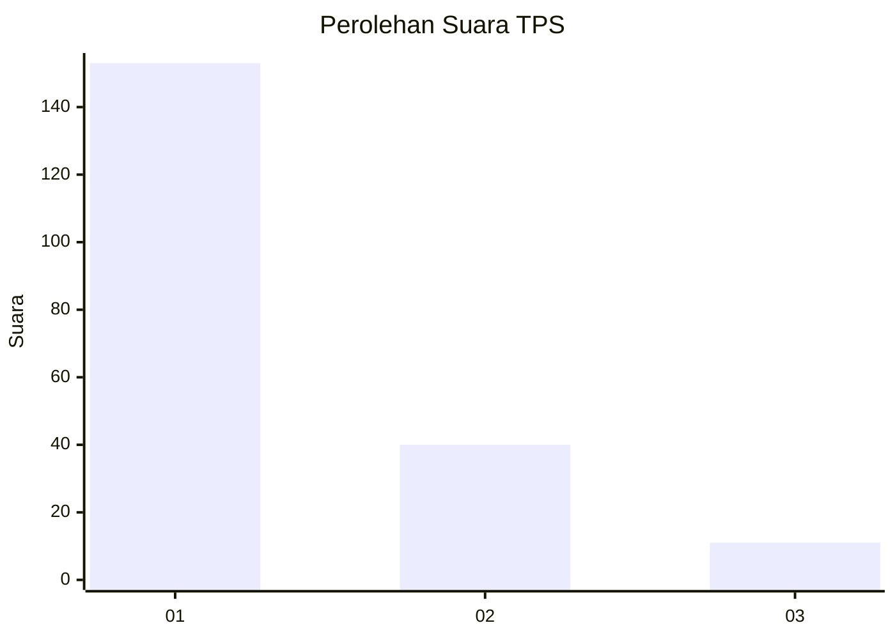
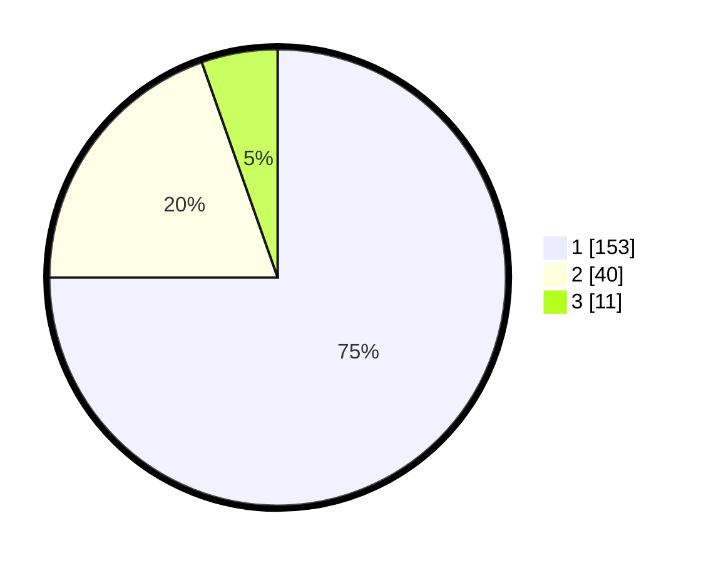

# Hasil

## Grafik

## Tabel

| No. | Nama Paslon    | Suara | Suara (raw) | Persentase |
|:--- |:-------------- | -----:| -----------:| ----------:|
| 1   | ANIES MUHAIMIN | 153   | [153][p-1]  | 75,00      |
| 2   | PRABOWO GIBRAN | 40    | [40][p-2]   | 19,61      |
| 3   | GANJAR MAHFUD  | 11    | [11][p-3]   | 5,39       |

[p-1]: https://github.com/gigit-pemilu/pemilu-2024-11-aceh/blob/main/pilpres/hitung-suara/sub/11-aceh/sub/71-kota-banda-aceh/sub/05-lueng-bata/sub/2005-lamseupeung/sub/001-tps/sub/paslon-1.txt
[p-2]: https://github.com/gigit-pemilu/pemilu-2024-11-aceh/blob/main/pilpres/hitung-suara/sub/11-aceh/sub/71-kota-banda-aceh/sub/05-lueng-bata/sub/2005-lamseupeung/sub/001-tps/sub/paslon-2.txt
[p-3]: https://github.com/gigit-pemilu/pemilu-2024-11-aceh/blob/main/pilpres/hitung-suara/sub/11-aceh/sub/71-kota-banda-aceh/sub/05-lueng-bata/sub/2005-lamseupeung/sub/001-tps/sub/paslon-3.txt

## Foto C Plano

https://sirekap-obj-formc.kpu.go.id/61a4/pemilu/ppwp/11/71/05/20/05/1171052005001-20240218-232148--15b4aaad-48e4-42e1-94bc-ce8685d561ae.jpg

https://sirekap-obj-formc.kpu.go.id/61a4/pemilu/ppwp/11/71/05/20/05/1171052005001-20240218-232221--0c3ca324-eb59-4bbe-b766-1bb74ecf2441.jpg

https://sirekap-obj-formc.kpu.go.id/61a4/pemilu/ppwp/11/71/05/20/05/1171052005001-20240218-232250--ed64e9c3-6c44-4296-8015-ea7cede2ca02.jpg

## Metadata

| Key        | Value               |
| ---------- | ------------------- |
| Time Stamp | 2024-02-19 10:00:00 |

