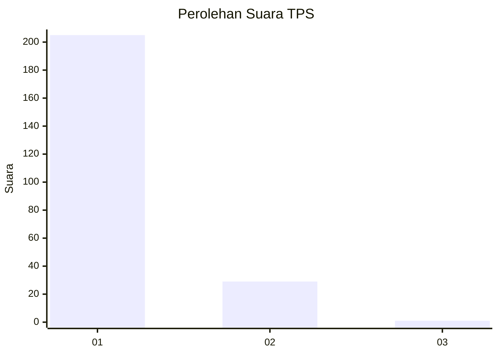
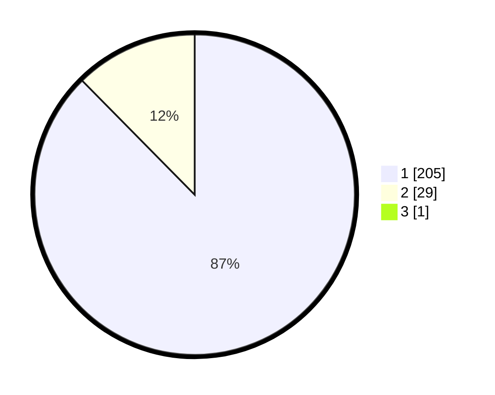

# Hasil

## Grafik

## Tabel

| No. | Nama Paslon    | Suara | Suara (raw) | Persentase |
|:--- |:-------------- | -----:| -----------:| ----------:|
| 1   | ANIES MUHAIMIN | 205   | [205][p-1]  | 87,23      |
| 2   | PRABOWO GIBRAN | 29    | [29][p-2]   | 12,34      |
| 3   | GANJAR MAHFUD  | 1     | [1][p-3]    | 0,43       |

[p-1]: https://github.com/gigit-pemilu/pemilu-2024-11-aceh/blob/main/pilpres/hitung-suara/sub/11-aceh/sub/71-kota-banda-aceh/sub/05-lueng-bata/sub/2006-batoh/sub/001-tps/sub/paslon-1.txt
[p-2]: https://github.com/gigit-pemilu/pemilu-2024-11-aceh/blob/main/pilpres/hitung-suara/sub/11-aceh/sub/71-kota-banda-aceh/sub/05-lueng-bata/sub/2006-batoh/sub/001-tps/sub/paslon-2.txt
[p-3]: https://github.com/gigit-pemilu/pemilu-2024-11-aceh/blob/main/pilpres/hitung-suara/sub/11-aceh/sub/71-kota-banda-aceh/sub/05-lueng-bata/sub/2006-batoh/sub/001-tps/sub/paslon-3.txt

## Foto C Plano

https://sirekap-obj-formc.kpu.go.id/ac51/pemilu/ppwp/11/71/05/20/06/1171052006001-20240214-215025--6ffdb1ea-61c4-4069-9e9b-36c630b10ca4.jpg

https://sirekap-obj-formc.kpu.go.id/ac51/pemilu/ppwp/11/71/05/20/06/1171052006001-20240214-215032--79942c55-fc38-4b7a-8828-ca961665a514.jpg

https://sirekap-obj-formc.kpu.go.id/ac51/pemilu/ppwp/11/71/05/20/06/1171052006001-20240214-215041--65dc34cc-d66c-4839-b1b2-bfb63d8941c2.jpg

## Metadata

| Key        | Value               |
| ---------- | ------------------- |
| Time Stamp | 2024-02-15 15:00:29 |

