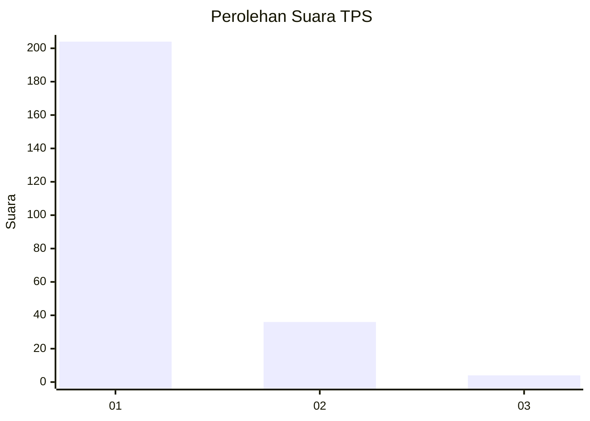
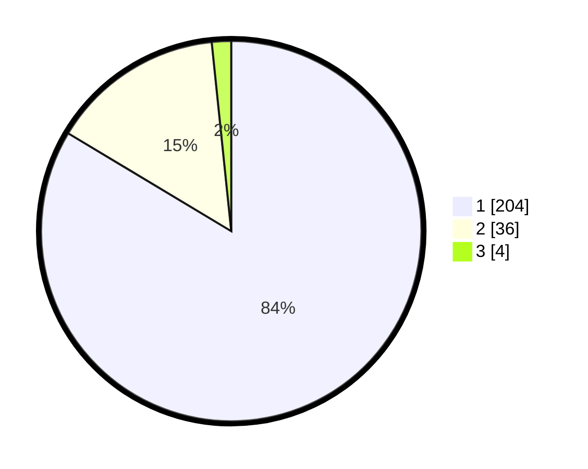

# Hasil

## Grafik

## Tabel

| No. | Nama Paslon    | Suara | Suara (raw) | Persentase |
|:--- |:-------------- | -----:| -----------:| ----------:|
| 1   | ANIES MUHAIMIN | 204   | [204][p-1]  | 83,61      |
| 2   | PRABOWO GIBRAN | 36    | [36][p-2]   | 14,75      |
| 3   | GANJAR MAHFUD  | 4     | [4][p-3]    | 1,64       |

[p-1]: https://github.com/gigit-pemilu/pemilu-2024-11-aceh/blob/main/pilpres/hitung-suara/sub/11-aceh/sub/71-kota-banda-aceh/sub/05-lueng-bata/sub/2006-batoh/sub/002-tps/sub/paslon-1.txt
[p-2]: https://github.com/gigit-pemilu/pemilu-2024-11-aceh/blob/main/pilpres/hitung-suara/sub/11-aceh/sub/71-kota-banda-aceh/sub/05-lueng-bata/sub/2006-batoh/sub/002-tps/sub/paslon-2.txt
[p-3]: https://github.com/gigit-pemilu/pemilu-2024-11-aceh/blob/main/pilpres/hitung-suara/sub/11-aceh/sub/71-kota-banda-aceh/sub/05-lueng-bata/sub/2006-batoh/sub/002-tps/sub/paslon-3.txt

## Foto C Plano

https://sirekap-obj-formc.kpu.go.id/392c/pemilu/ppwp/11/71/05/20/06/1171052006002-20240220-093823--83b3f671-8e0c-43a7-9c9b-379e75b45d06.jpg

https://sirekap-obj-formc.kpu.go.id/392c/pemilu/ppwp/11/71/05/20/06/1171052006002-20240220-093924--e76ea4cd-a2bf-43ad-89ea-23233f4e6e88.jpg

https://sirekap-obj-formc.kpu.go.id/392c/pemilu/ppwp/11/71/05/20/06/1171052006002-20240220-094044--82ed9c6f-9ff5-437e-8198-53634c3c5287.jpg

## Metadata

| Key        | Value               |
| ---------- | ------------------- |
| Time Stamp | 2024-02-20 11:00:00 |

