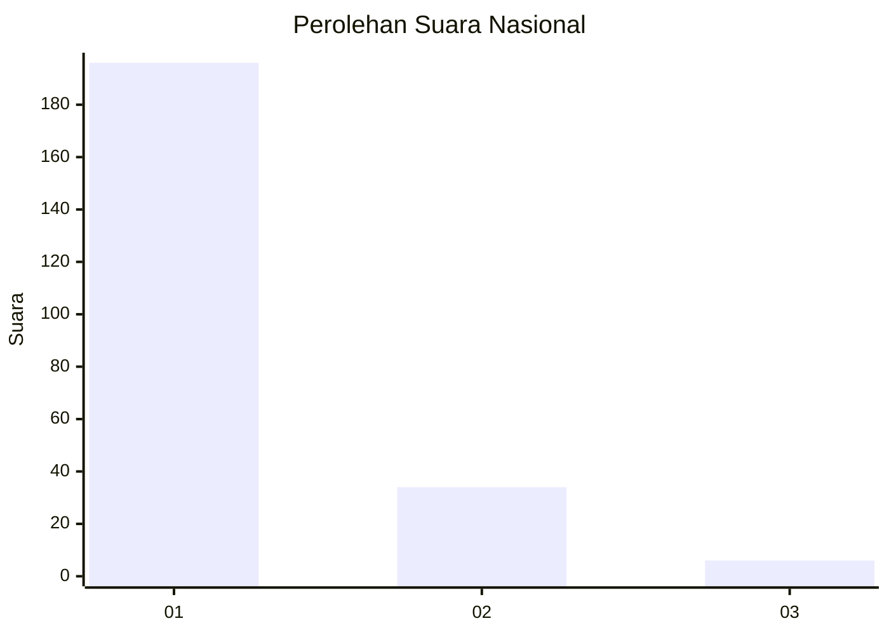
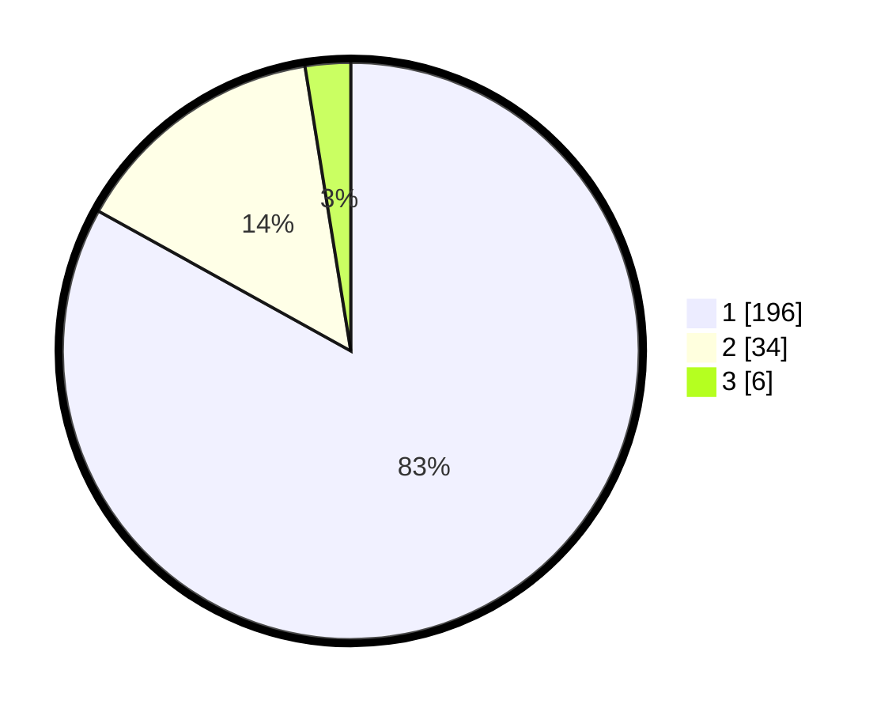

# Hasil

## Grafik

## Tabel

| No. | Nama Paslon    | Suara | Suara (raw) | Persentase |
|:--- |:-------------- | -----:| -----------:| ----------:|
| 1   | ANIES MUHAIMIN | 196   | [196][p-1]  | 83,05      |
| 2   | PRABOWO GIBRAN | 34    | [34][p-2]   | 14,41      |
| 3   | GANJAR MAHFUD  | 6     | [6][p-3]    | 2,54       |

[p-1]: https://github.com/gigit-pemilu/pemilu-2024/blob/main/pilpres/hitung-suara/sub/11-aceh/sub/71-kota-banda-aceh/sub/05-lueng-bata/sub/2006-batoh/sub/003-tps/sub/paslon-1.txt
[p-2]: https://github.com/gigit-pemilu/pemilu-2024/blob/main/pilpres/hitung-suara/sub/11-aceh/sub/71-kota-banda-aceh/sub/05-lueng-bata/sub/2006-batoh/sub/003-tps/sub/paslon-2.txt
[p-3]: https://github.com/gigit-pemilu/pemilu-2024/blob/main/pilpres/hitung-suara/sub/11-aceh/sub/71-kota-banda-aceh/sub/05-lueng-bata/sub/2006-batoh/sub/003-tps/sub/paslon-3.txt

## Foto C Plano

https://sirekap-obj-formc.kpu.go.id/7e93/pemilu/ppwp/11/71/05/20/06/1171052006003-20240220-113407--5de2ea83-b576-4f44-b013-0304bbb2c72d.jpg

https://sirekap-obj-formc.kpu.go.id/7e93/pemilu/ppwp/11/71/05/20/06/1171052006003-20240220-113702--41ca8b7f-c51c-4ebd-9f0c-81d93a7c5b47.jpg

https://sirekap-obj-formc.kpu.go.id/7e93/pemilu/ppwp/11/71/05/20/06/1171052006003-20240220-113737--17037182-8d66-4578-86ef-b2c26fc34401.jpg

## Metadata

| Key        | Value               |
| ---------- | ------------------- |
| Time Stamp | 2024-02-24 22:31:28 |

