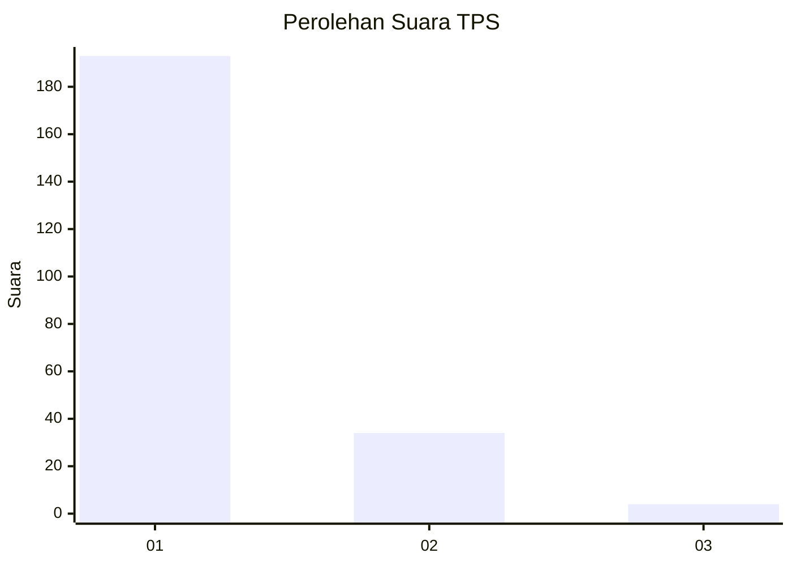
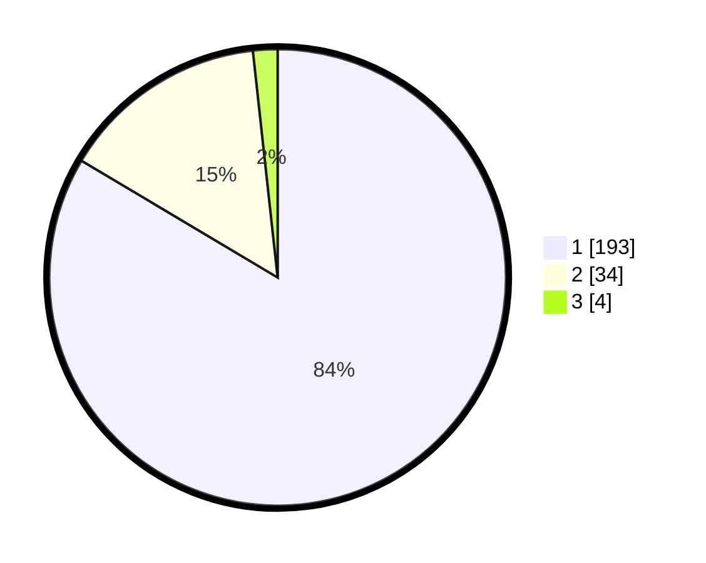

# Hasil

## Grafik

## Tabel

| No. | Nama Paslon    | Suara | Suara (raw) | Persentase |
|:--- |:-------------- | -----:| -----------:| ----------:|
| 1   | ANIES MUHAIMIN | 193   | [193][p-1]  | 83,55      |
| 2   | PRABOWO GIBRAN | 34    | [34][p-2]   | 14,72      |
| 3   | GANJAR MAHFUD  | 4     | [4][p-3]    | 1,73       |

[p-1]: https://github.com/gigit-pemilu/pemilu-2024-11-aceh/blob/main/pilpres/hitung-suara/sub/11-aceh/sub/71-kota-banda-aceh/sub/05-lueng-bata/sub/2006-batoh/sub/004-tps/sub/paslon-1.txt
[p-2]: https://github.com/gigit-pemilu/pemilu-2024-11-aceh/blob/main/pilpres/hitung-suara/sub/11-aceh/sub/71-kota-banda-aceh/sub/05-lueng-bata/sub/2006-batoh/sub/004-tps/sub/paslon-2.txt
[p-3]: https://github.com/gigit-pemilu/pemilu-2024-11-aceh/blob/main/pilpres/hitung-suara/sub/11-aceh/sub/71-kota-banda-aceh/sub/05-lueng-bata/sub/2006-batoh/sub/004-tps/sub/paslon-3.txt

## Foto C Plano

https://sirekap-obj-formc.kpu.go.id/a0a3/pemilu/ppwp/11/71/05/20/06/1171052006004-20240220-141010--2d19e497-1092-4350-9b92-adbb9c8d6c0f.jpg

https://sirekap-obj-formc.kpu.go.id/a0a3/pemilu/ppwp/11/71/05/20/06/1171052006004-20240220-140838--7e88628d-f33b-41e4-b766-e336659515e1.jpg

https://sirekap-obj-formc.kpu.go.id/a0a3/pemilu/ppwp/11/71/05/20/06/1171052006004-20240220-141032--e392e296-afd0-4d6a-abaa-b35dfddc828c.jpg

## Metadata

| Key        | Value               |
| ---------- | ------------------- |
| Time Stamp | 2024-02-24 22:31:28 |

