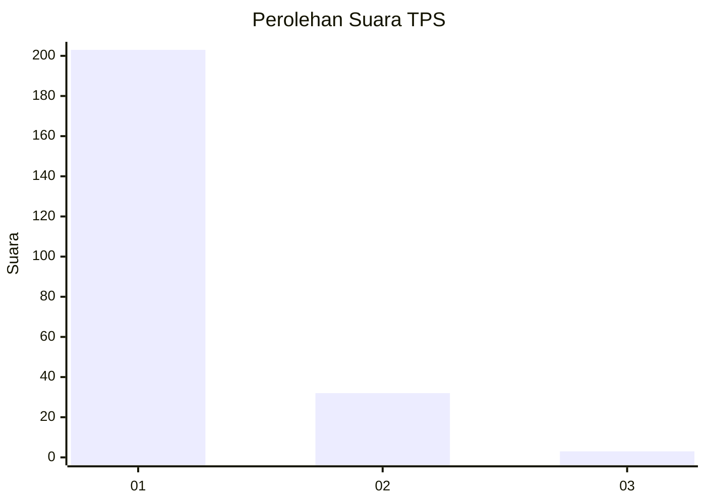
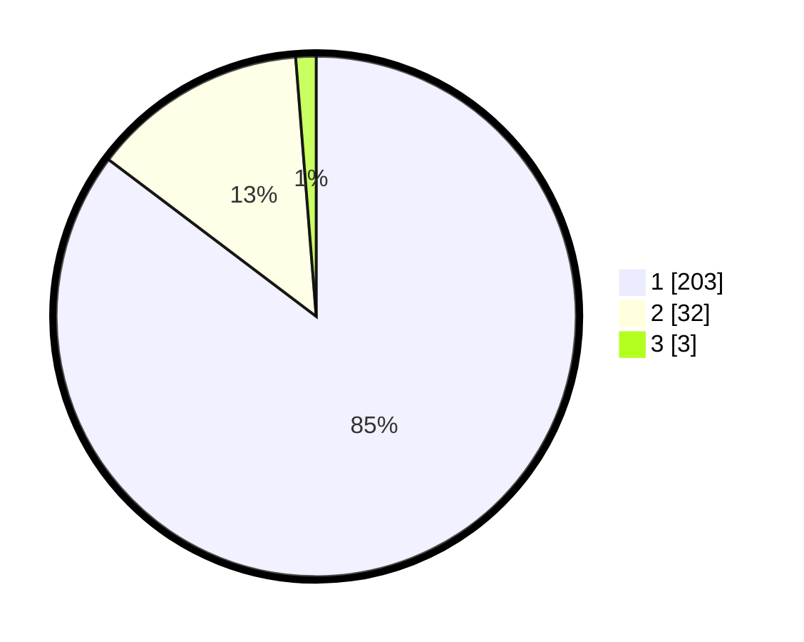

# Hasil

## Grafik

## Tabel

| No. | Nama Paslon    | Suara | Suara (raw) | Persentase |
|:--- |:-------------- | -----:| -----------:| ----------:|
| 1   | ANIES MUHAIMIN | 203   | [203][p-1]  | 85,29      |
| 2   | PRABOWO GIBRAN | 32    | [32][p-2]   | 13,45      |
| 3   | GANJAR MAHFUD  | 3     | [3][p-3]    | 1,26       |

[p-1]: https://github.com/gigit-pemilu/pemilu-2024-11-aceh/blob/main/pilpres/hitung-suara/sub/11-aceh/sub/71-kota-banda-aceh/sub/05-lueng-bata/sub/2006-batoh/sub/005-tps/sub/paslon-1.txt
[p-2]: https://github.com/gigit-pemilu/pemilu-2024-11-aceh/blob/main/pilpres/hitung-suara/sub/11-aceh/sub/71-kota-banda-aceh/sub/05-lueng-bata/sub/2006-batoh/sub/005-tps/sub/paslon-2.txt
[p-3]: https://github.com/gigit-pemilu/pemilu-2024-11-aceh/blob/main/pilpres/hitung-suara/sub/11-aceh/sub/71-kota-banda-aceh/sub/05-lueng-bata/sub/2006-batoh/sub/005-tps/sub/paslon-3.txt

## Foto C Plano

https://sirekap-obj-formc.kpu.go.id/710f/pemilu/ppwp/11/71/05/20/06/1171052006005-20240220-103314--707ac962-9c7b-4a0c-9b9d-52e48458fbbf.jpg

https://sirekap-obj-formc.kpu.go.id/710f/pemilu/ppwp/11/71/05/20/06/1171052006005-20240220-103333--56c346a8-ee2f-4e5a-ab50-0ce2c3868dec.jpg

https://sirekap-obj-formc.kpu.go.id/710f/pemilu/ppwp/11/71/05/20/06/1171052006005-20240220-103355--96a0d7bc-135f-4628-9e78-1cc0c9bcc9a7.jpg

## Metadata

| Key        | Value               |
| ---------- | ------------------- |
| Time Stamp | 2024-02-20 11:00:00 |

