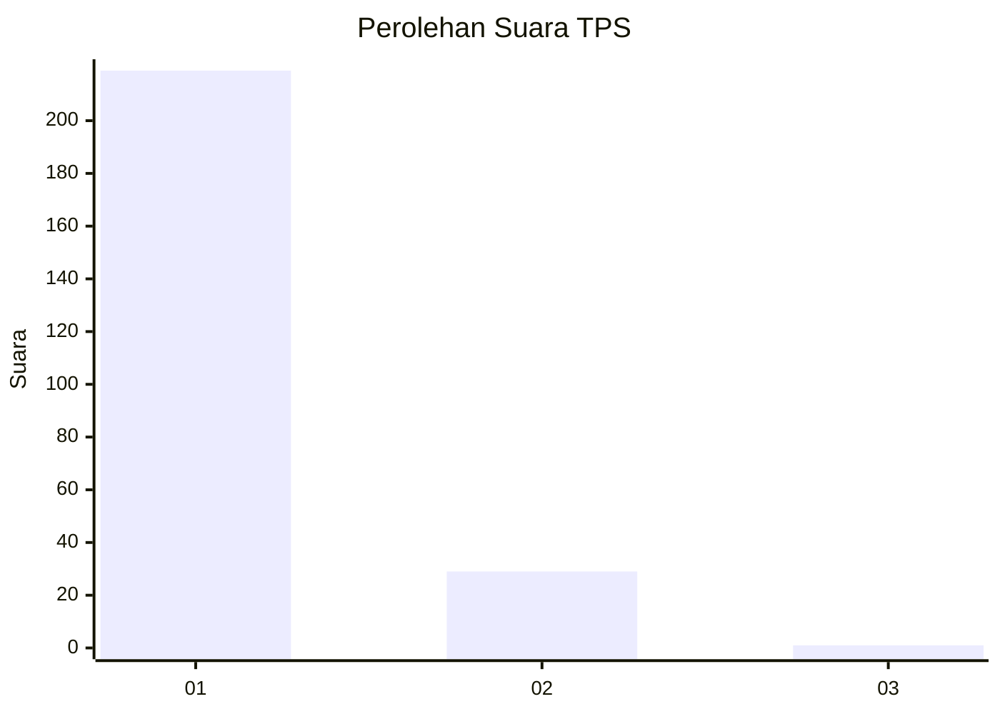
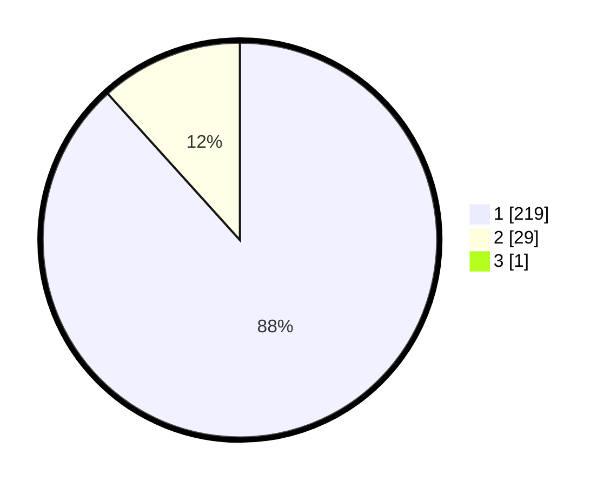

# Hasil

## Grafik

## Tabel

| No. | Nama Paslon    | Suara | Suara (raw) | Persentase |
|:--- |:-------------- | -----:| -----------:| ----------:|
| 1   | ANIES MUHAIMIN | 219   | [219][p-1]  | 87,95      |
| 2   | PRABOWO GIBRAN | 29    | [29][p-2]   | 11,65      |
| 3   | GANJAR MAHFUD  | 1     | [1][p-3]    | 0,40       |

[p-1]: https://github.com/gigit-pemilu/pemilu-2024-11-aceh/blob/main/pilpres/hitung-suara/sub/11-aceh/sub/71-kota-banda-aceh/sub/05-lueng-bata/sub/2006-batoh/sub/007-tps/sub/paslon-1.txt
[p-2]: https://github.com/gigit-pemilu/pemilu-2024-11-aceh/blob/main/pilpres/hitung-suara/sub/11-aceh/sub/71-kota-banda-aceh/sub/05-lueng-bata/sub/2006-batoh/sub/007-tps/sub/paslon-2.txt
[p-3]: https://github.com/gigit-pemilu/pemilu-2024-11-aceh/blob/main/pilpres/hitung-suara/sub/11-aceh/sub/71-kota-banda-aceh/sub/05-lueng-bata/sub/2006-batoh/sub/007-tps/sub/paslon-3.txt

## Foto C Plano

https://sirekap-obj-formc.kpu.go.id/11a4/pemilu/ppwp/11/71/05/20/06/1171052006007-20240220-153808--543c5719-dba0-4e49-8e72-d9f2f10ff43c.jpg

https://sirekap-obj-formc.kpu.go.id/11a4/pemilu/ppwp/11/71/05/20/06/1171052006007-20240220-154020--f0055f90-28ee-4083-b137-a46c4da01aab.jpg

https://sirekap-obj-formc.kpu.go.id/11a4/pemilu/ppwp/11/71/05/20/06/1171052006007-20240220-154041--3aefadae-ab1e-4b03-a1ec-4f45374233cf.jpg

## Metadata

| Key        | Value               |
| ---------- | ------------------- |
| Time Stamp | 2024-02-24 22:31:28 |

