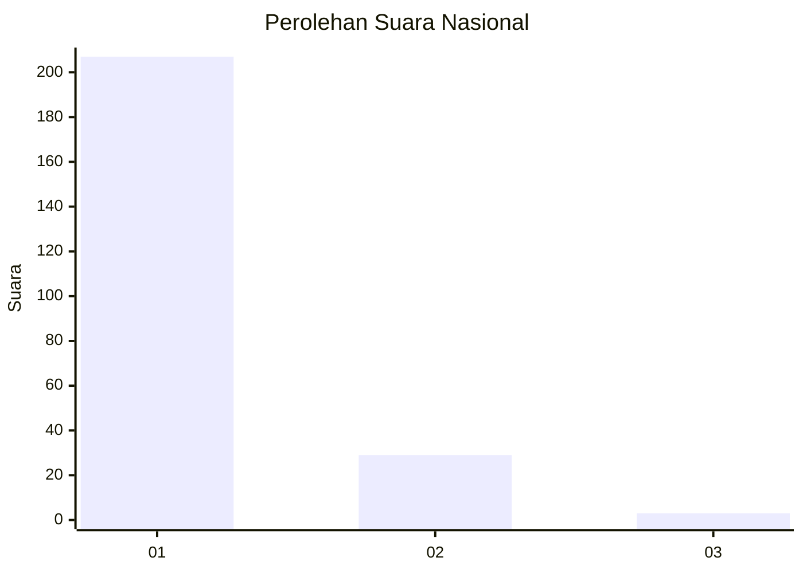
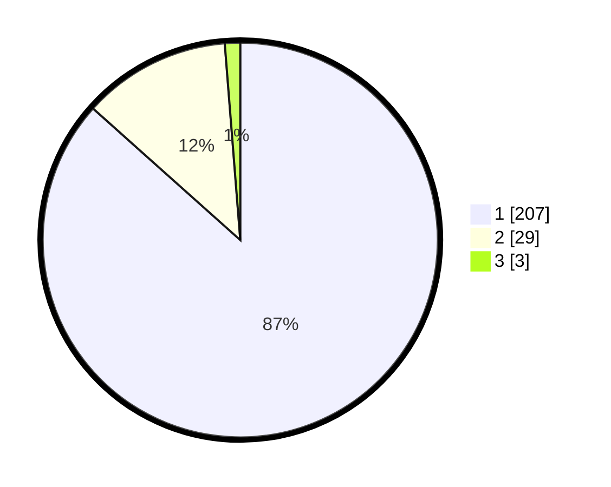

# Hasil

## Grafik

## Tabel

| No. | Nama Paslon    | Suara | Suara (raw) | Persentase |
|:--- |:-------------- | -----:| -----------:| ----------:|
| 1   | ANIES MUHAIMIN | 207   | [207][p-1]  | 86,61      |
| 2   | PRABOWO GIBRAN | 29    | [29][p-2]   | 12,13      |
| 3   | GANJAR MAHFUD  | 3     | [3][p-3]    | 1,26       |

[p-1]: https://github.com/gigit-pemilu/pemilu-2024/blob/main/pilpres/hitung-suara/sub/11-aceh/sub/71-kota-banda-aceh/sub/05-lueng-bata/sub/2006-batoh/sub/009-tps/sub/paslon-1.txt
[p-2]: https://github.com/gigit-pemilu/pemilu-2024/blob/main/pilpres/hitung-suara/sub/11-aceh/sub/71-kota-banda-aceh/sub/05-lueng-bata/sub/2006-batoh/sub/009-tps/sub/paslon-2.txt
[p-3]: https://github.com/gigit-pemilu/pemilu-2024/blob/main/pilpres/hitung-suara/sub/11-aceh/sub/71-kota-banda-aceh/sub/05-lueng-bata/sub/2006-batoh/sub/009-tps/sub/paslon-3.txt

## Foto C Plano

https://sirekap-obj-formc.kpu.go.id/6af9/pemilu/ppwp/11/71/05/20/06/1171052006009-20240220-173314--062b0142-12a3-4404-abf4-933779fe7933.jpg

https://sirekap-obj-formc.kpu.go.id/6af9/pemilu/ppwp/11/71/05/20/06/1171052006009-20240220-173517--91ed6415-66b9-482c-af95-44cc29401e5b.jpg

https://sirekap-obj-formc.kpu.go.id/6af9/pemilu/ppwp/11/71/05/20/06/1171052006009-20240220-173614--5aa7637c-44b1-4afa-9666-8c7f11f76799.jpg

## Metadata

| Key        | Value               |
| ---------- | ------------------- |
| Time Stamp | 2024-02-24 22:31:28 |

