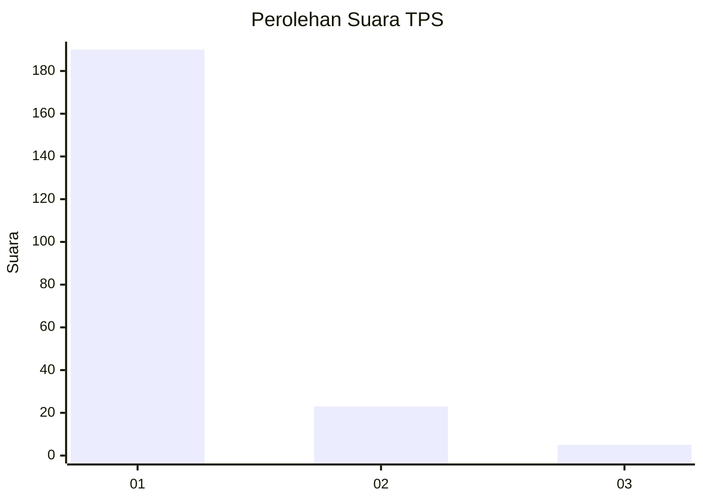
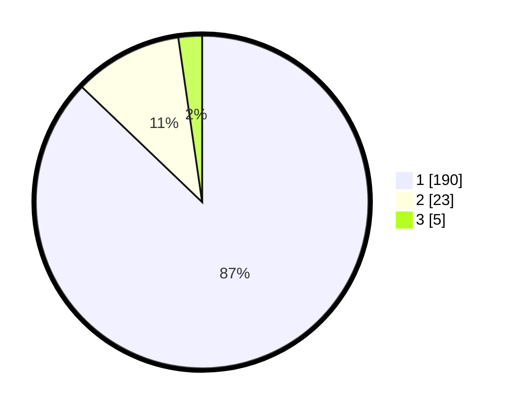

# Hasil

## Grafik

## Tabel

| No. | Nama Paslon    | Suara | Suara (raw) | Persentase |
|:--- |:-------------- | -----:| -----------:| ----------:|
| 1   | ANIES MUHAIMIN | 190   | [190][p-1]  | 87,16      |
| 2   | PRABOWO GIBRAN | 23    | [23][p-2]   | 10,55      |
| 3   | GANJAR MAHFUD  | 5     | [5][p-3]    | 2,29       |

[p-1]: https://github.com/gigit-pemilu/pemilu-2024-11-aceh/blob/main/pilpres/hitung-suara/sub/11-aceh/sub/71-kota-banda-aceh/sub/05-lueng-bata/sub/2006-batoh/sub/010-tps/sub/paslon-1.txt
[p-2]: https://github.com/gigit-pemilu/pemilu-2024-11-aceh/blob/main/pilpres/hitung-suara/sub/11-aceh/sub/71-kota-banda-aceh/sub/05-lueng-bata/sub/2006-batoh/sub/010-tps/sub/paslon-2.txt
[p-3]: https://github.com/gigit-pemilu/pemilu-2024-11-aceh/blob/main/pilpres/hitung-suara/sub/11-aceh/sub/71-kota-banda-aceh/sub/05-lueng-bata/sub/2006-batoh/sub/010-tps/sub/paslon-3.txt

## Foto C Plano

https://sirekap-obj-formc.kpu.go.id/bbae/pemilu/ppwp/11/71/05/20/06/1171052006010-20240220-211642--2bad35d9-156d-4cd5-a39d-115e6061fee4.jpg

https://sirekap-obj-formc.kpu.go.id/bbae/pemilu/ppwp/11/71/05/20/06/1171052006010-20240220-213652--610e8216-90e5-44cc-b982-e5648d1c41d1.jpg

https://sirekap-obj-formc.kpu.go.id/bbae/pemilu/ppwp/11/71/05/20/06/1171052006010-20240220-211812--4b09a37a-79a7-454d-8f16-520027349253.jpg

## Metadata

| Key        | Value               |
| ---------- | ------------------- |
| Time Stamp | 2024-02-24 22:31:28 |

