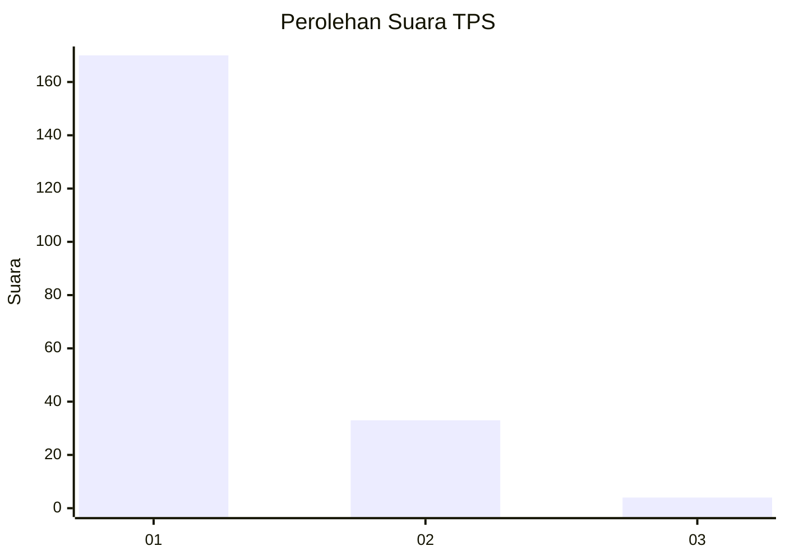
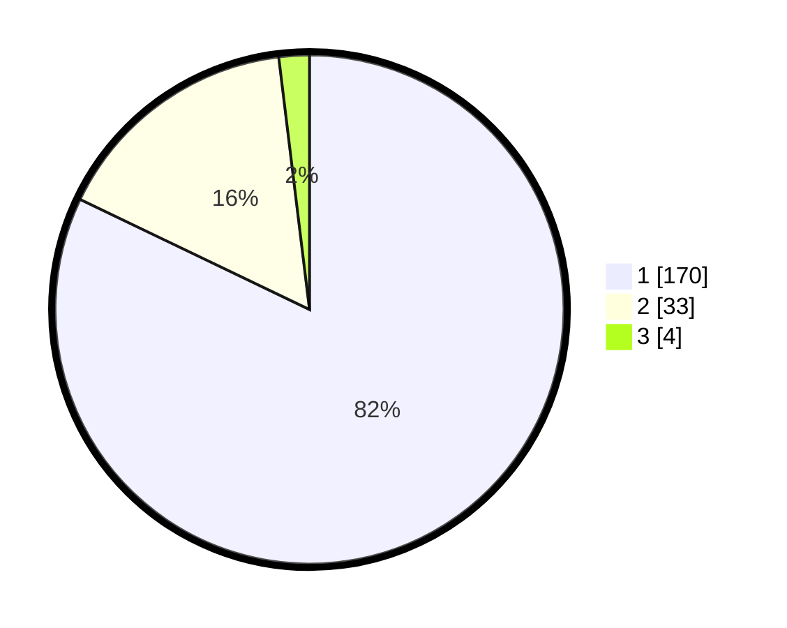

# Hasil

## Grafik

## Tabel

| No. | Nama Paslon    | Suara | Suara (raw) | Persentase |
|:--- |:-------------- | -----:| -----------:| ----------:|
| 1   | ANIES MUHAIMIN | 170   | [170][p-1]  | 82,13      |
| 2   | PRABOWO GIBRAN | 33    | [33][p-2]   | 15,94      |
| 3   | GANJAR MAHFUD  | 4     | [4][p-3]    | 1,93       |

[p-1]: https://github.com/gigit-pemilu/pemilu-2024-11-aceh/blob/main/pilpres/hitung-suara/sub/11-aceh/sub/71-kota-banda-aceh/sub/05-lueng-bata/sub/2006-batoh/sub/012-tps/sub/paslon-1.txt
[p-2]: https://github.com/gigit-pemilu/pemilu-2024-11-aceh/blob/main/pilpres/hitung-suara/sub/11-aceh/sub/71-kota-banda-aceh/sub/05-lueng-bata/sub/2006-batoh/sub/012-tps/sub/paslon-2.txt
[p-3]: https://github.com/gigit-pemilu/pemilu-2024-11-aceh/blob/main/pilpres/hitung-suara/sub/11-aceh/sub/71-kota-banda-aceh/sub/05-lueng-bata/sub/2006-batoh/sub/012-tps/sub/paslon-3.txt

## Foto C Plano

https://sirekap-obj-formc.kpu.go.id/e45c/pemilu/ppwp/11/71/05/20/06/1171052006012-20240220-225943--4c2f52fd-5acc-48de-8167-e94bbc69a21b.jpg

https://sirekap-obj-formc.kpu.go.id/e45c/pemilu/ppwp/11/71/05/20/06/1171052006012-20240220-230035--96a26a98-e823-4867-833d-acd0b44d8a20.jpg

https://sirekap-obj-formc.kpu.go.id/e45c/pemilu/ppwp/11/71/05/20/06/1171052006012-20240220-230108--9045a641-6942-4d87-8594-98c036ddeb0b.jpg

## Metadata

| Key        | Value               |
| ---------- | ------------------- |
| Time Stamp | 2024-02-24 22:31:28 |

