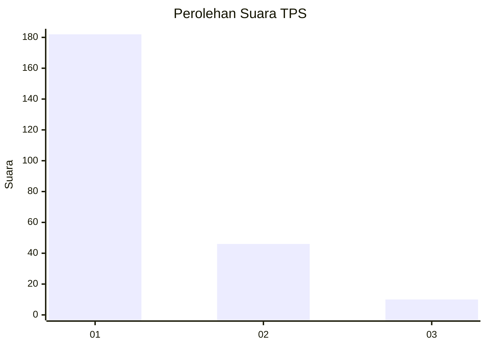
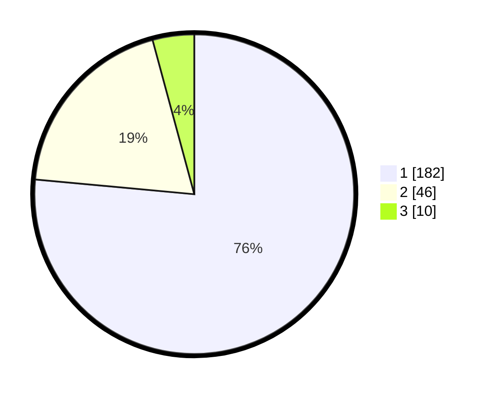

# Hasil

## Grafik

## Tabel

| No. | Nama Paslon    | Suara | Suara (raw) | Persentase |
|:--- |:-------------- | -----:| -----------:| ----------:|
| 1   | ANIES MUHAIMIN | 182   | [182][p-1]  | 76,47      |
| 2   | PRABOWO GIBRAN | 46    | [46][p-2]   | 19,33      |
| 3   | GANJAR MAHFUD  | 10    | [10][p-3]   | 4,20       |

[p-1]: https://github.com/gigit-pemilu/pemilu-2024-11-aceh/blob/main/pilpres/hitung-suara/sub/11-aceh/sub/71-kota-banda-aceh/sub/05-lueng-bata/sub/2007-suka-damai/sub/002-tps/sub/paslon-1.txt
[p-2]: https://github.com/gigit-pemilu/pemilu-2024-11-aceh/blob/main/pilpres/hitung-suara/sub/11-aceh/sub/71-kota-banda-aceh/sub/05-lueng-bata/sub/2007-suka-damai/sub/002-tps/sub/paslon-2.txt
[p-3]: https://github.com/gigit-pemilu/pemilu-2024-11-aceh/blob/main/pilpres/hitung-suara/sub/11-aceh/sub/71-kota-banda-aceh/sub/05-lueng-bata/sub/2007-suka-damai/sub/002-tps/sub/paslon-3.txt

## Foto C Plano

https://sirekap-obj-formc.kpu.go.id/8bd5/pemilu/ppwp/11/71/05/20/07/1171052007002-20240217-225801--4b83adaf-7c5f-4161-853b-8811b5ec53b5.jpg

https://sirekap-obj-formc.kpu.go.id/8bd5/pemilu/ppwp/11/71/05/20/07/1171052007002-20240217-225818--1ee7b1d3-8690-4d28-aeca-4ba94213702d.jpg

https://sirekap-obj-formc.kpu.go.id/8bd5/pemilu/ppwp/11/71/05/20/07/1171052007002-20240217-225837--238e4d1c-c818-4f44-803a-13e2403d1872.jpg

## Metadata

| Key        | Value               |
| ---------- | ------------------- |
| Time Stamp | 2024-02-19 06:16:00 |

