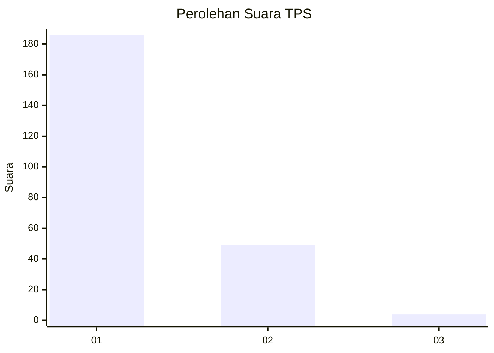
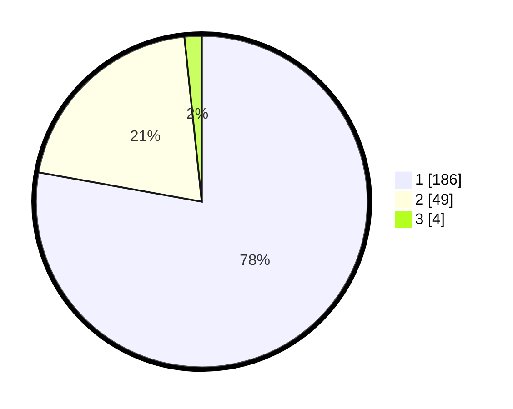

# Hasil

## Grafik

## Tabel

| No. | Nama Paslon    | Suara | Suara (raw) | Persentase |
|:--- |:-------------- | -----:| -----------:| ----------:|
| 1   | ANIES MUHAIMIN | 186   | [186][p-1]  | 77,82      |
| 2   | PRABOWO GIBRAN | 49    | [49][p-2]   | 20,50      |
| 3   | GANJAR MAHFUD  | 4     | [4][p-3]    | 1,67       |

[p-1]: https://github.com/gigit-pemilu/pemilu-2024-11-aceh/blob/main/pilpres/hitung-suara/sub/11-aceh/sub/71-kota-banda-aceh/sub/05-lueng-bata/sub/2007-suka-damai/sub/003-tps/sub/paslon-1.txt
[p-2]: https://github.com/gigit-pemilu/pemilu-2024-11-aceh/blob/main/pilpres/hitung-suara/sub/11-aceh/sub/71-kota-banda-aceh/sub/05-lueng-bata/sub/2007-suka-damai/sub/003-tps/sub/paslon-2.txt
[p-3]: https://github.com/gigit-pemilu/pemilu-2024-11-aceh/blob/main/pilpres/hitung-suara/sub/11-aceh/sub/71-kota-banda-aceh/sub/05-lueng-bata/sub/2007-suka-damai/sub/003-tps/sub/paslon-3.txt

## Foto C Plano

https://sirekap-obj-formc.kpu.go.id/2500/pemilu/ppwp/11/71/05/20/07/1171052007003-20240217-233311--49b1e750-7f78-4e71-859d-6075079fb19b.jpg

https://sirekap-obj-formc.kpu.go.id/2500/pemilu/ppwp/11/71/05/20/07/1171052007003-20240217-233330--94bc78e4-6b3c-4467-996a-d37b150109eb.jpg

https://sirekap-obj-formc.kpu.go.id/2500/pemilu/ppwp/11/71/05/20/07/1171052007003-20240217-233347--38361a72-803b-4874-b37f-ec7d6c8b2afc.jpg

## Metadata

| Key        | Value               |
| ---------- | ------------------- |
| Time Stamp | 2024-02-19 06:16:00 |

