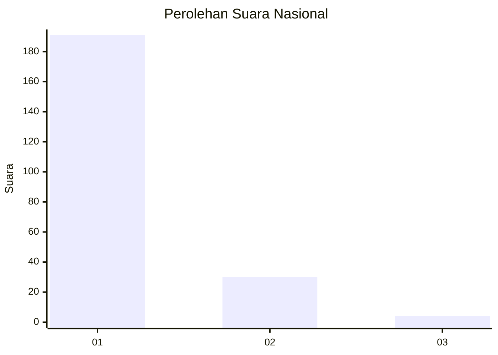
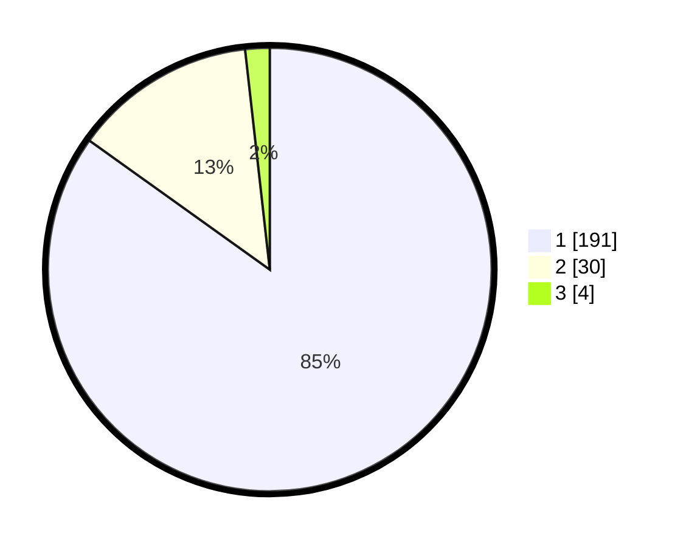

# Hasil

## Grafik

## Tabel

| No. | Nama Paslon    | Suara | Suara (raw) | Persentase |
|:--- |:-------------- | -----:| -----------:| ----------:|
| 1   | ANIES MUHAIMIN | 191   | [191][p-1]  | 84,89      |
| 2   | PRABOWO GIBRAN | 30    | [30][p-2]   | 13,33      |
| 3   | GANJAR MAHFUD  | 4     | [4][p-3]    | 1,78       |

[p-1]: https://github.com/gigit-pemilu/pemilu-2024/blob/main/pilpres/hitung-suara/sub/11-aceh/sub/71-kota-banda-aceh/sub/05-lueng-bata/sub/2008-lamdom/sub/001-tps/sub/paslon-1.txt
[p-2]: https://github.com/gigit-pemilu/pemilu-2024/blob/main/pilpres/hitung-suara/sub/11-aceh/sub/71-kota-banda-aceh/sub/05-lueng-bata/sub/2008-lamdom/sub/001-tps/sub/paslon-2.txt
[p-3]: https://github.com/gigit-pemilu/pemilu-2024/blob/main/pilpres/hitung-suara/sub/11-aceh/sub/71-kota-banda-aceh/sub/05-lueng-bata/sub/2008-lamdom/sub/001-tps/sub/paslon-3.txt

## Foto C Plano

https://sirekap-obj-formc.kpu.go.id/d8e3/pemilu/ppwp/11/71/05/20/08/1171052008001-20240221-124133--90e8f682-f9d8-4928-9cd6-cd6f9eda1707.jpg

https://sirekap-obj-formc.kpu.go.id/d8e3/pemilu/ppwp/11/71/05/20/08/1171052008001-20240221-124345--bf559b04-0422-4751-894b-4897e7c69124.jpg

https://sirekap-obj-formc.kpu.go.id/d8e3/pemilu/ppwp/11/71/05/20/08/1171052008001-20240221-124433--73d8beb2-4f04-42cd-a42f-a51b672306af.jpg

## Metadata

| Key        | Value               |
| ---------- | ------------------- |
| Time Stamp | 2024-02-24 22:31:28 |

