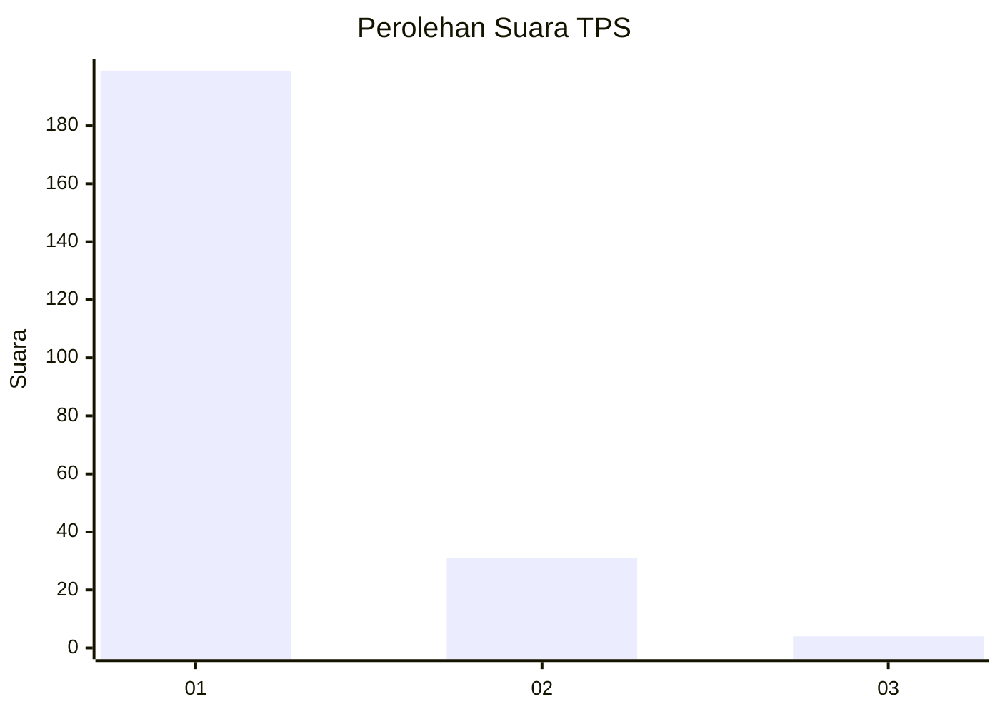
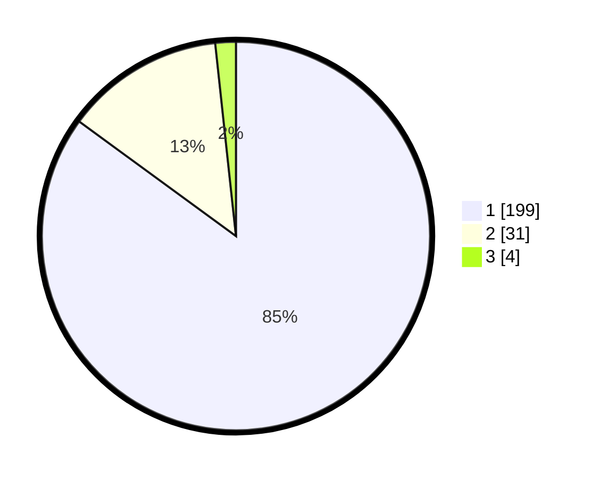

# Hasil

## Grafik

## Tabel

| No. | Nama Paslon    | Suara | Suara (raw) | Persentase |
|:--- |:-------------- | -----:| -----------:| ----------:|
| 1   | ANIES MUHAIMIN | 199   | [199][p-1]  | 85,04      |
| 2   | PRABOWO GIBRAN | 31    | [31][p-2]   | 13,25      |
| 3   | GANJAR MAHFUD  | 4     | [4][p-3]    | 1,71       |

[p-1]: https://github.com/gigit-pemilu/pemilu-2024-11-aceh/blob/main/pilpres/hitung-suara/sub/11-aceh/sub/71-kota-banda-aceh/sub/05-lueng-bata/sub/2008-lamdom/sub/002-tps/sub/paslon-1.txt
[p-2]: https://github.com/gigit-pemilu/pemilu-2024-11-aceh/blob/main/pilpres/hitung-suara/sub/11-aceh/sub/71-kota-banda-aceh/sub/05-lueng-bata/sub/2008-lamdom/sub/002-tps/sub/paslon-2.txt
[p-3]: https://github.com/gigit-pemilu/pemilu-2024-11-aceh/blob/main/pilpres/hitung-suara/sub/11-aceh/sub/71-kota-banda-aceh/sub/05-lueng-bata/sub/2008-lamdom/sub/002-tps/sub/paslon-3.txt

## Foto C Plano

https://sirekap-obj-formc.kpu.go.id/2931/pemilu/ppwp/11/71/05/20/08/1171052008002-20240221-120828--9ffd1593-2e53-492b-81c3-0febc9d4d250.jpg

https://sirekap-obj-formc.kpu.go.id/2931/pemilu/ppwp/11/71/05/20/08/1171052008002-20240221-120928--f006e0ec-294d-485a-b603-358cd3a699c4.jpg

https://sirekap-obj-formc.kpu.go.id/2931/pemilu/ppwp/11/71/05/20/08/1171052008002-20240221-121523--bbfe3aec-83b4-4f8a-ae40-80dae9879696.jpg

## Metadata

| Key        | Value               |
| ---------- | ------------------- |
| Time Stamp | 2024-02-24 22:31:28 |

