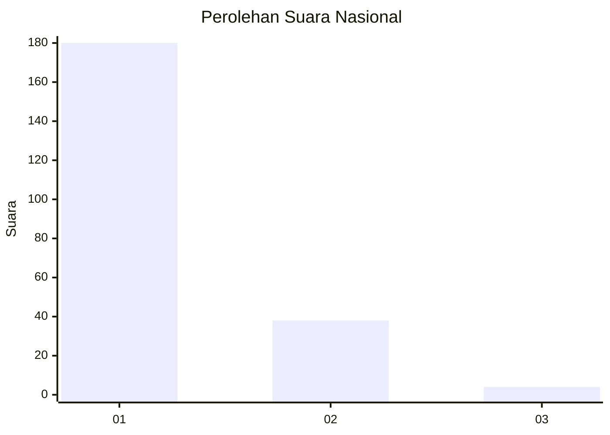
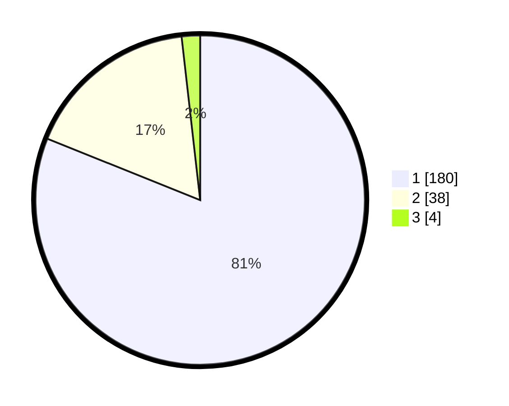

# Hasil

## Grafik

## Tabel

| No. | Nama Paslon    | Suara | Suara (raw) | Persentase |
|:--- |:-------------- | -----:| -----------:| ----------:|
| 1   | ANIES MUHAIMIN | 180   | [180][p-1]  | 81,08      |
| 2   | PRABOWO GIBRAN | 38    | [38][p-2]   | 17,12      |
| 3   | GANJAR MAHFUD  | 4     | [4][p-3]    | 1,80       |

[p-1]: https://github.com/gigit-pemilu/pemilu-2024/blob/main/pilpres/hitung-suara/sub/11-aceh/sub/71-kota-banda-aceh/sub/05-lueng-bata/sub/2008-lamdom/sub/003-tps/sub/paslon-1.txt
[p-2]: https://github.com/gigit-pemilu/pemilu-2024/blob/main/pilpres/hitung-suara/sub/11-aceh/sub/71-kota-banda-aceh/sub/05-lueng-bata/sub/2008-lamdom/sub/003-tps/sub/paslon-2.txt
[p-3]: https://github.com/gigit-pemilu/pemilu-2024/blob/main/pilpres/hitung-suara/sub/11-aceh/sub/71-kota-banda-aceh/sub/05-lueng-bata/sub/2008-lamdom/sub/003-tps/sub/paslon-3.txt

## Foto C Plano

https://sirekap-obj-formc.kpu.go.id/8c06/pemilu/ppwp/11/71/05/20/08/1171052008003-20240221-153629--c0bd9814-13ef-46cb-bc7b-6264869e1d78.jpg

https://sirekap-obj-formc.kpu.go.id/8c06/pemilu/ppwp/11/71/05/20/08/1171052008003-20240221-153708--4c60fedc-4dd5-4fb3-b8c6-89c472bde372.jpg

https://sirekap-obj-formc.kpu.go.id/8c06/pemilu/ppwp/11/71/05/20/08/1171052008003-20240221-153829--acc69953-1c9c-4b43-ab12-d9f8cc465652.jpg

## Metadata

| Key        | Value               |
| ---------- | ------------------- |
| Time Stamp | 2024-02-24 22:31:28 |

