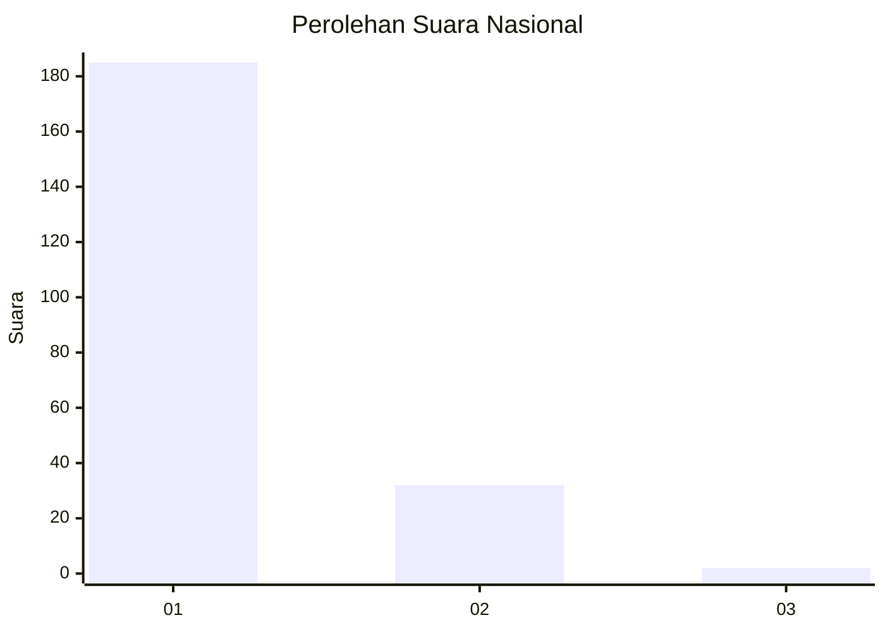
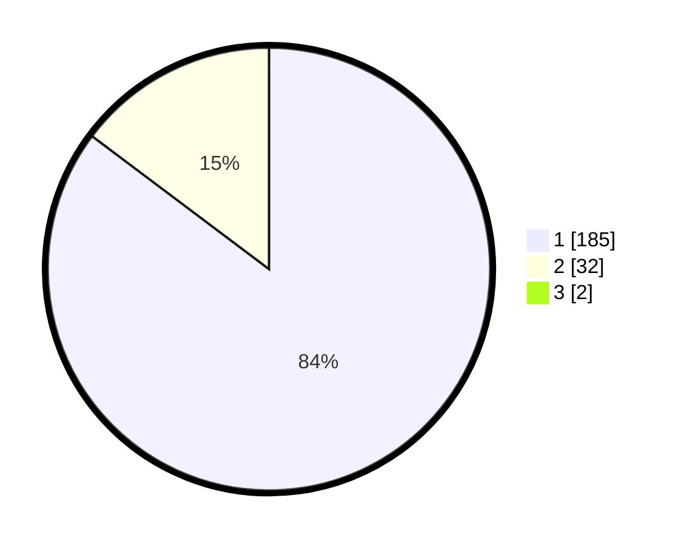

# Hasil

## Grafik

## Tabel

| No. | Nama Paslon    | Suara | Suara (raw) | Persentase |
|:--- |:-------------- | -----:| -----------:| ----------:|
| 1   | ANIES MUHAIMIN | 185   | [185][p-1]  | 84,47      |
| 2   | PRABOWO GIBRAN | 32    | [32][p-2]   | 14,61      |
| 3   | GANJAR MAHFUD  | 2     | [2][p-3]    | 0,91       |

[p-1]: https://github.com/gigit-pemilu/pemilu-2024/blob/main/pilpres/hitung-suara/sub/11-aceh/sub/71-kota-banda-aceh/sub/05-lueng-bata/sub/2008-lamdom/sub/004-tps/sub/paslon-1.txt
[p-2]: https://github.com/gigit-pemilu/pemilu-2024/blob/main/pilpres/hitung-suara/sub/11-aceh/sub/71-kota-banda-aceh/sub/05-lueng-bata/sub/2008-lamdom/sub/004-tps/sub/paslon-2.txt
[p-3]: https://github.com/gigit-pemilu/pemilu-2024/blob/main/pilpres/hitung-suara/sub/11-aceh/sub/71-kota-banda-aceh/sub/05-lueng-bata/sub/2008-lamdom/sub/004-tps/sub/paslon-3.txt

## Foto C Plano

https://sirekap-obj-formc.kpu.go.id/8470/pemilu/ppwp/11/71/05/20/08/1171052008004-20240221-165624--c141abe5-16b5-4eaf-9a4e-3bd12a9de072.jpg

https://sirekap-obj-formc.kpu.go.id/8470/pemilu/ppwp/11/71/05/20/08/1171052008004-20240221-165658--56c15c7d-5fe9-49f7-8a35-abf8b355ca95.jpg

https://sirekap-obj-formc.kpu.go.id/8470/pemilu/ppwp/11/71/05/20/08/1171052008004-20240221-165738--9090a042-96f2-4d76-a6be-97cd587cf4e1.jpg

## Metadata

| Key        | Value               |
| ---------- | ------------------- |
| Time Stamp | 2024-02-24 22:31:28 |

