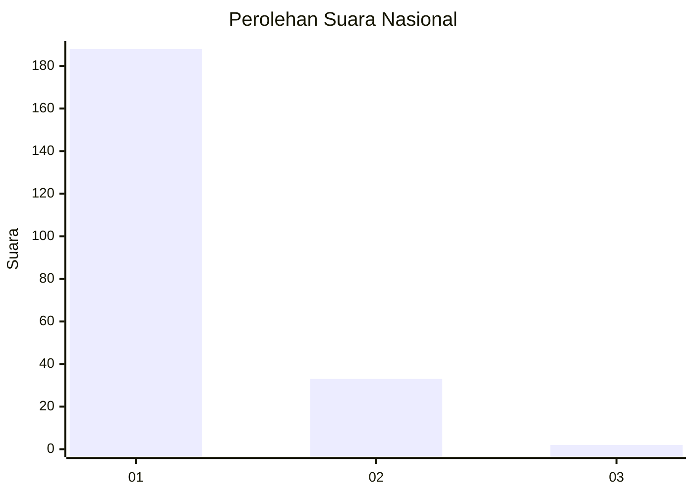
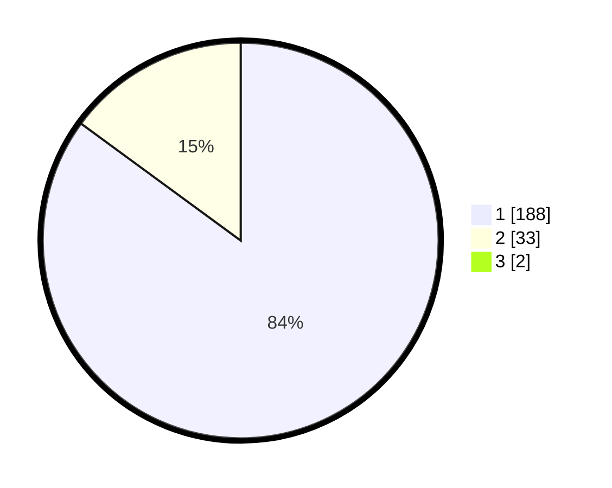

# Hasil

## Grafik

## Tabel

| No. | Nama Paslon    | Suara | Suara (raw) | Persentase |
|:--- |:-------------- | -----:| -----------:| ----------:|
| 1   | ANIES MUHAIMIN | 188   | [188][p-1]  | 84,30      |
| 2   | PRABOWO GIBRAN | 33    | [33][p-2]   | 14,80      |
| 3   | GANJAR MAHFUD  | 2     | [2][p-3]    | 0,90       |

[p-1]: https://github.com/gigit-pemilu/pemilu-2024/blob/main/pilpres/hitung-suara/sub/11-aceh/sub/71-kota-banda-aceh/sub/05-lueng-bata/sub/2008-lamdom/sub/006-tps/sub/paslon-1.txt
[p-2]: https://github.com/gigit-pemilu/pemilu-2024/blob/main/pilpres/hitung-suara/sub/11-aceh/sub/71-kota-banda-aceh/sub/05-lueng-bata/sub/2008-lamdom/sub/006-tps/sub/paslon-2.txt
[p-3]: https://github.com/gigit-pemilu/pemilu-2024/blob/main/pilpres/hitung-suara/sub/11-aceh/sub/71-kota-banda-aceh/sub/05-lueng-bata/sub/2008-lamdom/sub/006-tps/sub/paslon-3.txt

## Foto C Plano

https://sirekap-obj-formc.kpu.go.id/37c6/pemilu/ppwp/11/71/05/20/08/1171052008006-20240221-211903--3d73c157-456b-44af-bb50-203ba9724c78.jpg

https://sirekap-obj-formc.kpu.go.id/37c6/pemilu/ppwp/11/71/05/20/08/1171052008006-20240221-211942--c2216db4-843e-4b88-b4b8-727fcd7156a9.jpg

https://sirekap-obj-formc.kpu.go.id/37c6/pemilu/ppwp/11/71/05/20/08/1171052008006-20240221-212011--5dc8cf24-0dc3-4cb9-90ad-d911ab376bb6.jpg

## Metadata

| Key        | Value               |
| ---------- | ------------------- |
| Time Stamp | 2024-02-24 22:31:28 |

